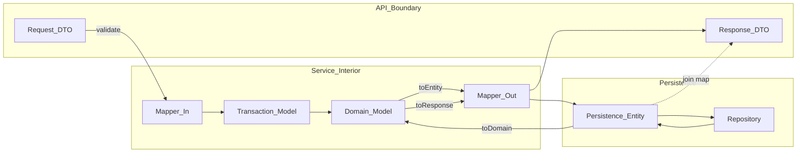

# Model Separation

EPB mandates five distinct model types at every service boundary. Each type serves one architectural concern — API contract, use-case processing, business rules, or persistence — and explicit mappers convert between them. A single class shared across layers couples HTTP responses to database schema and blocks independent evolution.

**Source:** [model-separation.mmd](model-separation.mmd)

## Model Types

| Model | Role |
|-------|------|
| Request DTO | Validates incoming write/read parameters |
| Response DTO | Stable outward contract; presentation shape |
| Transaction model | Carries data through a single use case or command |
| Domain model | Encapsulates business rules and invariants |
| Persistence entity | Maps to database tables; never returned from controllers |

## Related Chapters

- [Model Separation](../Volume-1-Foundation/11-model-separation.md)
- [DTO Standards](../Volume-1-Foundation/15-dto-standards.md)
- [Entity Standards](../Volume-1-Foundation/16-entity-standards.md)
- [Shared Libraries](../Volume-1-Foundation/10-shared-libraries.md)
- [Create Mapper](../Volume-3-Developer-Guide/09-create-mapper.md)
