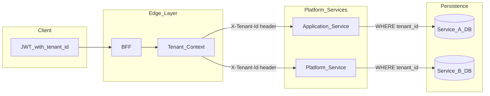

# Multi-Tenant Isolation

Every tenant's data is invisible to others. The BFF extracts `tenant_id` from the authenticated JWT — never from the client request body — and propagates it to downstream services via `X-Tenant-Id`. Each service scopes every query with `tenant_id`; cross-tenant access attempts return `404`.

**Source:** [multi-tenant-isolation.mmd](multi-tenant-isolation.mmd)

## Propagation Rules

1. Tenant ID comes from the token at the BFF — clients must not supply it
2. Request DTOs omit `tenantId`; controllers inject from platform context
3. Every tenant-scoped table includes `tenant_id` with a leading composite index
4. Platform services are multi-tenant by default

## Related Chapters

- [How to Set Up Multi-Tenant Isolation](../Volume-3-Developer-Guide/48-multi-tenant-setup.md)
- [Entity Standards](../Volume-1-Foundation/16-entity-standards.md)
- [Backend For Frontend BFF](../Volume-1-Foundation/08-bff-layer.md)
- [Platform Services Layer](../Volume-1-Foundation/09-platform-services-layer.md)
- [Authentication Integration](../Volume-3-Developer-Guide/46-authentication-integration.md)
