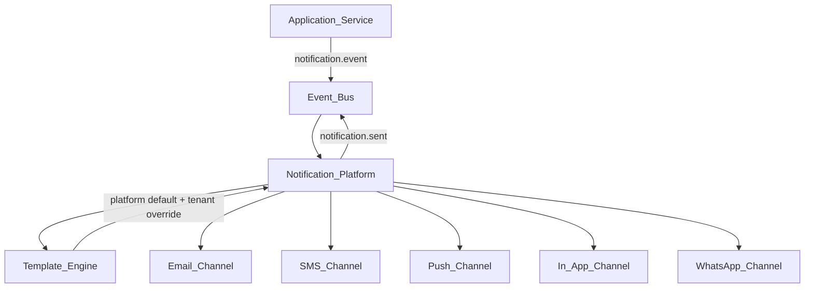

# Notification Platform

Business logic publishes notification events; the platform resolves templates and delivers messages across channels. Applications never send email, SMS, or push directly. The template engine applies platform defaults first, then optional tenant overrides, before routing to the selected channel provider.

**Source:** [notification-platform.mmd](notification-platform.mmd)



## Resolution Chain

```text
Platform Default Template → Optional Tenant Override → Final Message → Channel Provider
```

## Related Chapters

- [Notification Platform](../Volume-2-Platform-Services/15-notification-platform.md)
- [Template Engine](../Volume-2-Platform-Services/16-template-engine.md)
- [Event Bus](../Volume-2-Platform-Services/30-event-bus.md)
- [Notification Email Channel](../Volume-2-Platform-Services/42-notification-email-channel.md)
- [Create Notification Event](../Volume-3-Developer-Guide/13-create-notification-event.md)
- [Notification Flow](../Sequence-Diagrams/notification-flow.md) (sequence diagram)
