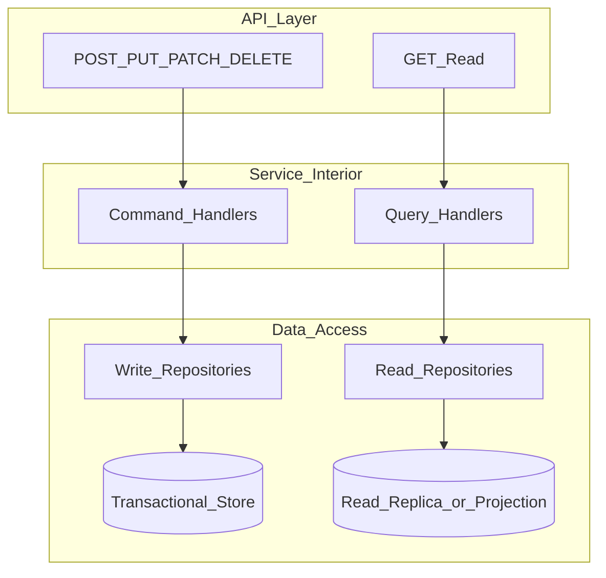

# Read/Write Split

Read and write workloads behave differently. EPB separates them from the API boundary inward: GET routes to query handlers and read repositories; POST, PUT, PATCH, and DELETE route to command handlers and write repositories. At maturity, read repositories may target replicas or projections without changing the API surface.

**Source:** [read-write-split.mmd](read-write-split.mmd)

## Key Rules

- Commands change state; queries do not
- Side effects (events, notifications, audit) attach to command success only
- List reads require pagination; writes run inside transactional boundaries

## Related Chapters

- [Read/Write Separation](../Volume-1-Foundation/12-read-write-separation.md)
- [Model Separation](../Volume-1-Foundation/11-model-separation.md)
- [API Standards](../Volume-1-Foundation/18-api-standards.md)
- [Transactional vs Reporting](../Volume-1-Foundation/13-transactional-vs-reporting.md)
