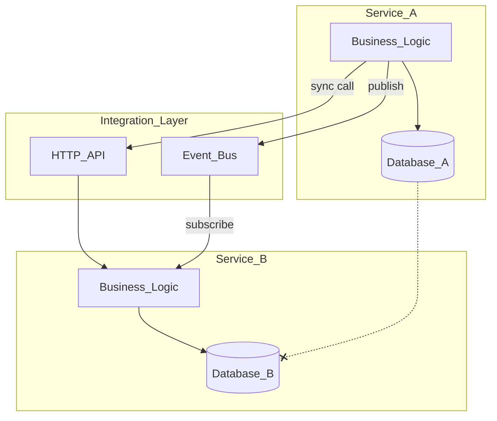

# Service Communication

Each EPB service owns its business logic and its data store. Services integrate only through synchronous HTTP APIs or asynchronous events on the event bus. No service queries another service's database — that boundary violation turns independent deployables into a distributed monolith.

**Source:** [service-communication.mmd](service-communication.mmd)

## Integration Modes

| Mode | When to Use |
|------|-------------|
| HTTP API | Caller needs an immediate result or validation |
| Event bus | Side effects, notifications, projection updates |
| Shared database | Never — each service owns its store |

## Related Chapters

- [Independent Services](../Volume-1-Foundation/14-independent-services.md)
- [Platform Services Layer](../Volume-1-Foundation/09-platform-services-layer.md)
- [Event Bus](../Volume-2-Platform-Services/30-event-bus.md)
- [API Standards](../Volume-1-Foundation/18-api-standards.md)
- [Create New Service](../Volume-3-Developer-Guide/04-create-new-service.md)
