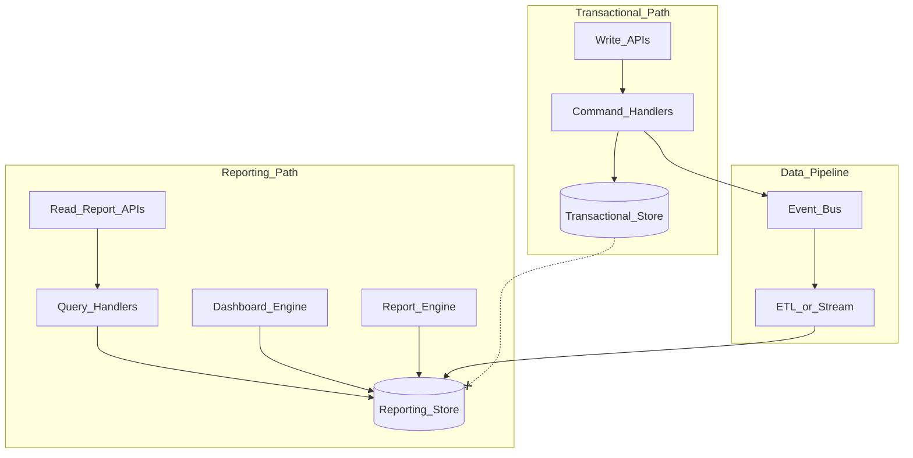

# Transactional vs Reporting

Transactional workloads optimize for correctness and low-latency writes. Reporting workloads optimize for scan-heavy analytics across large historical datasets. EPB keeps these paths architecturally distinct: writes commit to the transactional store and emit events; a pipeline feeds a separate reporting store that dashboards and report engines query — never the transactional primary during heavy analytics.

**Source:** [transactional-reporting.mmd](transactional-reporting.mmd)

## Isolation Guarantees

- Reporting never blocks transactional commits
- Pipeline failure does not reject writes
- Reporting accepts eventual consistency with a documented staleness SLA
- Each path scales independently

## Related Chapters

- [Transactional vs Reporting](../Volume-1-Foundation/13-transactional-vs-reporting.md)
- [Read/Write Separation](../Volume-1-Foundation/12-read-write-separation.md)
- [Event Bus](../Volume-2-Platform-Services/30-event-bus.md)
- [Platform Services Layer](../Volume-1-Foundation/09-platform-services-layer.md)
