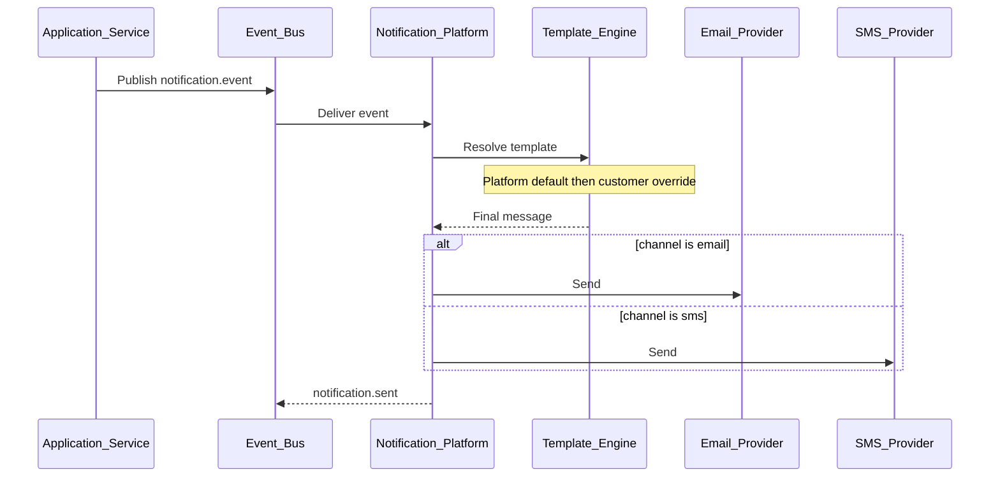

# Notification Platform Flow

```mermaid
sequenceDiagram
  participant App as Application_Service
  participant EB as Event_Bus
  participant Notif as Notification_Platform
  participant Tmpl as Template_Engine
  participant Email as Email_Provider
  participant SMS as SMS_Provider

  App->>EB: Publish notification.event
  EB->>Notif: Deliver event
  Notif->>Tmpl: Resolve template
  Note over Tmpl: Platform default then customer override
  Tmpl-->>Notif: Final message
  alt channel is email
    Notif->>Email: Send
  else channel is sms
    Notif->>SMS: Send
  end
  Notif-->>EB: notification.sent
```

Business logic publishes events only. The notification platform prepares and delivers the final message.
