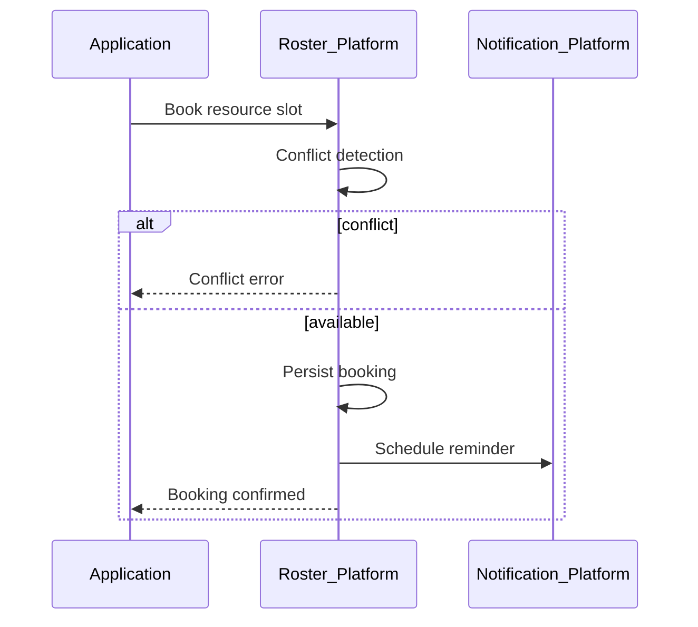

# Roster Platform Flow

```mermaid
sequenceDiagram
  participant App as Application
  participant Roster as Roster_Platform
  participant Notif as Notification_Platform

  App->>Roster: Book resource slot
  Roster->>Roster: Conflict detection
  alt conflict
    Roster-->>App: Conflict error
  else available
    Roster->>Roster: Persist booking
    Roster->>Notif: Schedule reminder
    Roster-->>App: Booking confirmed
  end
```

Roster is reusable across appointments, shifts, classes, and resource booking.
