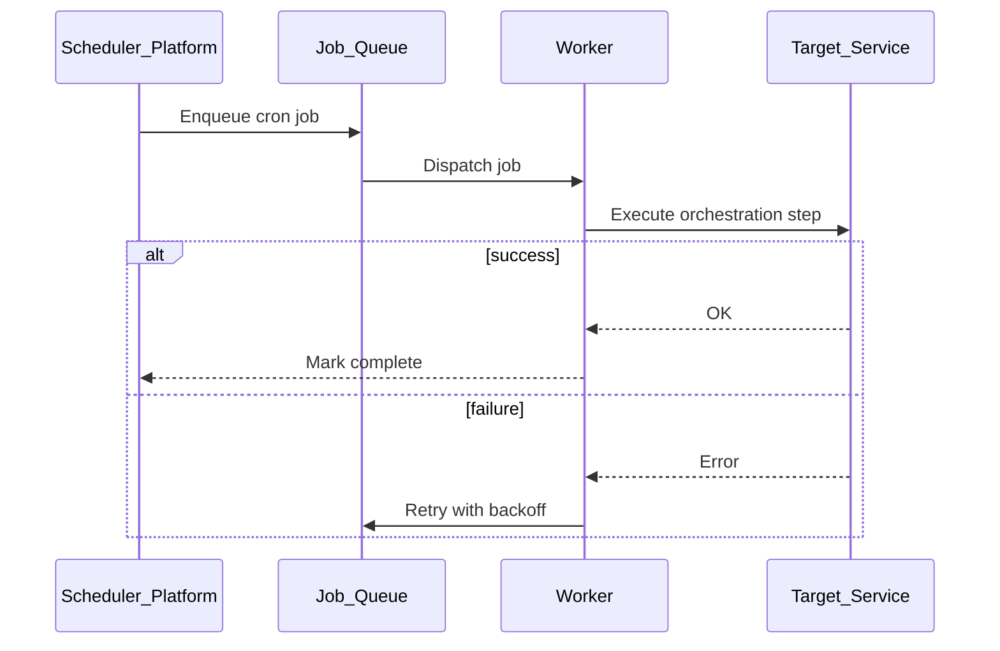

# Scheduler Platform Flow

```mermaid
sequenceDiagram
  participant Sched as Scheduler_Platform
  participant Queue as Job_Queue
  participant Worker as Worker
  participant Target as Target_Service

  Sched->>Queue: Enqueue cron job
  Queue->>Worker: Dispatch job
  Worker->>Target: Execute orchestration step
  alt success
    Target-->>Worker: OK
    Worker-->>Sched: Mark complete
  else failure
    Target-->>Worker: Error
    Worker->>Queue: Retry with backoff
  end
```

Scheduler contains orchestration only. Business processing runs in target services.
