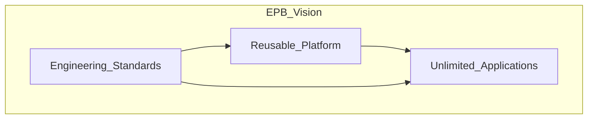

# Vision and Mission

> **Volume:** 1 | **Chapter ID:** v1-01 | **Status:** reviewed

## Purpose

Define why the Enterprise Platform Blueprint exists and what success looks like for organizations adopting it.

## Overview

Building enterprise software is expensive because every team reinvents the same capabilities: authentication, authorization, notifications, scheduling, file storage, reporting, audit trails, and workflow orchestration. Each new ERP, CRM, hospital system, or school application duplicates months of engineering work.

EPB reverses this pattern. **Build the platform once. Build unlimited applications on top of it.**

The vision is an internal engineering framework comparable to what large technology companies maintain — but documented as a framework-agnostic handbook any organization can implement with their chosen technology stack.

The mission is threefold:

1. **Reduce time-to-market** for new enterprise applications by providing ready-made platform capabilities
2. **Enforce engineering standards** so every application behaves consistently (APIs, errors, security, logging)
3. **Eliminate duplicate implementations** through shared platform services and libraries

## Architecture

EPB is not a single product. It is a **blueprint** — architecture patterns, service boundaries, standards, and developer workflows that teams implement.

Applications consume platform services. Platform services follow EPB standards. Applications add only domain-specific business logic.

## Responsibilities

- Articulate the long-term goal: platform engineering at organizational scale
- Keep all documentation domain-neutral (works for ERP, CRM, hospital, school, banking, etc.)
- Anchor Volumes 2 and 3 to Volume 1 foundations
- Provide rationale for every architectural decision

## Design Principles

| Principle | Meaning |
|-----------|---------|
| Build Once. Reuse Everywhere. | Shared capabilities are implemented once |
| Platform First | Platform services before application features |
| API First | Contracts defined before implementation |
| Configuration Over Customization | Behavior driven by config, not forks |
| Developer Experience First | Standards reduce cognitive load |

## Implementation Guidelines

1. Start every new application by identifying which platform services it consumes
2. Never reimplement capabilities that exist in Volume 2
3. Document deviations in Architecture Decision Records
4. Review new services against EPB scope — is it truly generic?

## Best Practices

1. Treat EPB as the engineering constitution for all teams
2. Onboard developers with Volume 3 before they write application code
3. Revisit Volume 1 annually as the platform evolves
4. Measure success by reduction in duplicate code across applications

## Anti-Patterns

| Anti-Pattern | Why It Fails | Preferred Approach |
|--------------|--------------|--------------------|
| Building auth per application | Inconsistent security, audit gaps | Use Authentication + Authorization platform services |
| Domain logic in BFF | BFF becomes unmaintainable monolith | BFF aggregates; business logic stays in services |
| Skipping standards for "speed" | Technical debt compounds across apps | Follow EPB from project day one |
| Platform that assumes one industry | Cannot reuse for other domains | Keep abstractions generic |

## Related Chapters

- [Next: Platform Objective](02-platform-objective.md)
- [Core Philosophy](03-core-philosophy.md)
- [EPB Glossary](../docs/GLOSSARY.md)

---

*Enterprise Platform Blueprint — Volume 1*
