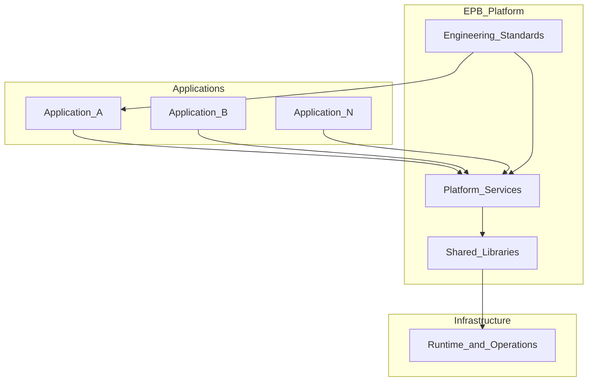

# Platform Objective

> **Volume:** 1 | **Chapter ID:** v1-02 | **Status:** reviewed

## Purpose

Define what EPB is, what it is not, and the measurable outcomes organizations should expect when they adopt the platform. This chapter translates the vision from [Vision and Mission](01-vision-and-mission.md) into concrete engineering goals.

## Overview

EPB is a **generic enterprise engineering platform** — not an ERP, CRM, hospital system, school management product, or any other business application. It is the reusable foundation underneath those applications.

The platform objective is simple: **build the platform once, then build unlimited applications on top of it.**

Every future application should spend engineering effort only on domain-specific business logic. Authentication, authorization, notifications, scheduling, file management, reporting infrastructure, audit trails, and dozens of other cross-cutting capabilities are provided by platform services documented in Volume 2.

Organizations that adopt EPB aim for four outcomes:

1. **Reduced development time** — new applications start with working platform capabilities instead of greenfield infrastructure
2. **Enforced engineering standards** — every service follows the same API, error, logging, security, and testing conventions
3. **Eliminated duplicate implementations** — one notification service, one scheduler, one identity stack across all products
4. **Consistency across applications** — users, operators, and developers encounter predictable behavior regardless of which application they use

Think of EPB as the internal engineering framework that large technology companies maintain for themselves — documented as a framework-agnostic handbook any organization can implement with their chosen technology stack.

## Architecture

EPB separates **platform** from **application** at every layer:

**Platform services** deliver reusable capabilities. **Application services** contain domain logic for a specific product (inventory, patient records, student enrollment — whatever the business requires). **Shared libraries** hold the single source of truth for contracts. **Infrastructure** provides runtime concerns. **Engineering standards** bind everything together.

Applications never reimplement what the platform already provides. Platform services never embed domain-specific business rules.

## Responsibilities

The platform objective imposes clear boundaries:

| Concern | Platform Owns | Application Owns |
|---------|---------------|------------------|
| Identity and access | Authentication, authorization, users, roles, permissions | Domain-specific access policies |
| Cross-cutting capabilities | Notifications, scheduling, search, file storage, audit | Business events that trigger platform actions |
| Contracts | DTOs, API envelopes, error codes, pagination | Domain models and business validation rules |
| Operations | Logging, monitoring, health checks, deployment patterns | Domain-specific metrics and SLAs |
| Data | Platform service databases | Application service databases |

The platform must remain **completely generic**. It must never assume a business domain. It must work equally well for ERP, CRM, hospital, school, manufacturing, logistics, HRMS, banking, insurance, government, retail, e-commerce, or any future enterprise application.

## Design Principles

| Principle | Platform Objective Implication |
|-----------|-------------------------------|
| Build Once. Reuse Everywhere. | Every shared capability is implemented once in platform services |
| Platform First | New features check platform catalog before building custom code |
| API First | Platform capabilities expose contracts before implementation ships |
| Configuration Over Customization | Tenant behavior changes through config, not forks |
| Single Source of Truth | Shared libraries define one canonical model per concept |

## Implementation Guidelines

1. **Start with the platform catalog** — before writing application code, identify which Volume 2 services the product consumes
2. **Define application boundaries** — each application owns its domain services; everything else delegates to the platform
3. **Measure duplication** — track how many capabilities are reimplemented per application; the goal trends toward zero
4. **Gate new services** — ask "Is this truly generic?" before adding a platform service; domain logic belongs in applications
5. **Document deviations** — when an application cannot use a platform capability, record the rationale in an [ADR](34-architecture-decision-records.md)

### Success Criteria

An organization has achieved the platform objective when:

- A new application can authenticate users, send notifications, and schedule jobs on day one without writing those subsystems
- All applications share identical API response formats, error handling, and logging structure
- Platform upgrades benefit every application simultaneously
- Developers onboard faster because folder structure, naming, and patterns are identical across repositories

## Best Practices

1. Treat EPB as the engineering constitution — platform standards are defaults, not suggestions
2. Invest in platform services before application features when both are needed
3. Run periodic platform-vs-application audits to catch capability drift
4. Publish a platform capability matrix showing which services each application consumes
5. Onboard application teams with Volume 1 and Volume 3 before they write domain code

## Anti-Patterns

| Anti-Pattern | Why It Fails | Preferred Approach |
|--------------|--------------|--------------------|
| Building EPB as a single monolithic application | Cannot reuse capabilities across products | Separate platform services with clear APIs |
| Embedding domain logic in platform services | Platform becomes unusable for other domains | Keep platform generic; domain logic in application services |
| "We'll adopt standards later" | Technical debt compounds across every application | Follow EPB from project day one |
| Forking platform code per customer | Maintenance nightmare, security gaps | Use configuration and extension points |
| Treating EPB as a product backlog | Platform scope creeps into business features | Maintain strict platform/application boundary |

## Related Chapters

- [Previous: Vision and Mission](01-vision-and-mission.md)
- [Next: Core Philosophy](03-core-philosophy.md)
- [EPB Glossary](../docs/GLOSSARY.md)

---

*Enterprise Platform Blueprint — Volume 1*
