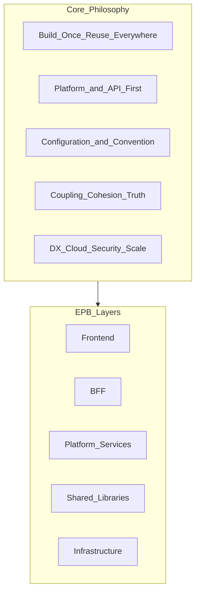

# Core Philosophy

> **Volume:** 1 | **Chapter ID:** v1-03 | **Status:** reviewed

## Purpose

Document the guiding principles that shape every architectural, engineering, and operational decision in EPB. These principles are non-negotiable — they resolve trade-offs when teams disagree and keep the platform generic, reusable, and maintainable.

## Overview

Philosophy is not decoration. When a team debates whether to add business logic to the BFF, fork a platform service for one customer, or expose a database entity directly in an API, the answer comes from these principles.

EPB philosophy clusters into four themes:

1. **Reuse and platform investment** — build once, consume everywhere
2. **Contracts and conventions** — define standards before code
3. **Structural discipline** — coupling, cohesion, and single sources of truth
4. **Operational excellence** — developer experience, cloud readiness, security, and scale

Every principle below appears in the master design. Teams should cite the relevant principle in Architecture Decision Records when making significant choices.

## Architecture

Philosophy flows from principles into layers and standards:

Principles constrain how layers interact. For example, **Loose Coupling** means the frontend never calls platform services directly. **Single Source of Truth** means DTOs live in shared libraries, not duplicated per service.

## Responsibilities

- Provide a shared vocabulary for architecture reviews and ADRs
- Resolve conflicts between speed and long-term platform health
- Keep the platform domain-neutral across all applications
- Guide Volume 2 service design and Volume 3 developer workflows

## Design Principles

EPB adopts thirteen core principles. Each includes rationale and practical application.

### Build Once. Reuse Everywhere.

Implement every cross-cutting capability once in the platform. Applications consume it through APIs and events — never reimplement.

**Application:** Authentication, notifications, scheduling, and file management are platform services. An inventory application and a patient portal both use the same notification platform.

### Reuse Everywhere.

A capability built for one application must be available to all applications without modification. Reuse is the return on platform investment.

**Application:** When one team builds a roster/scheduling engine, every application that needs appointments, shifts, or resource booking uses the same roster platform.

### Platform First.

Before writing application code, check whether the platform already provides the capability. Extend the platform when the need is generic; build application code only for domain-specific logic.

**Application:** A new export feature uses the platform import/export framework rather than a custom CSV parser in each service.

### API First.

Define contracts (OpenAPI schemas, event schemas, DTOs) before implementation. Consumers depend on stable interfaces, not internal structure.

**Application:** The BFF and platform services publish versioned API specifications. Breaking changes require a new major version.

### Configuration Over Customization.

Prefer runtime configuration and feature flags over per-customer code forks. Behavior differences should not require separate codebases.

**Application:** Tenant-specific notification templates override platform defaults through configuration, not by modifying notification service source code.

### Convention Over Configuration.

Establish sensible defaults so developers spend less time on boilerplate decisions. Configuration handles exceptions; conventions handle the common case.

**Application:** Every service uses the same folder structure, naming patterns, and response envelope without per-project setup meetings.

### Single Source of Truth.

Maintain one canonical definition for each concept — DTOs, entities, enums, error codes, configuration schemas. Duplication guarantees drift.

**Application:** Request and response models live in shared libraries. Services import them; they do not redefine their own copies.

### Loose Coupling.

Components interact through well-defined interfaces. A change in one service should not require changes in unrelated services. No direct database access across service boundaries.

**Application:** Service A calls Service B through its REST API or publishes an event — never by querying Service B's database tables.

### High Cohesion.

Each module, service, and layer should have a focused responsibility. Related logic stays together; unrelated logic moves elsewhere.

**Application:** The BFF handles aggregation and edge security. Business rules stay in application or platform services where they belong.

### Developer Experience First.

Standards exist to reduce cognitive load, not to create ceremony. Predictable structure, clear documentation, and consistent tooling let developers move fast without sacrificing quality.

**Application:** Volume 3 provides templates, checklists, and reference implementations so a new developer can create a compliant service in hours, not weeks.

### Cloud Native.

Design for containerized deployment, horizontal scaling, health checks, and infrastructure-as-code from the start. The platform runs equally well on-premises or in any cloud.

**Application:** Every service exposes health endpoints, runs in containers, and externalizes configuration for environment-specific deployment.

### Security by Design.

Security is embedded in architecture — not bolted on after release. Authentication, authorization, encryption, audit, and secrets management are platform concerns.

**Application:** The BFF enforces authentication on every request. Services never trust caller identity without validated tokens. Secrets never appear in source code.

### Scalability by Design.

Architect for growth from day one. Separate transactional and reporting paths, use asynchronous processing for heavy work, and avoid patterns that require coordinated scaling.

**Application:** Reporting queries run against a dedicated reporting store or service so analytics load never degrades transactional CRUD performance.

## Implementation Guidelines

1. Reference the relevant principle in every significant [ADR](34-architecture-decision-records.md)
2. Use principles as review checklist items in pull request templates
3. When two principles conflict (e.g., speed vs. Platform First), Platform First and Single Source of Truth take precedence for generic capabilities
4. Onboard new team members by walking through this chapter before they write code
5. Revisit principles annually — they are stable but not immutable; changes require ADR and handbook update

## Best Practices

1. Print the thirteen principles where architecture reviews happen
2. Ask "Which principle applies?" when a design debate stalls
3. Reject shortcuts that violate Security by Design or Single Source of Truth — these are expensive to fix later
4. Measure Developer Experience First through onboarding time and time-to-first-PR for new hires
5. Link principle violations in code review comments so teams learn the rationale

## Anti-Patterns

| Anti-Pattern | Why It Fails | Preferred Approach |
|--------------|--------------|--------------------|
| Ignoring principles under deadline pressure | Creates debt that blocks every future application | Cite principle, document ADR if exception is unavoidable |
| Cherry-picking convenient principles | Inconsistent architecture across services | Apply the full set; principles reinforce each other |
| Platform First without API First | Rushed implementations with unstable contracts | Define contracts before coding |
| Configuration Over Customization taken to extremes | Over-abstracted systems nobody understands | Use configuration for tenant behavior; use code for genuine domain logic |
| Loose Coupling without High Cohesion | Distributed monolith with chatty services | Keep services focused; couple only through defined interfaces |

## Related Chapters

- [Previous: Platform Objective](02-platform-objective.md)
- [Next: Scope and Domain Neutrality](04-scope-and-domain-neutrality.md)
- [Platform First Design](36-platform-first-design.md)
- [API First Design](37-api-first-design.md)
- [Cloud Native Principles](38-cloud-native-principles.md)
- [EPB Glossary](../docs/GLOSSARY.md)

---

*Enterprise Platform Blueprint — Volume 1*
