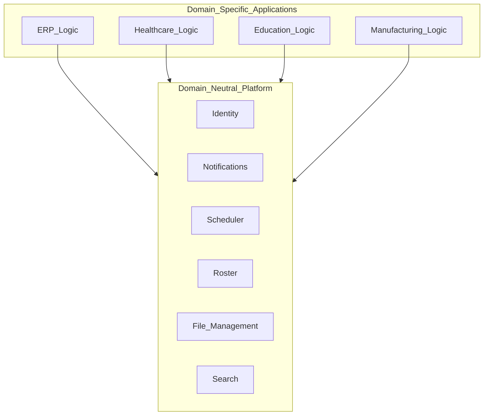

# Scope and Domain Neutrality

> **Volume:** 1 | **Chapter ID:** v1-04 | **Status:** reviewed

## Purpose

Define what EPB includes, what it excludes, and how the platform remains usable across every enterprise domain without embedding business-specific assumptions.

## Overview

A platform that assumes one industry cannot serve another. An authentication service that hard-codes "employee" as the only user type fails for patient portals. A scheduling engine built only for hospital appointments cannot serve shift management in manufacturing.

**EPB must remain completely generic.** It must never assume a business domain. Every abstraction — user, resource, entity, organization, tenant — uses neutral terminology that maps to any industry.

The platform works equally well for:

- ERP and CRM
- Hospital and school management
- Manufacturing and logistics
- HRMS, banking, and insurance
- Government, retail, and e-commerce
- Any future enterprise application

Domain-specific concepts live exclusively in **application services**. The platform provides primitives; applications compose them into business meaning.

## Architecture

Domain neutrality is enforced by a strict boundary between platform and application:



Platform services know about **resources**, **users**, **events**, and **schedules** — not patients, students, invoices, or production orders. Applications map domain concepts onto platform primitives.

## Responsibilities

### In Scope (Platform)

Everything in the shared platform capabilities catalog:

- Identity, authentication, authorization, users, roles, permissions
- Configuration, feature flags, localization
- Logging, audit, monitoring, health checks
- Notifications, template engine, scheduler, roster
- Workflow engine, rule engine, search
- Dashboard engine, report engine, document engine
- File management, import, export, queue, cache, event bus
- Integration framework, master data, validation, exception handling
- Response formatting, pagination, sorting, filtering, bulk operations

These are **reusable platform capabilities**, not business implementations.

### Out of Scope (Application)

- Domain business rules (pricing logic, clinical protocols, grading algorithms)
- Industry-specific workflows that do not generalize
- Regulatory interpretations tied to a single jurisdiction or industry
- UI screens specific to one product's user journeys

### Neutrality Rules

| Rule | Example |
|------|---------|
| Use generic nouns | `resource`, `entity`, `party`, `organization` — not `patient`, `student`, `invoice` |
| Parameterize domain labels | Display names come from configuration or localization, not hard-coded strings |
| Avoid industry enums in platform | Platform defines `status: ACTIVE \| INACTIVE`; applications define domain-specific status values |
| Extension points over forks | Applications customize through hooks and plugins, not platform code changes |

## Design Principles

| Principle | Domain Neutrality Application |
|-----------|------------------------------|
| Platform First | Generic capabilities live in platform; domain logic stays in applications |
| Configuration Over Customization | Industry-specific labels and rules are configured, not coded into platform |
| Single Source of Truth | Master data service holds reference data; applications reference it |
| Loose Coupling | Platform services have no compile-time dependency on application code |

## Implementation Guidelines

### Naming for Neutrality

Platform APIs and database schemas use neutral terms:

```text
# Platform (neutral)
GET /api/v1/resources/{id}
GET /api/v1/parties/{id}
POST /api/v1/roster/availability

# Application (domain-specific, in application services)
GET /api/v1/patients/{id}        # healthcare application
GET /api/v1/students/{id}        # education application
GET /api/v1/production-orders/{id}  # manufacturing application
```

### The Neutrality Test

Before adding anything to the platform, ask:

1. Would this make sense for a hospital **and** a bank **and** a school?
2. Does this encode business rules that only one industry needs?
3. Can this be expressed as a generic primitive with domain mapping in the application layer?

If the answer to question 1 is no, or question 2 is yes, it belongs in an application service.

### Master Data and Localization

Industry-specific terminology appears in:

- **Localization files** — "Patient" vs "Student" vs "Customer" as display labels
- **Application configuration** — domain entity names, form labels, report titles
- **Application services** — business validation and workflow logic

The platform provides the localization framework; applications supply the domain vocabulary.

## Best Practices

1. Review platform pull requests with the neutrality test
2. Maintain a glossary of platform terms vs application terms per product
3. Use generic examples in all Volume 1 and Volume 2 documentation
4. Design roster, workflow, and rule engines with pluggable domain models
5. Reject feature requests that embed one customer's industry into platform code

## Anti-Patterns

| Anti-Pattern | Why It Fails | Preferred Approach |
|--------------|--------------|--------------------|
| `Patient` table in identity service | Locks platform to healthcare | Application service owns domain entities; platform owns `user` |
| Industry-specific validation in platform | Other domains inherit irrelevant rules | Application-layer validation for domain rules |
| Hard-coded business enums in shared libraries | Every new domain requires library changes | Generic enums in platform; domain enums in applications |
| One application's shortcuts become platform defaults | Platform drifts toward a single product | ADR and architecture review for every platform addition |
| Domain examples in platform documentation | Teams copy industry-specific patterns | Use neutral examples: resource, entity, organization |

## Related Chapters

- [Previous: Core Philosophy](03-core-philosophy.md)
- [Next: Architecture Principles](05-architecture-principles.md)
- [Platform Services Layer](09-platform-services-layer.md)
- [EPB Glossary](../docs/GLOSSARY.md)

---

*Enterprise Platform Blueprint — Volume 1*
