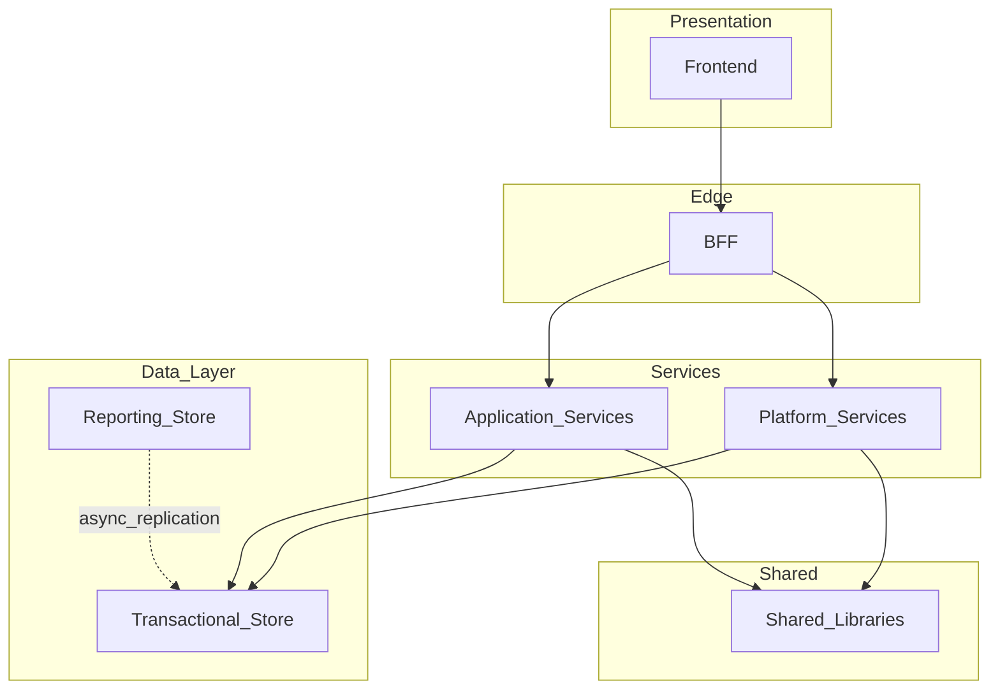

# Architecture Principles

> **Volume:** 1 | **Chapter ID:** v1-05 | **Status:** reviewed

## Purpose

Establish the structural rules that govern how EPB components are organized, how they communicate, and how data flows through the system. These principles translate [Core Philosophy](03-core-philosophy.md) into enforceable architecture constraints.

## Overview

Good architecture is not about diagrams — it is about constraints that keep systems maintainable as they grow. EPB architecture rests on six foundational rules:

1. **Layered architecture** with strict dependency direction
2. **Model separation** — never use one model for every layer
3. **Read/write separation** — distinct paths for queries and mutations
4. **Transactional vs reporting separation** — analytics must not slow operations
5. **Independent services** — each service owns its data and deploys independently
6. **API and event integration only** — no cross-service database access

Violating any of these principles creates coupling that compounds with every new application.

## Architecture



### Layered Architecture

The canonical stack from [Layered Architecture](06-layered-architecture.md):

```text
Frontend → BFF → Platform Services → Shared Libraries → Infrastructure
```

No layer skips its neighbor. The frontend never calls platform services directly. Shared libraries never depend on services.

### Model Separation

Maintain separate models for each concern — see [Model Separation](11-model-separation.md):

| Model | Purpose |
|-------|---------|
| Request DTO | Incoming API payload validation |
| Response DTO | Outgoing API representation |
| Transaction Model | Business processing within a service |
| Domain Model | Rich business logic within service boundary |
| Persistence Entity | Database mapping — never exposed via API |

Mappers convert between types. Complex response DTOs combine data from multiple entities.

### Read/Write Separation

Separate read and write operations per [Read Write Separation](12-read-write-separation.md):

| Path | HTTP Methods | Characteristics |
|------|--------------|-----------------|
| Write | POST, PUT, PATCH, DELETE | Validation, business rules, transactions |
| Read | GET | Optimized queries, caching, pagination |

Eventually the architecture supports full CQRS with separate read models. Even before that, read endpoints must not execute write side effects.

### Transactional vs Reporting

Per [Transactional vs Reporting](13-transactional-vs-reporting.md):

| Concern | Transactional | Reporting |
|---------|---------------|-----------|
| Purpose | CRUD, business processing, workflow | Dashboards, analytics, aggregation |
| Store | Primary transactional database | Reporting store or pipeline |
| Performance | Low latency, ACID where required | Batch-friendly, eventually consistent |
| Impact | Must never be slowed by reports | Must never block transactions |

Reporting queries run against dedicated infrastructure. Heavy aggregations never execute on the transactional database during peak load.

### Independent Services

Per [Independent Services](14-independent-services.md), every service:

- Owns its business logic
- Owns its data (database, cache keys, file prefixes)
- Deploys independently
- Follows identical project standards
- Communicates through standard APIs or events

**Never allow one service to access another service's database.** This is the most commonly violated principle and the hardest to undo.

## Responsibilities

- Enforce dependency rules across all repositories
- Define where domain logic may and may not live
- Separate operational and analytical workloads
- Ensure services remain independently deployable and testable

## Design Principles

| Principle | Architectural Expression |
|-----------|---------------------------|
| Loose Coupling | Services communicate via API/event only |
| High Cohesion | BFF aggregates; services process; libraries define contracts |
| Single Source of Truth | Shared libraries hold canonical DTOs and entities |
| API First | Service boundaries are API boundaries |
| Scalability by Design | Read/write and transactional/reporting separation |
| Security by Design | BFF is the security enforcement point |

## Implementation Guidelines

1. **BFF as sole frontend entry** — all browser and mobile traffic enters through the BFF
2. **No entity leakage** — persistence entities never appear in API responses; map to response DTOs
3. **Synchronous for commands, async for side effects** — use the event bus for notifications, audit, and reporting updates
4. **Database per service** — each service has its own schema or database instance
5. **Idempotent consumers** — event handlers must tolerate duplicate delivery
6. **Health and readiness** — every service exposes `/health` and `/ready` endpoints

### Communication Patterns

| Pattern | Use When |
|---------|----------|
| Synchronous REST | Request/response, immediate consistency required |
| Asynchronous events | Side effects, notifications, audit, reporting sync |
| BFF aggregation | Client needs data from multiple services in one response |

### Data Flow Example

A resource update flows through the architecture:

```text
1. Frontend sends PATCH to BFF
2. BFF validates auth, maps to request DTO
3. BFF calls Application Service API
4. Service validates, maps to domain model, persists entity
5. Service publishes ResourceUpdated event
6. Notification service consumes event, sends message
7. Reporting pipeline consumes event, updates reporting store
8. Service returns response DTO to BFF
9. BFF maps to client response envelope
```

## Best Practices

1. Draw service boundary diagrams before writing code
2. Review database migrations for cross-service foreign keys — they indicate coupling
3. Load-test reporting paths separately from transactional paths
4. Use correlation IDs across all layers for distributed tracing
5. Document service dependencies in each service's README

## Anti-Patterns

| Anti-Pattern | Why It Fails | Preferred Approach |
|--------------|--------------|--------------------|
| Shared database between services | Hidden coupling, cannot deploy independently | Database per service; integrate via API/events |
| Fat BFF with business logic | BFF becomes unmaintainable monolith | BFF aggregates and secures; logic stays in services |
| Single model for API and database | Schema changes break clients; exposes internals | Separate DTOs and entities with mappers |
| Reporting queries on transactional DB | Analytics degrades user-facing operations | Dedicated reporting store or service |
| Frontend calling services directly | Bypasses security, duplicates client logic | All client traffic through BFF |
| Distributed transactions (2PC) across services | Fragile, slow, hard to debug | Saga pattern or eventual consistency via events |

## Related Chapters

- [Previous: Scope and Domain Neutrality](04-scope-and-domain-neutrality.md)
- [Next: Layered Architecture](06-layered-architecture.md)
- [Model Separation](11-model-separation.md)
- [Read Write Separation](12-read-write-separation.md)
- [Transactional vs Reporting](13-transactional-vs-reporting.md)
- [Independent Services](14-independent-services.md)
- [EPB Glossary](../docs/GLOSSARY.md)

---

*Enterprise Platform Blueprint — Volume 1*
