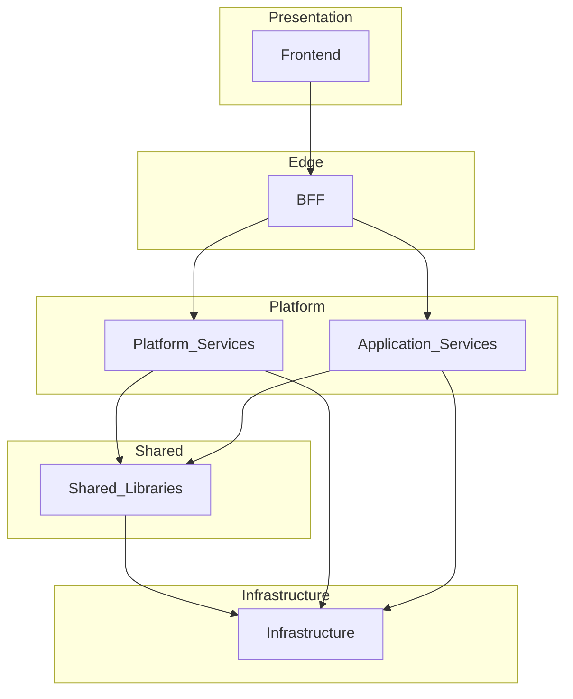

# Layered Architecture

> **Volume:** 1 | **Chapter ID:** v1-06 | **Status:** reviewed

## Purpose

Define the canonical five-layer stack for EPB and explain how each layer interacts, what it owns, and what it must never do. Layered architecture is the structural backbone that lets the platform be built once and consumed by unlimited applications.

## Overview

Enterprise applications accumulate complexity quickly: authentication, notifications, scheduling, reporting, and dozens of other capabilities recur across every product. Without a disciplined layer model, teams duplicate logic, leak persistence details into APIs, and couple frontends directly to internal services.

EPB adopts a strict layered architecture where each tier has a single, well-defined role. Applications built on the platform inherit this structure automatically. Domain-specific code lives only in application services; everything else is provided by shared platform capabilities below the application boundary.

The layer stack is fixed:

```text
Frontend → BFF → Platform Services → Shared Libraries → Infrastructure
```

No layer skips its neighbor. No layer reaches into a layer two steps away. This constraint is not bureaucratic — it is what makes independent deployment, consistent security, and long-term maintainability possible.

## Architecture



**Frontend** renders the user interface and manages client-side state. It communicates exclusively with the BFF.

**BFF (Backend For Frontend)** is the only entry point for frontend traffic. It handles authentication, authorization, request validation, API aggregation, response mapping, and routing.

**Platform Services** deliver reusable capabilities — identity, notifications, scheduling, search, document management, and the full catalog documented in Volume 2. **Application Services** sit at the same architectural tier but contain domain-specific business logic for a particular product.

**Shared Libraries** hold the single source of truth for DTOs, entities, interfaces, validators, enums, and mapper contracts. Every service depends on shared libraries; shared libraries never depend on services.

**Infrastructure** provides runtime concerns: containers, databases, caches, queues, object storage, secrets, monitoring, and CI/CD pipelines.

### Dependency Rules

| Layer | May Depend On | Must Not Depend On |
|-------|---------------|-------------------|
| Frontend | BFF (via HTTP) | Platform Services, databases |
| BFF | Platform/Application Services | Databases, other BFF internals |
| Platform/Application Services | Shared Libraries, Infrastructure | Frontend, BFF |
| Shared Libraries | Infrastructure primitives only | Any service |
| Infrastructure | — | Application logic |

Violating these rules — for example, letting a frontend call a platform service directly — breaks the abstraction boundary and forces every client to understand backend topology.

## Responsibilities

Each layer owns specific concerns and rejects everything else.

- **Frontend** — UI rendering, client state, input validation for UX, session presentation, API communication with BFF only
- **BFF** — edge security, auth enforcement, request shaping, response aggregation, standard envelopes
- **Platform Services** — generic reusable capabilities with no domain assumptions
- **Application Services** — domain business rules, workflows, and entity lifecycle for one product
- **Shared Libraries** — canonical type definitions and contracts consumed by all services
- **Infrastructure** — deployment, persistence engines, messaging brokers, observability backends

Cross-cutting capabilities (logging, audit, error formatting, pagination) are implemented once in platform services or shared libraries and consumed everywhere — never reimplemented per application.

## Design Principles

1. **Platform First** — before writing application code, check whether a platform service already provides the capability
2. **API First** — layers communicate through defined contracts (HTTP APIs, events), never through shared database tables
3. **Loose Coupling, High Cohesion** — each layer changes independently; components within a layer share a single purpose
4. **Single Source of Truth** — DTOs and entities live in shared libraries, not duplicated per service
5. **Convention Over Configuration** — identical folder structure, naming, and API patterns across every service
6. **Security by Design** — auth is enforced at the BFF; services trust internal network policies but still validate tenant context

## Implementation Guidelines

1. Map every new feature to a layer before writing code. If it is reusable across applications, it belongs in a platform service. If it is product-specific, it belongs in an application service.
2. Follow [Folder Structure](23-folder-structure.md) so every service at the same layer looks identical.
3. Apply [API Standards](18-api-standards.md) for all HTTP boundaries between layers.
4. Document significant layer decisions in [Architecture Decision Records](34-architecture-decision-records.md).
5. When a team proposes skipping a layer (e.g., frontend → platform service), require an ADR with explicit trade-off analysis.

### Onboarding Checklist for New Services

```text
1. Identify layer (platform vs application)
2. Create project from standard template
3. Reference shared library package for DTOs/entities
4. Register service in API gateway / service mesh
5. Wire BFF routes (never expose service URL to frontend)
6. Add health check and structured logging
```

## Best Practices

1. Keep layers thin — a layer that grows every unrelated concern becomes a monolith
2. Version shared libraries independently; services pin to compatible versions
3. Use the event bus for asynchronous cross-service communication instead of synchronous chains through the BFF
4. Design multi-tenant isolation at the platform service layer so applications inherit it
5. Test each layer's contract independently: frontend against BFF mocks, BFF against service stubs, services against integration databases

## Anti-Patterns

| Anti-Pattern | Why It Fails | Preferred Approach |
|--------------|--------------|--------------------|
| Frontend calls platform services directly | Exposes internal topology, bypasses auth edge, creates N+1 client calls | All client traffic through BFF |
| Shared library contains business logic | Couples all consumers to one domain; library becomes unmaintainable | Business logic in application/platform services only |
| BFF accesses databases | Blurs edge and data layers; duplicates persistence logic | BFF calls services; services own data |
| Skipping shared libraries | Divergent DTOs, mapping bugs, contract drift | Single canonical package |
| Monolithic "god service" spanning layers | Cannot scale or deploy independently | Split by layer and domain boundary |
| Infrastructure logic in application code | Environment coupling, untestable deployments | Inject infrastructure via configuration |

## Related Chapters

- [Previous: Architecture Principles](05-architecture-principles.md)
- [Next: Frontend Layer](07-frontend-layer.md)
- [Backend For Frontend (BFF)](08-bff-layer.md)
- [Platform Services Layer](09-platform-services-layer.md)
- [Shared Libraries](10-shared-libraries.md)
- [EPB Glossary](../docs/GLOSSARY.md)

---

*Enterprise Platform Blueprint — Volume 1*
