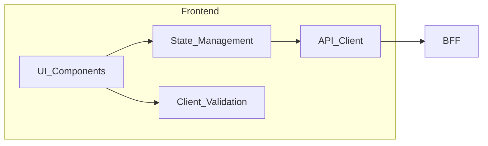
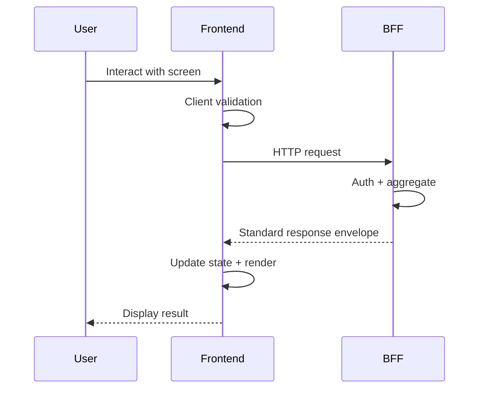

# Frontend Layer

> **Volume:** 1 | **Chapter ID:** v1-07 | **Status:** reviewed

## Purpose

Define the responsibilities, boundaries, and standards for the Frontend layer — the user-facing presentation tier that communicates exclusively with the BFF and never reaches into platform or application services directly.

## Overview

The frontend is what users experience: screens, forms, navigation, feedback, and responsiveness. In EPB, the frontend is deliberately constrained. It renders UI, manages client-side state, performs UX-level validation, and calls the BFF. It does not enforce authorization rules, execute business workflows, or decide how data is persisted.

This separation keeps the frontend replaceable. A web application, mobile app, and admin portal can share the same backend platform while each frontend optimizes for its device and interaction model. Framework choice (React, Vue, Angular, native mobile) is an implementation detail; the architectural contract is identical.

EPB treats developer experience as a first-class concern. Frontends consume predictable BFF APIs with standard response envelopes, so client code focuses on presentation rather than parsing inconsistent backend formats.

## Architecture





The frontend never appears in the right half of the second diagram. If a frontend developer needs data from two backend sources, the BFF aggregates — the frontend makes one call.

## Responsibilities

### In Scope

- **UI rendering** — layouts, components, themes, accessibility, responsive design
- **State management** — screen-level and session-level client state (form drafts, navigation, cached lists)
- **Client-side validation** — immediate feedback on required fields, formats, and ranges before submission
- **Authentication presentation** — login screens, token storage, session refresh UX, logout flows
- **API communication** — HTTP client configured for BFF base URL, correlation IDs, and standard envelopes
- **User experience** — loading states, optimistic updates, error messages mapped from BFF responses, empty states

### Out of Scope

- Authorization enforcement (BFF and services decide permissions)
- Business rule execution (e.g., eligibility, pricing, approval logic)
- Direct calls to platform or application services
- Database access or file system persistence beyond client cache
- Notification delivery (frontend displays in-app notifications; platform sends them)
- Server-side scheduling or batch processing

Client validation complements server validation; it never replaces it. A malicious client can bypass browser checks, so the BFF and services always re-validate.

## Design Principles

1. **BFF-only backend access** — configure the API client with one base URL; no service discovery in the frontend
2. **Thin client** — prefer fetching rendered-ready data from BFF over complex client-side joins
3. **Configuration over customization** — screen layouts and feature visibility driven by configuration/feature flags from platform services
4. **Consistent error handling** — map BFF error codes to user-friendly messages via a single error handler
5. **Tenant-aware UI** — branding, locale, and timezone come from tenant configuration, not hard-coded defaults
6. **Accessibility and i18n from day one** — localization strings from platform master data, not embedded literals

## Implementation Guidelines

1. Structure projects per [Folder Structure](23-folder-structure.md) frontend conventions.
2. Use [API Standards](18-api-standards.md) response shapes — parse `data`, `errors`, and pagination metadata uniformly.
3. Store auth tokens per [Security Foundation](21-security-foundation.md) — secure storage on mobile, httpOnly cookies or memory on web where applicable.
4. Propagate correlation IDs on every BFF request for [Logging Standards](20-logging-standards.md) traceability.
5. Handle errors per [Error Handling](19-error-handling.md) — never expose raw stack traces to users.

### Standard Screen Data Flow

```text
1. Screen mounts → read client cache if fresh
2. Fetch from BFF endpoint (single aggregated call)
3. On success → update state, render
4. On validation error → highlight fields from BFF field-level errors
5. On auth error → redirect to login
6. On server error → show safe message, log correlation ID
```

### Multi-Client Strategy

| Client Type | Typical BFF | Frontend Focus |
|-------------|-------------|----------------|
| Web application | Web BFF | Full feature set, keyboard navigation |
| Mobile app | Mobile BFF | Touch UX, offline-tolerant reads, push registration |
| Admin portal | Admin BFF | Bulk operations, audit views, configuration screens |

Each client type may have a dedicated BFF that shapes responses for its screens, but all frontends follow the same EPB frontend standards.

## Best Practices

1. Debounce search inputs; let the platform search service handle indexing — do not filter large lists client-side
2. Use optimistic UI only when the BFF documents idempotent or safely reversible operations
3. Paginate list screens using standard pagination parameters — never request unbounded datasets
4. Feature-gate experimental screens via platform feature flags, not compile-time branches
5. Keep bundle size manageable — lazy-load routes; shared design system components across applications
6. Test with BFF contract mocks; run end-to-end tests against staging BFF, not individual services

## Anti-Patterns

| Anti-Pattern | Why It Fails | Preferred Approach |
|--------------|--------------|--------------------|
| Frontend calls platform services directly | Security bypass, coupling to internal URLs, inconsistent auth | Single BFF entry point |
| Business logic in UI components | Duplicated across web/mobile, untestable, divergent behavior | BFF aggregates; services compute |
| Hard-coded API URLs per service | Deployment fragility, impossible client updates | One BFF base URL via configuration |
| Client-only authorization checks | Trivially bypassed | BFF enforces; UI hides disabled actions as UX only |
| Storing sensitive data in localStorage | XSS exposure | Secure token storage per security standards |
| Giant global state store | Unrelated screens coupled, hard to debug | Screen-scoped or feature-scoped state |
| Ignoring BFF error envelope | Inconsistent user messaging, lost field errors | Central error mapper |

## Related Chapters

- [Previous: Layered Architecture](06-layered-architecture.md)
- [Next: Backend For Frontend (BFF)](08-bff-layer.md)
- [API Standards](18-api-standards.md)
- [Error Handling](19-error-handling.md)
- [EPB Glossary](../docs/GLOSSARY.md)

---

*Enterprise Platform Blueprint — Volume 1*
