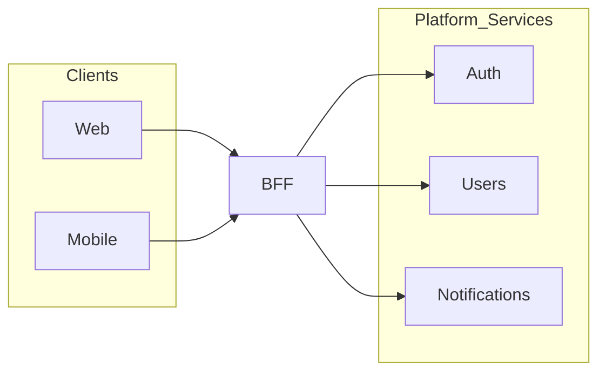

# Backend For Frontend (BFF)

> **Volume:** 1 | **Chapter ID:** v1-08 | **Status:** reviewed

## Purpose

Define the BFF as the **only entry point** for frontend applications, responsible for authentication, aggregation, validation, and response mapping.

## Overview

Frontends should not call platform services directly. Doing so exposes clients to service topology changes, inconsistent auth, and N+1 network calls. The BFF (Backend For Frontend) sits between UI clients and backend services.

Each frontend application (web, mobile, admin portal) may have its own BFF tailored to its screen needs — but all BFFs follow the same EPB standards.

## Architecture



## Responsibilities

### In Scope

- **Authentication** — validate tokens/sessions on every request
- **Authorization** — enforce permissions before calling backend
- **Request validation** — reject malformed input at the edge
- **API aggregation** — combine multiple service calls into one client response
- **Response mapping** — transform service DTOs to frontend-friendly shapes
- **Standard responses** — uniform success/error envelopes
- **Error handling** — map service errors to client-safe messages
- **Logging** — correlation IDs across all downstream calls
- **Security** — rate limiting, CORS, security headers
- **Request routing** — route to correct platform/application services

### Out of Scope

- Business logic (belongs in application/platform services)
- Direct database access (never)
- Long-running batch processing (use scheduler)

## Design Principles

1. **Thin BFF** — orchestration and mapping only
2. **One BFF per client type** when screen needs differ significantly
3. **No shared database** — BFF is stateless except session cache
4. **Fail fast** — validate auth before any downstream call

## Implementation Guidelines

### Standard Request Flow

```text
1. Receive HTTP request
2. Authenticate (reject 401 if invalid)
3. Authorize (reject 403 if insufficient)
4. Validate request DTO
5. Call one or more backend services (parallel when possible)
6. Map to response DTO
7. Return standard envelope
```

### Aggregation Example

A "user dashboard" screen may need data from Users, Notifications, and Scheduler services. The BFF makes three parallel internal calls and returns one combined response — the frontend makes one HTTP request.

## Best Practices

1. Cache read-heavy aggregated responses with TTL
2. Use circuit breakers when calling downstream services
3. Propagate correlation ID to all service calls
4. Version BFF APIs independently from backend services
5. Never expose internal service URLs to clients

## Anti-Patterns

| Anti-Pattern | Why It Fails | Preferred Approach |
|--------------|--------------|--------------------|
| Business rules in BFF | Duplicated logic, untestable | Move to domain services |
| Frontend calls services directly | Coupling, security gaps | All traffic through BFF |
| God BFF for all clients | Unmaintainable API surface | Separate BFFs per client type |
| Synchronous chains of 10+ calls | Latency, cascading failures | Aggregate in parallel; use events |

## Related Chapters

- [Previous: Frontend Layer](07-frontend-layer.md)
- [Next: Platform Services Layer](09-platform-services-layer.md)
- [API Standards](18-api-standards.md)
- [EPB Glossary](../docs/GLOSSARY.md)

---

*Enterprise Platform Blueprint — Volume 1*
