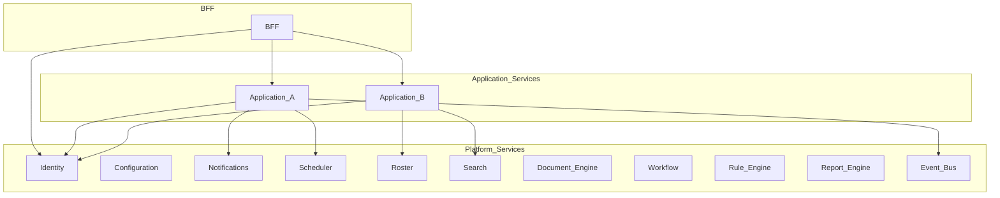

# Platform Services Layer

> **Volume:** 1 | **Chapter ID:** v1-09 | **Status:** reviewed

## Purpose

Define the Platform Services layer — the catalog of reusable, domain-neutral capabilities that every application consumes instead of reimplementing. Platform services are the practical expression of "Build Once. Reuse Everywhere."

## Overview

Application teams should spend their time on domain-specific business logic: how a resource is approved, how an order transitions state, how a tenant configures a workflow. They should not rebuild authentication, notification delivery, scheduling, search, or document generation for every product.

The Platform Services layer provides these capabilities as independently deployable services with standard APIs, identical project structure, and clear extension points. A hospital management product and a retail ERP both use the same notification platform, the same scheduler, and the same identity service — configured differently, never forked.

Platform services are generic. They never encode assumptions about a single industry. The roster platform supports appointments, shift scheduling, resource booking, and calendar management because those patterns recur across domains — not because EPB is a scheduling product.

Volume 2 documents each platform service in depth. This chapter establishes the layer's role, boundaries, and organizational model within the overall architecture.

## Architecture



Platform services sit between the BFF/application tier and shared libraries. Application services call platform services through APIs or events. Platform services never call application services — dependency flows downward and sideways, never upward into domain code.

## Responsibilities

### Platform Capability Catalog

The following capabilities are implemented as platform services, not per-application code:

| Category | Capabilities |
|----------|-------------|
| Identity | Authentication, authorization, users, roles, permissions |
| Configuration | Tenant settings, feature flags, environment configuration |
| Observability | Logging, audit trails, monitoring, health checks |
| Messaging | Notifications (email, SMS, push, in-app), template engine |
| Orchestration | Scheduler (cron, retry, queue processing), workflow engine, rule engine |
| Data access patterns | Pagination, sorting, filtering, global search, bulk operations |
| Content | Document engine, file management, import/export |
| Scheduling | Roster (availability, bookings, conflict detection, reminders) |
| Analytics infrastructure | Dashboard engine, report engine (see [Transactional vs Reporting](13-transactional-vs-reporting.md)) |
| Integration | Event bus, queue, cache, integration framework |
| Reference data | Master data, localization |

### In Scope for Every Platform Service

- Own its data store (no shared tables with other services)
- Expose versioned HTTP APIs per [API Standards](18-api-standards.md)
- Publish domain events where asynchronous notification is appropriate
- Implement health checks, structured logging, and tenant isolation
- Follow identical [Folder Structure](23-folder-structure.md) and [Naming Conventions](24-naming-conventions.md)
- Document extension points for application customization

### Out of Scope

- Domain-specific business rules (belong in application services)
- UI rendering or BFF aggregation logic
- Direct exposure to frontend clients (BFF mediates)
- Cross-service database queries

### Notification Example

Business logic publishes a notification event: "resource approved for tenant X." The notification platform resolves the template chain — platform default, optional tenant override, final message — and delivers via the configured channel. Application code never formats email HTML or manages SMTP credentials.

## Design Principles

1. **Platform First** — if two applications need the same capability, it becomes a platform service
2. **Configuration Over Customization** — tenants configure behavior; they do not fork service code
3. **API First** — contract published before implementation; consumers depend on interfaces
4. **Independent deployability** — each service releases on its own cadence without coordinated downtime
5. **Event-driven integration** — prefer events for fire-and-forget side effects (notifications, audit, search indexing)
6. **Extension points** — applications plug in via configuration, registered handlers, or plugins — not by modifying platform source

## Implementation Guidelines

1. Create new platform services only when a capability is genuinely cross-application. Domain-specific logic stays in application services even if only one product exists today — premature platformization wastes effort.
2. Register every service in the platform service catalog with ownership, SLA, and API version.
3. Use shared library packages for DTOs and event schemas — never define duplicate types in the service.
4. Implement [Model Separation](11-model-separation.md) — persistence entities never leak through APIs.
5. Apply [Read/Write Separation](12-read-write-separation.md) at the API design level from the start.
6. Test per [Testing Standards](27-testing-standards.md) — contract tests for APIs, integration tests for persistence.

### Service Interaction Patterns

```text
Synchronous:  Application Service → HTTP → Platform Service → response
Asynchronous: Application Service → Event Bus → Platform Service(s) → side effects
Never:        Platform Service → Application Service database
Never:        Service A → Service B database
```

## Best Practices

1. Keep platform service APIs stable; add fields compatibly; deprecate with version headers
2. Design idempotent write endpoints so event retries and scheduler jobs are safe
3. Scope every operation by tenant ID — platform services are multi-tenant by default
4. Return [Standard Response](../docs/GLOSSARY.md) envelopes with consistent error codes
5. Expose admin APIs for configuration separately from runtime APIs used during business processing
6. Cache read-heavy configuration (feature flags, templates) with tenant-scoped TTL
7. Document each service in Volume 2 before or alongside implementation

## Anti-Patterns

| Anti-Pattern | Why It Fails | Preferred Approach |
|--------------|--------------|--------------------|
| Domain logic in platform services | Service becomes unusable for other applications | Generic capability + application extension |
| Shared database between services | Coupling, scaling limits, schema migration conflicts | API or event integration; own data per service |
| Platform service calls application service | Circular dependency, deployment ordering nightmares | Events for upstream notification |
| One mega "common" service | Monolith disguised as microservices | Split by capability boundary |
| Skipping tenant isolation | Data leaks across customers | Tenant ID on every query and event |
| Synchronous notification delivery in request path | Latency spikes, cascading failures | Publish event; notification service delivers async |
| Per-application notification code | Inconsistent templates, duplicate channel integrations | Central notification platform |

## Related Chapters

- [Previous: Backend For Frontend (BFF)](08-bff-layer.md)
- [Next: Shared Libraries](10-shared-libraries.md)
- [Independent Services](14-independent-services.md)
- [Transactional vs Reporting](13-transactional-vs-reporting.md)
- Volume 2 — individual platform service chapters
- [EPB Glossary](../docs/GLOSSARY.md)

---

*Enterprise Platform Blueprint — Volume 1*
