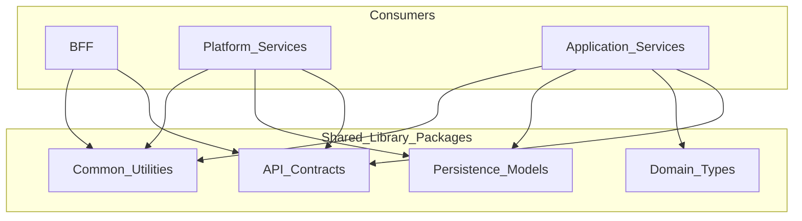

# Shared Libraries

> **Volume:** 1 | **Chapter ID:** v1-10 | **Status:** reviewed

## Purpose

Define the Shared Libraries layer as the single source of truth for types, contracts, and cross-service definitions. Shared libraries eliminate duplicate DTOs, inconsistent enums, and divergent validation rules across platform and application services.

## Overview

In a multi-service platform, the fastest way to introduce bugs is to let every team define their own request shape for "create resource" or their own numeric codes for status values. Services compile independently but fail at runtime when field names, nullability, or enum mappings disagree.

EPB centralizes canonical definitions in shared library packages. Platform services, application services, and BFFs import the same artifacts. When a contract changes, the library version bumps, consumers update, and the compiler — not production traffic — catches mismatches.

Shared libraries are not a dumping ground for business logic. They contain types, interfaces, constants, validators, and mapper contracts. Behavior that orchestrates workflows, calls databases, or enforces domain rules belongs in services.

## Architecture



Packages may be split by concern to keep dependency graphs lean — a BFF importing API contracts should not pull in database entity annotations if avoidable.

## Responsibilities

### Contents of Shared Libraries

| Artifact | Purpose |
|----------|---------|
| Request DTOs | Incoming API payload shapes with validation annotations |
| Response DTOs | Outgoing API payload shapes; stable public contract |
| Transaction models | Structures passed through business processing pipelines |
| Persistence entities | Database-mapped models; never exposed on public APIs |
| Interfaces | Service contracts, repository abstractions, mapper interfaces |
| Enums and constants | Status codes, type discriminators, configuration keys |
| Validators | Reusable validation rules shared across entry points |
| Common types | Identifiers, money, date ranges, tenant context carriers |
| Helpers | Pure functions with no infrastructure dependencies |
| Mapper contracts | Interface definitions for entity ↔ DTO conversion |
| Event schemas | Payload types for event bus messages |

### In Scope

- Defining canonical types consumed by two or more deployable components
- Versioning packages with semantic versioning
- Publishing migration notes when breaking changes occur
- Keeping types framework-agnostic where possible (plain classes, minimal annotations)

### Out of Scope

- Business workflow execution
- Database queries or ORM session management
- HTTP controllers or middleware
- Infrastructure configuration (connection strings, secrets)
- UI components

## Design Principles

1. **Single Source of Truth** — one definition per contract; no copy-paste DTOs in individual services
2. **Thin libraries** — types and pure utilities only; resist adding service behavior
3. **Stable outward contracts** — Response DTOs and event schemas change rarely and compatibly
4. **Separation of packages** — split API contracts from persistence models so consumers import only what they need
5. **Convention Over Configuration** — naming suffixes (`CreateResourceRequest`, `ResourceResponse`, `ResourceEntity`) are consistent across all domains
6. **Compile-time safety** — prefer shared types over untyped maps or generic JSON blobs at service boundaries

## Implementation Guidelines

1. Follow [DTO Standards](15-dto-standards.md) and [Entity Standards](16-entity-standards.md) for every type added to a library.
2. Apply [Naming Conventions](24-naming-conventions.md) — package names, class names, and field names match across the platform.
3. Implement [Model Separation](11-model-separation.md) — distinct types per layer; mappers live in services, contracts in libraries.
4. Version packages independently: `epb-contracts-v2` coexists during migration; consumers migrate explicitly.
5. Never expose persistence entities in API contract packages.

### Package Organization Example

```text
epb-common          → identifiers, pagination, standard response wrappers
epb-contracts       → request/response DTOs, event schemas
epb-domain-types    → shared domain value objects (optional, use sparingly)
epb-persistence     → entities and repository interfaces
```

### Change Management Workflow

```text
1. Propose contract change in ADR or API review
2. Update shared library with backward-compatible addition OR major version bump
3. Publish library to artifact repository
4. Update consumers in dependency order: services → BFF
5. Deprecate old fields with documented timeline
```

## Best Practices

1. Add optional fields to response DTOs rather than breaking renames — clients ignore unknown fields
2. Use enums for fixed sets; use string constants with validation for tenant-extensible values
3. Document each DTO field's purpose, nullability, and example value in library source or companion spec
4. Run contract compatibility checks in CI when library versions change
5. Keep validators in the library only when identical at BFF and service boundaries; domain-specific validation stays in services
6. Generate OpenAPI or JSON Schema from contract packages where tooling supports it — library remains the source

## Anti-Patterns

| Anti-Pattern | Why It Fails | Preferred Approach |
|--------------|--------------|--------------------|
| Duplicate DTO per service | Field drift, mapping bugs at integration | Shared contract package |
| Business logic in library | Every consumer inherits unwanted behavior; versioning breaks apps | Logic in services; types in library |
| Entity exposed as API response | Leaks schema, blocks API evolution, over-fetches data | Map entity → response DTO |
| God package importing everything | Slow builds, accidental transitive dependencies | Split by concern |
| Untyped JSON at service boundaries | Runtime failures, no refactor support | Shared event/DTO types |
| Frequent breaking major versions | Consumer upgrade fatigue | Compatible additions; rare majors |
| Library depends on service code | Circular dependency, impossible builds | Libraries are leaf dependencies |

## Related Chapters

- [Previous: Platform Services Layer](09-platform-services-layer.md)
- [Next: Model Separation](11-model-separation.md)
- [DTO Standards](15-dto-standards.md)
- [Entity Standards](16-entity-standards.md)
- [Naming Conventions](24-naming-conventions.md)
- [EPB Glossary](../docs/GLOSSARY.md)

---

*Enterprise Platform Blueprint — Volume 1*
