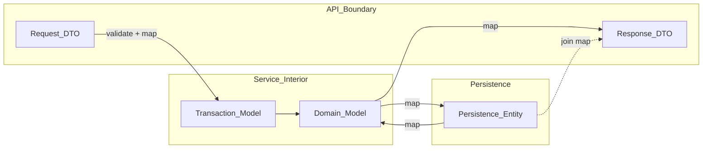
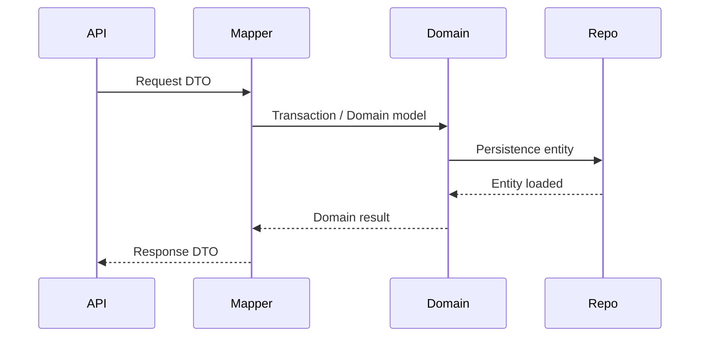

# Model Separation

> **Volume:** 1 | **Chapter ID:** v1-11 | **Status:** reviewed

## Purpose

Establish the requirement to maintain separate models for each architectural concern — request DTO, response DTO, transaction model, domain model, and persistence entity — with explicit mappers between them. One model for everything is an anti-pattern EPB rejects.

## Overview

A persistence entity mirrors database columns: nullable foreign keys, audit columns, soft-delete flags, and vendor-specific types. An API response should present a curated view: computed fields, nested summaries, and no internal identifiers users should not see. A write request accepts only the fields a client is allowed to change.

Using a single class for all of these forces compromises. Entities leak into JSON responses. API changes break database migrations. Business rules attach to types that also serialize to HTTP. Teams hesitate to evolve any layer because everything is coupled.

EPB mandates model separation at every service boundary. Mappers convert between types. Complex response DTOs assemble data from multiple entities — a list row might combine resource, owner, and status history without exposing full entity graphs.

## Architecture





## Responsibilities

### Model Types and Roles

| Model | Role | Travels Across |
|-------|------|----------------|
| Request DTO | Validates incoming write/read parameters | HTTP request → service entry |
| Response DTO | Stable outward contract; presentation shape | Service exit → HTTP response |
| Transaction model | Carries data through a single use case or command handler | Within service, one operation |
| Domain model | Encapsulates business rules and invariants | Service interior |
| Persistence entity | Maps to database tables | Repository layer only |

**Request DTO** — fields the client supplies. Validation annotations reject malformed input before business logic runs. Create and update requests are separate types when allowed fields differ.

**Response DTO** — fields the client receives. May include derived values (display name, aggregate counts) never stored directly. List responses use summary DTOs; detail screens use expanded DTOs.

**Transaction model** — optional intermediate shape for command pipelines, saga steps, or message payloads. Useful when the processing shape differs from both API input and persistence layout.

**Domain model** — rich behavior where the platform uses domain-driven patterns. Not every service requires heavy domain models; simple CRUD may map request DTO → entity with thin logic. EPB allows pragmatism inside the service while keeping API and persistence types separate.

**Persistence entity** — ORM-mapped or raw SQL row representation. Includes `tenant_id`, audit columns, and storage-specific details. Never returned from controllers.

### Mapper Responsibilities

Mappers are explicit components (classes or modules) that convert between model types. They:

- Map request DTO → transaction/domain model → entity on write
- Map entity(ies) → response DTO on read
- Combine multiple entities into one response (e.g., resource + organization name from join)
- Centralize null handling and field renaming so services stay readable

Mapper interfaces may live in shared libraries; implementations live in the service that owns the data.

## Design Principles

1. **Never one model everywhere** — if a type serves two layers, split it
2. **Response curation** — response DTOs expose what clients need, not database truth
3. **Write protection** — request DTOs omit fields clients must not set (internal status, tenant ID from token only)
4. **Mapper ownership** — the service that owns the entity owns the mapper
5. **Composable responses** — aggregate DTOs built from multiple repositories, mapped once at the edge of the use case
6. **Shared library for shapes** — DTO and entity class definitions live in libraries; mapping logic stays in services

## Implementation Guidelines

1. Define types per [DTO Standards](15-dto-standards.md) and [Entity Standards](16-entity-standards.md).
2. Place canonical class definitions in [Shared Libraries](10-shared-libraries.md); implement mappers in `mappers/` or equivalent per [Folder Structure](23-folder-structure.md).
3. Controllers accept and return DTOs only — no entity types in method signatures.
4. Repositories accept and return entities (or domain models) — no DTOs inside SQL layers.
5. For list endpoints, define `ResourceSummaryResponse` separate from `ResourceDetailResponse`.
6. Document cross-entity response assembly in the use case, not hidden inside generic mappers.

### Write Path

```text
HTTP body → Request DTO (validate)
         → Mapper.toTransactionModel()
         → Domain rules applied
         → Mapper.toEntity()
         → Repository.save()
         → Mapper.toResponseDTO()
         → HTTP response
```

### Read Path with Joins

```text
Repository.fetchResourceWithOwner() → ResourceEntity + OwnerEntity
         → Mapper.toDetailResponse(resource, owner)
         → HTTP response
```

## Best Practices

1. Keep mappers deterministic and side-effect free
2. Test mappers with fixture entities — mapping bugs are a common defect class
3. Use separate create and update request DTOs when updatable fields differ
4. Avoid circular mapping dependencies between services — each service maps its own entities
5. Version response DTOs additively; use new response types for breaking layout changes
6. Do not lazy-load entity graphs into response DTOs — explicit fetch, explicit map

## Anti-Patterns

| Anti-Pattern | Why It Fails | Preferred Approach |
|--------------|--------------|--------------------|
| Entity returned from API | Schema coupling, over-exposure, serialization leaks | Map to response DTO |
| Request DTO saved directly to database | Mass assignment vulnerabilities, invalid states | Map through domain rules |
| Single `Resource` class for all layers | Cannot evolve API or schema independently | Separate types per layer |
| Manual field copy in every method | Drift, missed fields | Dedicated mapper component |
| Response built from 20 lazy relations | N+1 queries, unpredictable performance | Explicit query + mapper |
| Mapper in shared library with DB access | Library depends on infrastructure | Mapper implementation in service |
| God DTO with 200 optional fields | Unclear contracts, validation nightmares | Summary vs detail DTOs |

## Related Chapters

- [Previous: Shared Libraries](10-shared-libraries.md)
- [Next: Read/Write Separation](12-read-write-separation.md)
- [DTO Standards](15-dto-standards.md)
- [Entity Standards](16-entity-standards.md)
- [EPB Glossary](../docs/GLOSSARY.md)

---

*Enterprise Platform Blueprint — Volume 1*
