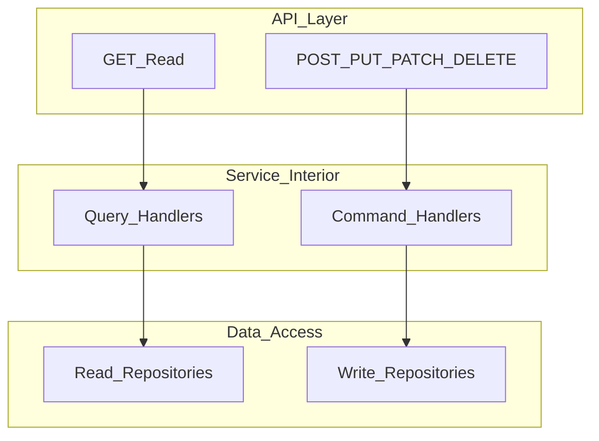
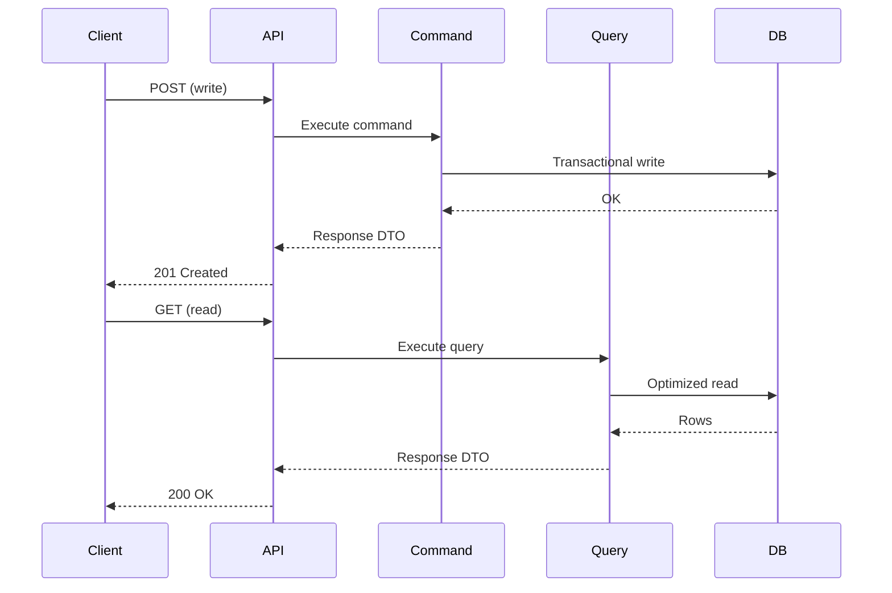

# Read/Write Separation

> **Volume:** 1 | **Chapter ID:** v1-12 | **Status:** reviewed

## Purpose

Define the architectural split between read operations (GET) and write operations (POST, PUT, PATCH, DELETE) at the API and service design level, as the foundation for eventual transactional and reporting path isolation.

## Overview

Read and write workloads behave differently. Writes enforce invariants, touch multiple tables, emit events, and require transactional consistency. Reads often scan large datasets, apply filters, sort, paginate, and tolerate slightly stale data. When both share identical code paths, query optimizations compete with write safety — and heavy reporting queries degrade CRUD latency.

EPB separates read and write concerns from the API boundary inward. HTTP method semantics align with operation type: GET for reads; POST, PUT, PATCH, DELETE for writes. Services structure use cases as commands (writes) and queries (reads) even before infrastructure splits onto separate databases.

This chapter covers the design-level separation that every service implements now. Physical separation of transactional and reporting stores is the next evolution, documented in [Transactional vs Reporting](13-transactional-vs-reporting.md).

## Architecture



At maturity, `ReadRepo` may point to read replicas or reporting stores while `WriteRepo` targets the primary transactional database — without changing the API surface.



## Responsibilities

### Read Path (GET)

- List, search, filter, sort, and paginate resources
- Fetch single resource detail for display
- Return response DTOs optimized for presentation
- Apply read-only authorization checks
- Use query-specific indexes and projections
- May cache results with TTL where staleness is acceptable
- Must not mutate state as a side effect of GET (no "GET that deletes")

### Write Path (POST, PUT, PATCH, DELETE)

- Create, update, partial update, and delete resources
- Validate request DTOs; enforce business rules
- Execute within transactional boundaries
- Emit domain events and audit records after successful commits
- Return minimal confirmation or created resource response — not full graph unless needed
- Idempotency keys for safe retries on POST where applicable

### HTTP Method Mapping

| Method | Operation | EPB Classification |
|--------|-----------|-------------------|
| GET | Fetch one or many | Read |
| POST | Create or action | Write |
| PUT | Full replace | Write |
| PATCH | Partial update | Write |
| DELETE | Remove or soft-delete | Write |

Action-style POST endpoints (`POST /resources/{id}/approve`) are writes even though the URL suggests a read resource.

## Design Principles

1. **Commands change state; queries do not** — query handlers never call save or delete
2. **Different models for read and write** — update request DTO ≠ detail response DTO ≠ list summary DTO
3. **Optimize reads without compromising writes** — denormalized read projections are acceptable when fed by events
4. **Explicit side effects on write only** — notifications, search indexing, and audit trail triggers attach to command success
5. **Pagination on all list reads** — standard [pagination](../docs/GLOSSARY.md) parameters; no unbounded GET
6. **Read authorization still enforced** — separation does not mean public reads

## Implementation Guidelines

1. Structure services with distinct `commands/` and `queries/` (or `handlers/write` and `handlers/read`) per [Folder Structure](23-folder-structure.md).
2. Apply [Model Separation](11-model-separation.md) — commands consume request DTOs; queries produce response DTOs.
3. Follow [API Standards](18-api-standards.md) — correct method usage, status codes (201 for create, 204 for delete without body).
4. Implement list reads with filtering, sorting, and pagination from platform common patterns.
5. Wrap writes in transactions; scope rollback on any invariant failure.
6. After write success, publish events for asynchronous read-model updates rather than synchronous dual writes when possible.

### Command Handler Skeleton

```text
1. Load entities (write repository)
2. Apply domain rules
3. Persist in transaction
4. Publish events (after commit)
5. Map to response DTO
```

### Query Handler Skeleton

```text
1. Parse query parameters (filter, sort, page)
2. Execute read-optimized query
3. Map rows to summary or detail response DTOs
4. Attach pagination metadata
```

## Best Practices

1. Name use cases clearly: `CreateResourceCommand` vs `GetResourceByIdQuery`
2. Do not reuse write repositories for complex reports — prepare for reporting store routing
3. Cache GET responses at BFF with tenant-scoped keys; never cache writes
4. Use ETags or version fields on reads to support conditional GET
5. Log writes with audit trail; log reads at lower verbosity unless sensitive data accessed
6. Design APIs so mobile clients can prefetch reads while writes queue offline — writes are never silent GETs

## Anti-Patterns

| Anti-Pattern | Why It Fails | Preferred Approach |
|--------------|--------------|--------------------|
| GET endpoint that mutates data | Cache poisoning, crawler accidents, non-idempotent reads | POST for actions |
| Same repository method for read and write | Cannot tune indexes or routes independently | Split repositories |
| Heavy joins in write path | Slow creates/updates | Write minimal entities; denormalize in read model |
| Unbounded list GET | Memory exhaustion, API abuse | Mandatory pagination |
| Synchronous search index update in write request | Write latency tied to search cluster health | Event-driven index update |
| Query handler publishes notifications | Hidden side effects, untestable reads | Side effects in command handlers only |
| PATCH that replaces entire resource | Accidental field nulling | PATCH with explicit partial DTO |

## Related Chapters

- [Previous: Model Separation](11-model-separation.md)
- [Next: Transactional vs Reporting](13-transactional-vs-reporting.md)
- [API Standards](18-api-standards.md)
- [DTO Standards](15-dto-standards.md)
- [EPB Glossary](../docs/GLOSSARY.md)

---

*Enterprise Platform Blueprint — Volume 1*
