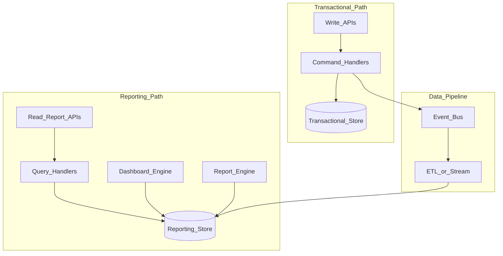
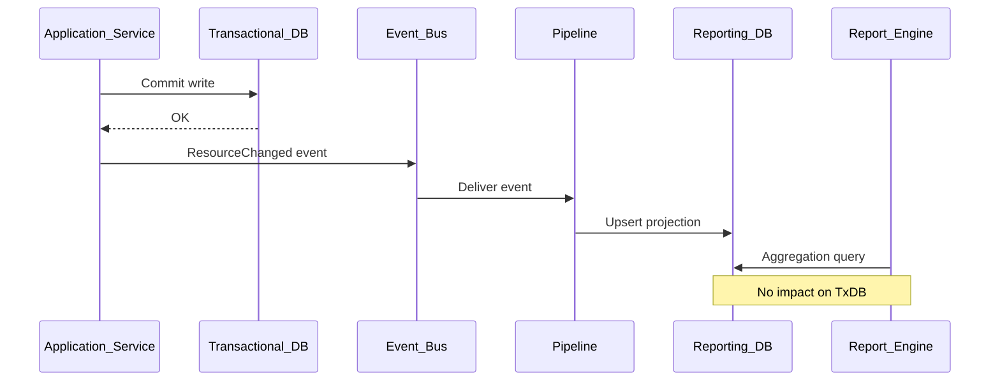

# Transactional vs Reporting

> **Volume:** 1 | **Chapter ID:** v1-13 | **Status:** reviewed

## Purpose

Define the separation between transactional workloads (CRUD, business processing, validation, workflow) and reporting workloads (dashboards, analytics, reports, aggregation, historical data). Reporting must never degrade transactional performance.

## Overview

Transactional systems optimize for correctness, consistency, and low-latency writes. Users create resources, approve requests, and move entities through workflows — each operation must complete quickly and leave data in a valid state. Reporting systems optimize for scan-heavy queries across large historical datasets: monthly aggregates, tenant dashboards, cross-entity analytics, and exported ledgers.

When both workloads share one database and one query path, reporting queries lock tables, exhaust connection pools, and inflate P99 write latency. Operations teams respond by scaling the primary database — paying for capacity that only heavy reads consume — while writes still contend with analytics.

EPB treats transactional and reporting paths as architecturally distinct. They may start on the same database with read/write separation ([Read/Write Separation](12-read-write-separation.md)), but the platform evolves toward dedicated reporting stores fed by events or ETL. The report engine and dashboard engine (Volume 2) target reporting infrastructure; application services route operational CRUD through transactional stores.

## Architecture

Transactional writes commit to the primary store and emit change events. Reporting stores consume those events asynchronously. Dashboard and report services query only reporting infrastructure — never the transactional primary during heavy analytics.

## Responsibilities

### Transactional Path

| Concern | Description |
|---------|-------------|
| CRUD | Create, read (operational), update, delete on live entities |
| Business processing | Validation, state transitions, rule evaluation |
| Workflow | Multi-step approvals and orchestrated processes |
| Consistency | ACID transactions, foreign key integrity, optimistic locking |
| Latency | Target low P99 for interactive user operations |
| Events | Publish domain events after successful commits |

Operational reads (single resource for edit screen, small paginated lists) may use the transactional store. These reads are selective, indexed, and tenant-scoped — not full-table scans.

### Reporting Path

| Concern | Description |
|---------|-------------|
| Dashboards | Real-time or near-real-time KPI tiles and charts |
| Analytics | Trend analysis, cohort views, comparative metrics |
| Reports | Scheduled PDF/Excel exports, regulatory submissions |
| Aggregation | Sums, counts, averages across millions of rows |
| Historical data | Point-in-time and archival queries |
| Search-heavy listing | Global filters across denormalized projections |

Reporting accepts eventual consistency. A dashboard may lag seconds or minutes behind the transactional truth — documented SLA per pipeline.

### Platform Services in Reporting

- **Dashboard engine** — configurable widgets querying reporting stores
- **Report engine** — template-based report generation, scheduled delivery via scheduler
- **Scheduler** — orchestrates scheduled report runs without blocking transactional APIs

## Design Principles

1. **Reporting never blocks transactional commits** — async propagation only
2. **Denormalize for reads** — reporting projections flatten joins acceptable in transactional normalized schema
3. **Own the SLA** — state staleness explicitly (e.g., "dashboard data up to 5 minutes behind")
4. **Isolate failure domains** — reporting pipeline failure does not reject writes
5. **Tenant isolation everywhere** — reporting queries always filter by tenant
6. **Scale independently** — add reporting replicas without scaling transactional primaries

## Implementation Guidelines

1. Command handlers write to transactional store only; never run aggregate analytics in the same transaction.
2. Publish events with sufficient payload for reporting projections — or publish IDs and let pipeline enrich from transactional read replicas with care.
3. Build reporting tables/views optimized for query patterns: columnar storage, materialized views, or search indices as appropriate.
4. Route report and dashboard APIs to reporting services — not application CRUD endpoints with `?export=all`.
5. Use [Scheduler](09-platform-services-layer.md) for scheduled reports; results stored in object storage, delivered via notification platform.
6. Document pipeline lag and monitoring alerts when replication exceeds SLA.

### Evolution Stages

| Stage | Transactional | Reporting | When |
|-------|---------------|-----------|------|
| 1 | Primary DB | Same DB, read replicas | Early product, low analytics load |
| 2 | Primary DB | Replicas + materialized views | Growing read analytics |
| 3 | Primary DB | Dedicated reporting DB + pipeline | Heavy dashboards, compliance reports |
| 4 | Sharded transactional | Lake/warehouse for historical | Very large tenants, long retention |

Services designed with read/write separation migrate between stages without API changes.

### What Stays Transactional

- Creating or approving a resource
- Workflow state transitions
- Validation that gates a write
- Operational detail fetch for edit forms
- Idempotent command retries

### What Moves to Reporting

- Cross-tenant admin analytics (with strict auth)
- Month-over-month aggregate charts
- Export of all resources matching complex filters
- Full-text search across historical archives
- Compliance audit reports spanning years

## Best Practices

1. Monitor transactional P99 latency separately from reporting query duration
2. Cap report export row counts; stream large exports asynchronously
3. Pre-aggregate common dashboard metrics in the pipeline — do not sum raw rows on every page load
4. Version reporting projections when transactional schema changes; replay events if needed
5. Test pipeline idempotency — duplicate events must not double-count aggregates
6. Apply row-level security in reporting layer matching transactional permissions

## Anti-Patterns

| Anti-Pattern | Why It Fails | Preferred Approach |
|--------------|--------------|--------------------|
| Analytics queries on primary DB | Write latency spikes, lock contention | Reporting store + pipeline |
| Synchronous dual-write to both stores | Partial failure corrupts consistency | Transactional commit then event |
| Export via unbounded CRUD API | Timeouts, memory pressure, client abuse | Dedicated report engine |
| Dashboard hits live workflow tables | Complex joins on hot path | Denormalized reporting projection |
| Ignoring pipeline lag in UI | Users distrust data | Show freshness indicator |
| Reporting service reads transactional DB in emergency "temp" mode | Becomes permanent, SLA collapses | Fix pipeline; never bypass |
| Same indexes for OLTP and OLAP | Neither workload optimized | Separate stores and index strategy |

## Related Chapters

- [Previous: Read/Write Separation](12-read-write-separation.md)
- [Next: Independent Services](14-independent-services.md)
- [Platform Services Layer](09-platform-services-layer.md)
- [EPB Glossary](../docs/GLOSSARY.md)

---

*Enterprise Platform Blueprint — Volume 1*
