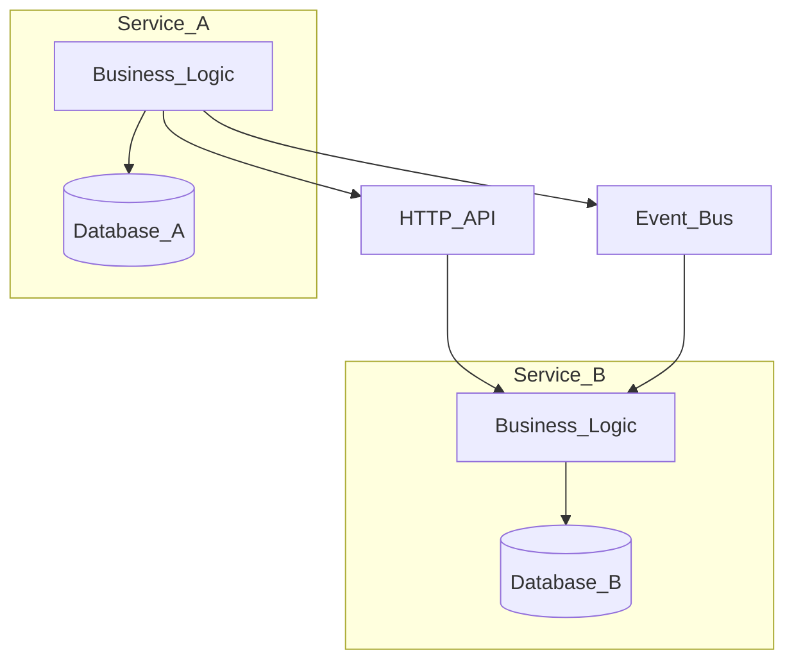
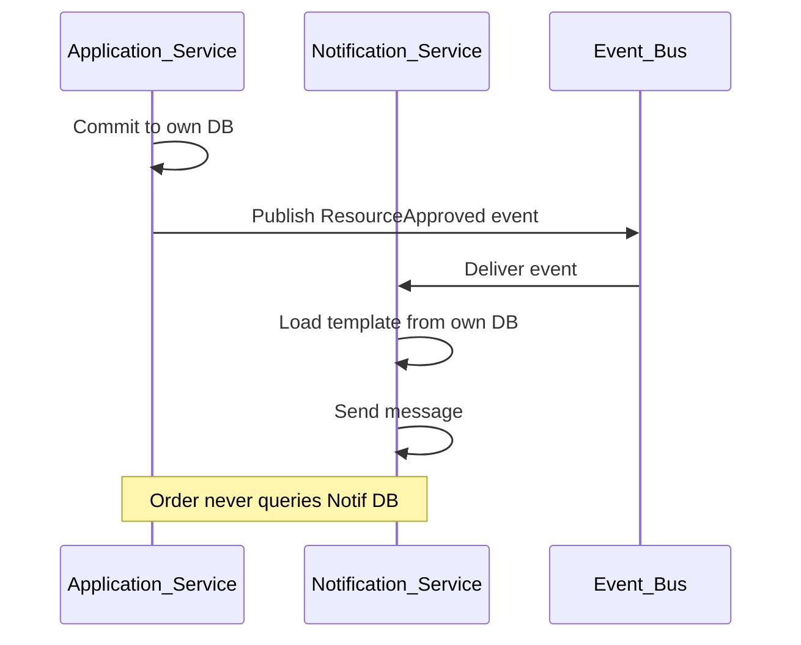

# Independent Services

> **Volume:** 1 | **Chapter ID:** v1-14 | **Status:** reviewed

## Purpose

Define the standards for service independence: each deployable service owns its business logic, owns its data, releases independently, follows identical project standards, and communicates only through APIs or events — never through shared databases.

## Overview

EPB is a platform of many services — platform capabilities and application domains — not a monolith with module boundaries drawn in documentation only. Independence means a team can deploy the notification service on Tuesday and the identity service on Thursday without coordinated downtime, schema lockstep, or "deploy everything" rituals.

Independence is violated the moment one service queries another service's database. Schema changes become cross-team negotiations. Scaling read replicas for analytics accidentally exposes write tables. Transaction boundaries blur. The platform reverts to a distributed monolith with the worst properties of both worlds.

EPB enforces hard boundaries: own your data, expose contracts, integrate synchronously via HTTP APIs or asynchronously via the event bus. Shared libraries carry types, not live data. [Platform Services Layer](09-platform-services-layer.md) capabilities follow the same rules as application services.

## Architecture



No arrow connects `Database_A` to `Database_B`. No service embeds another service's connection string.



## Responsibilities

### Every Service Must

| Requirement | Rationale |
|-------------|-----------|
| Own its business logic | Clear accountability; no logic scattered in BFF or other services' DBs |
| Own its data store | Schema migrations scoped to one team; no foreign keys across services |
| Be independently deployable | Release cadence matches team velocity |
| Follow identical project standards | [Folder Structure](23-folder-structure.md), [Naming Conventions](24-naming-conventions.md), [API Standards](18-api-standards.md) |
| Communicate via APIs or events | Explicit contracts; observable integrations |
| Enforce tenant isolation | Every query scoped by tenant context |
| Expose health checks and metrics | Platform operations depend on uniform observability |
| Use shared libraries for types only | Contracts compile together; data never shares tables |

### Service Categories

**Platform services** — reusable, domain-neutral capabilities (identity, notifications, scheduler, search). Consumed by all applications.

**Application services** — domain logic for one product (order processing, resource lifecycle, tenant-specific workflows). May consume platform services; do not share databases with other application services.

**BFF** — not a data-owning service; stateless edge except optional session cache. Calls services; never owns domain tables.

### Integration Modes

```text
Synchronous API:  Caller needs immediate result or validation (GET user, authorize action)
Asynchronous event: Side effect, notification, projection update, audit fan-out
Never:            Direct SQL to another service's database
Never:            Shared mutable tables between services
```

Choose events when the caller does not need the side effect to complete before responding. Choose APIs when the operation's outcome determines the caller's next step.

## Design Principles

1. **Loose coupling** — services know contracts, not implementations or schemas
2. **High cohesion** — everything that changes together lives in one service
3. **API First** — design and publish the contract before internal schema
4. **Fail independently** — circuit breakers and timeouts on synchronous calls; dead-letter queues on events
5. **Convention Over Configuration** — new services boot from the same template, reducing cognitive load
6. **No distributed monolith** — independence is architectural, not merely deployment packaging

## Implementation Guidelines

1. Bootstrap services from the standard project template in Volume 3.
2. Register each service in the platform catalog with owner, repository, and API base path.
3. Store connection strings in secrets management — never in shared libraries or client apps.
4. Cross-service references use resource IDs (UUIDs), not foreign keys enforced across databases.
5. When data from two services must appear together, the BFF aggregates or the read model denormalizes via events — not cross-DB joins.
6. Version APIs; support at least one previous version during migration windows.
7. Document extension points where applications register handlers without modifying platform service core.

### New Service Checklist

```text
1. Define service boundary and owned entities
2. Create database (or schema) owned exclusively by this service
3. Publish API contract in shared library package
4. Implement health endpoint and structured logging
5. Wire auth (validate token, extract tenant)
6. Register in service mesh / API gateway
7. Add integration tests with test database — not another service's DB
8. Document in Volume 2 if platform service
```

### Identical Standards Across Services

Every service — platform or application — uses the same:

- Layered interior structure (API → handlers → domain → repository)
- Error envelope and status code mapping
- Pagination, filtering, and sorting query parameters
- Audit and correlation ID propagation
- CI pipeline stages: lint, test, contract verify, deploy

Consistency is what makes independence workable. Without it, each service becomes a unique snowflake operations cannot reason about.

## Best Practices

1. Design idempotent event handlers — at-least-once delivery is the norm
2. Use correlation IDs across API chains for distributed tracing
3. Prefer bulkhead thread pools per downstream service in BFF and orchestrators
4. Keep synchronous call graphs shallow — deep chains amplify latency and failure
5. Publish "resource changed" events with minimal payloads; consumers fetch details via API if needed
6. Run contract tests in CI when consumers depend on a service's API package
7. Scale services based on their own metrics — not cluster-wide guesses

## Anti-Patterns

| Anti-Pattern | Why It Fails | Preferred Approach |
|--------------|--------------|--------------------|
| Shared database between services | Coupled migrations, hidden joins, scaling paralysis | One database per service |
| Service A reads Service B's tables | Schema leakage, untested dependencies | API or event contract |
| Distributed transactions (2PC) across services | Operational complexity, fragile locks | Saga, outbox, eventual consistency |
| Logic in BFF to avoid new service | BFF becomes monolith, untestable domain | Application or platform service |
| Synchronous chain of 8 services | Fragile, slow, hard to debug | Aggregate, cache, or event-driven flow |
| Duplicate data without ownership | No single writer, inconsistent truth | One owner; others consume via API/event |
| Snowflake service structure | Onboarding friction, missed security controls | Standard template and checklist |
| Calling another service inside a DB transaction | Locks held during network I/O | Commit then call or event after commit |

## Related Chapters

- [Previous: Transactional vs Reporting](13-transactional-vs-reporting.md)
- [Next: DTO Standards](15-dto-standards.md)
- [Platform Services Layer](09-platform-services-layer.md)
- [Layered Architecture](06-layered-architecture.md)
- [Shared Libraries](10-shared-libraries.md)
- [EPB Glossary](../docs/GLOSSARY.md)

---

*Enterprise Platform Blueprint — Volume 1*
