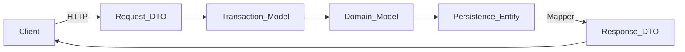

# DTO Standards

> **Volume:** 1 | **Chapter ID:** v1-15 | **Status:** reviewed

## Purpose

Define how EPB separates API contracts from internal processing and persistence. DTOs (Data Transfer Objects) are the public shape of platform and application APIs; they must never leak database structure or business internals.

## Overview

EPB maintains **five distinct model types** — not one model used everywhere. Each type has a single responsibility and lives in the [Shared Library](10-shared-libraries.md) as the canonical definition. Services map between types at layer boundaries; see [Model Separation](11-model-separation.md) and [Mapping Strategy](17-mapping-strategy.md).

The BFF and platform services expose only Request DTOs and Response DTOs. Transaction Models, Domain Models, and Persistence Entities remain inside the service boundary.



## Architecture

DTOs sit at the API boundary. Request DTOs enter through the BFF; Response DTOs exit after mapping. Internal models never cross the HTTP boundary.

| Model Type | Layer | Exposed via API |
|------------|-------|-----------------|
| Request DTO | BFF / service ingress | Yes (request body, query) |
| Response DTO | BFF / service egress | Yes (response body) |
| Transaction Model | Service processing | No |
| Domain Model | Business logic | No |
| Persistence Entity | Data access | No |

## Responsibilities

- **Request DTO** — validate and deserialize incoming payloads; define the write contract
- **Response DTO** — shape data returned to clients; hide internal IDs and storage details unless the client needs them
- **Transaction Model** — carry validated input through a single use case or command handler
- **Domain Model** — enforce invariants and orchestrate business rules within a service
- **Persistence Entity** — map rows and relationships to the database; owned by the data access layer

## Design Principles

1. **Single Source of Truth** — one shared library package holds all model definitions per bounded context
2. **API First** — design Request and Response DTOs before implementation; version them explicitly
3. **Immutability at boundaries** — treat DTOs as snapshots; avoid mutating them after validation
4. **Least exposure** — Response DTOs include only fields the client needs; never mirror entity tables
5. **Composition over duplication** — nest DTOs for complex shapes; combine multiple entities in mappers when building responses

## Implementation Guidelines

### Naming

Use consistent suffixes (language conventions may vary casing):

| Type | Suffix | Example |
|------|--------|---------|
| Request DTO | `Request` | `CreateResourceRequest` |
| Response DTO | `Response` | `ResourceResponse` |
| Transaction Model | `Command` or `Input` | `CreateResourceCommand` |
| Domain Model | none or `Model` | `Resource` |
| Persistence Entity | `Entity` | `ResourceEntity` |

List endpoints use a dedicated list wrapper (see [Common Functionalities](39-common-functionalities.md)) such as `PagedResourceListResponse`.

### Request DTO

- Declares validation rules (required fields, formats, ranges) at the edge
- Contains no business logic, no database annotations, no computed domain state
- Scoped to one operation: separate `CreateResourceRequest` and `UpdateResourceRequest`; do not reuse a single "upsert" DTO unless the API explicitly supports upsert
- Includes `tenantId` or relies on auth context — never trust client-supplied tenant identifiers without verification

**Example — create resource:**

```json
{
  "code": "RES-001",
  "displayName": "Primary Resource",
  "organizationId": "org_7f3a2b",
  "metadata": {
    "category": "standard"
  }
}
```

Corresponding type (illustrative, framework-agnostic):

```text
CreateResourceRequest
  code: string (required, max 64)
  displayName: string (required, max 256)
  organizationId: string (required, UUID format)
  metadata: map<string, string> (optional)
```

### Response DTO

- Returns stable, client-oriented field names (camelCase in JSON)
- Omits internal surrogate keys unless the client must reference them in subsequent calls
- Uses nested DTOs for related data instead of flat denormalized blobs
- Never includes password hashes, tokens, row versions used only for optimistic locking internals, or soft-delete flags unless the API contract requires them

**Example — single resource:**

```json
{
  "id": "res_9c4e1d",
  "code": "RES-001",
  "displayName": "Primary Resource",
  "status": "ACTIVE",
  "organization": {
    "id": "org_7f3a2b",
    "name": "Central Unit"
  },
  "createdAt": "2026-08-01T10:30:00Z",
  "updatedAt": "2026-08-01T10:30:00Z"
}
```

Complex responses are built by **combining multiple entities** in a mapper — for example, joining `ResourceEntity` and `OrganizationEntity` into one `ResourceResponse`.

### Transaction Model

- Service-internal input after Request DTO validation and enrichment (user ID, tenant ID, correlation ID)
- One Transaction Model per command or use case
- May include fields not present in the Request DTO (e.g., `createdBy` from the security context)
- Passed to application services or command handlers; not serialized to HTTP

**Example:**

```text
CreateResourceCommand
  tenantId: string (from context)
  code: string
  displayName: string
  organizationId: string
  createdBy: string (from auth)
  correlationId: string
```

### Domain Model

- Rich model with behavior: `activate()`, `assignToOrganization()`, invariant checks
- Independent of HTTP and ORM concerns
- May aggregate value objects and child collections
- Optional for simple CRUD; required when business rules exceed validation

**Example:**

```text
Resource (domain)
  - validateCodeUniqueness()
  - activate(): raises DomainException if status invalid
  - organizationId: OrganizationId (value object)
```

### Persistence Entity

- Maps tables, columns, indexes, and relationships
- Includes audit columns, tenant discriminator, and optimistic concurrency fields
- Never returned from controllers or BFF handlers — see [Entity Standards](16-entity-standards.md)

### Versioning

- Add optional fields to Response DTOs in backward-compatible ways
- Introduce breaking Request DTO changes under a new API version (`/api/v2/...`)
- Document deprecated fields in OpenAPI descriptions; remove only after the deprecation window

## Best Practices

1. Co-locate DTOs for a bounded context in the shared library; publish as a versioned package
2. Generate OpenAPI schemas from Request and Response DTO definitions
3. Use separate DTOs for list summaries (`ResourceSummaryResponse`) and detail views (`ResourceDetailResponse`)
4. Validate at the BFF for fast failure; re-validate in the owning service before writes
5. Keep DTOs free of framework-specific serialization attributes in the canonical definition when possible — map in adapters

## Anti-Patterns

| Anti-Pattern | Why It Fails | Preferred Approach |
|--------------|--------------|--------------------|
| One model for all layers | Leaks schema, couples API to database | Five model types with explicit mappers |
| Exposing Persistence Entity via API | Breaks encapsulation, blocks schema evolution | Map Entity → Response DTO |
| Fat Request DTO with 50+ fields | Unclear contract, hard to version | Split by operation; use nested objects |
| Business logic in DTOs | Untestable, duplicated across services | Move rules to Domain Model |
| Copy-paste DTOs per service | Drift, inconsistent validation | Centralize in shared library |

## Related Chapters

- [Previous: Independent Services](14-independent-services.md)
- [Next: Entity Standards](16-entity-standards.md)
- [Model Separation](11-model-separation.md)
- [Mapping Strategy](17-mapping-strategy.md)
- [API Standards](18-api-standards.md)
- [EPB Glossary](../docs/GLOSSARY.md)

---

*Enterprise Platform Blueprint — Volume 1*
