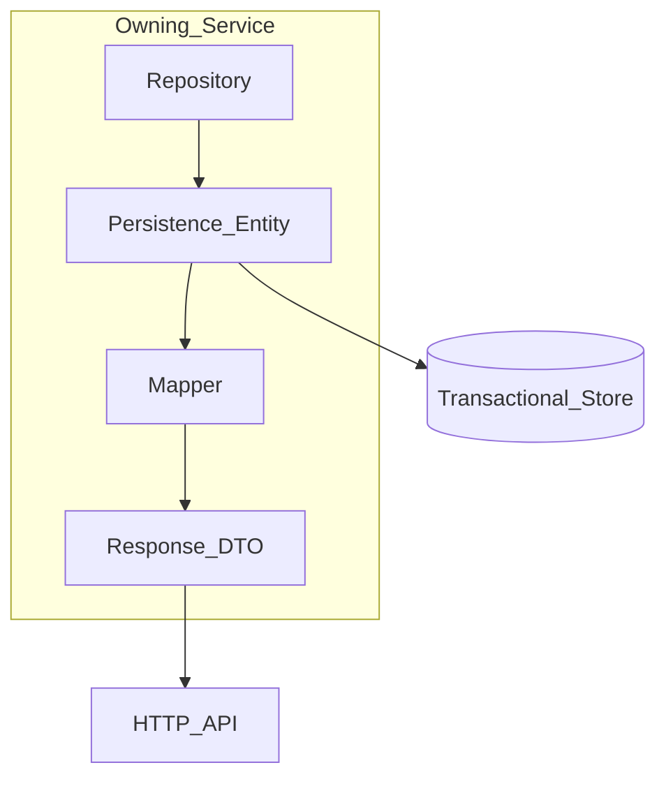

# Entity Standards

> **Volume:** 1 | **Chapter ID:** v1-16 | **Status:** reviewed

## Purpose

Define how EPB maps domain data to persistent storage. Persistence Entities are the database-facing models inside a service — they are never exposed through APIs and never shared across service boundaries.

## Overview

Every platform and application service **owns its data**. Persistence Entities live in the service (or its data-access module) and represent tables, views, or document collections. They are the sink for writes on the transactional path and the source for reads before mapping to Response DTOs.

EPB enforces [Independent Services](14-independent-services.md): no service reads or writes another service's tables. Integration happens through APIs or the [Event Bus](../docs/GLOSSARY.md).



## Architecture

Persistence Entities belong to the **Shared Libraries → Infrastructure** boundary within a single service. They pair with repositories or data-access objects. Reporting and analytics use separate stores per [Transactional vs Reporting](13-transactional-vs-reporting.md); entities for the transactional store must not be reused for heavy aggregation queries that belong in a reporting pipeline.

## Responsibilities

### In Scope

- Table/column mapping, relationships, and indexes
- Audit metadata (who created/updated, when)
- Multi-tenant isolation columns or schema strategy
- Optimistic concurrency (version or timestamp column)
- Soft-delete flags where the domain requires recoverable deletion

### Out of Scope

- HTTP serialization (belongs to Response DTOs)
- Input validation rules (belongs to Request DTOs)
- Cross-service joins (use API composition or read models)
- Business rule enforcement (belongs to Domain Models)

## Design Principles

1. **Service-owned schema** — each service migrates its own database; no shared tables between services
2. **Never expose entities** — map to Response DTOs at the repository or application layer exit
3. **Tenant isolation by design** — every tenant-scoped row includes a tenant discriminator or lives in a tenant-scoped schema
4. **Audit everything that mutates** — align with platform audit capabilities; immutable audit events complement row-level audit columns
5. **Explicit naming** — database names follow [Naming Conventions](24-naming-conventions.md); entity property names align with column names via mapping configuration

## Implementation Guidelines

### Base Entity Fields

All mutable transactional entities include:

| Field | Type | Purpose |
|-------|------|---------|
| `id` | UUID or bigint (surrogate) | Primary key; prefer UUID for distributed systems |
| `tenant_id` | UUID/string | Multi-tenant partition key |
| `created_at` | timestamp (UTC) | Row creation time |
| `created_by` | user reference | Actor from auth context |
| `updated_at` | timestamp (UTC) | Last modification time |
| `updated_by` | user reference | Last modifier |
| `version` | integer or rowversion | Optimistic concurrency |
| `is_deleted` | boolean | Soft delete when applicable |

Read-only or system-generated entities may omit `updated_*` or soft-delete fields when justified in an ADR.

### Naming Conventions

| Artifact | Convention | Example |
|----------|------------|---------|
| Table | snake_case, plural | `resources` |
| Column | snake_case | `organization_id` |
| Entity class | PascalCase + `Entity` suffix | `ResourceEntity` |
| Foreign key column | `{referenced_table_singular}_id` | `organization_id` |
| Index | `ix_{table}_{columns}` | `ix_resources_tenant_id_code` |
| Unique constraint | `uq_{table}_{columns}` | `uq_resources_tenant_id_code` |

### Relationships

- **One-to-many** — parent holds collection navigation only if the ORM requires it; prefer explicit queries for large collections
- **Many-to-many** — use a join entity (`ResourceTagEntity`) with its own primary key and audit fields
- **References to other services** — store external IDs only (e.g., `organization_id` referencing the Organization service); never foreign-key to another service's database

### Example Entity (conceptual)

```text
ResourceEntity
  table: resources
  id: uuid (PK)
  tenant_id: uuid (indexed, required)
  code: varchar(64) (unique per tenant)
  display_name: varchar(256)
  status: varchar(32)
  organization_id: uuid (external reference, not FK to another DB)
  metadata: jsonb (optional)
  created_at, created_by, updated_at, updated_by, version, is_deleted
```

### Mapping to Domain and DTOs

```text
Create flow:
  CreateResourceRequest → CreateResourceCommand → Resource (domain) → ResourceEntity → save

Read flow:
  ResourceEntity (+ optional OrganizationEntity local cache) → ResourceResponse
```

Never return `ResourceEntity` from a repository method to the HTTP layer — return a Domain Model or map directly to a Response DTO inside the application service.

### Migrations

- One migration history per service database
- Backward-compatible migrations for rolling deployments (add column nullable first, backfill, then enforce)
- Never rename or drop columns in use without a deprecation and dual-write period documented in an ADR

### Read/Write Separation

Entities on the transactional path support CRUD and business processing. Long-running reports, dashboards, and aggregations read from the reporting store or materialized views — not from hot transactional tables under load. See [Read Write Separation](12-read-write-separation.md).

## Best Practices

1. Keep entities anemic when Domain Models carry behavior; entities are persistence shapes, not domain aggregates — unless the team standardizes on a single aggregate root mapped 1:1
2. Use database constraints (unique, check, FK within the same database) to enforce invariants that must survive application bugs
3. Index `tenant_id` on every tenant-scoped table; composite indexes lead with `tenant_id`
4. Store timestamps in UTC; convert to locale only in the presentation layer
5. Log structural changes through the platform audit trail, not only row-level columns

## Anti-Patterns

| Anti-Pattern | Why It Fails | Preferred Approach |
|--------------|--------------|--------------------|
| Exposing entity JSON in API responses | Couples clients to schema, leaks internals | Map to Response DTO |
| Shared database across services | Violates ownership, prevents independent deploy | API or event integration |
| Missing tenant_id | Cross-tenant data leaks | Tenant discriminator on every scoped row |
| Lazy-loading entire object graphs | N+1 queries, memory spikes | Explicit queries or projections |
| Using entities for report queries | Degrades transactional performance | Reporting store / read models |

## Related Chapters

- [Previous: DTO Standards](15-dto-standards.md)
- [Next: Mapping Strategy](17-mapping-strategy.md)
- [Transactional vs Reporting](13-transactional-vs-reporting.md)
- [Naming Conventions](24-naming-conventions.md)
- [EPB Glossary](../docs/GLOSSARY.md)

---

*Enterprise Platform Blueprint — Volume 1*
