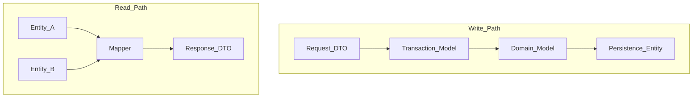

# Mapping Strategy

> **Volume:** 1 | **Chapter ID:** v1-17 | **Status:** reviewed

## Purpose

Define how EPB converts between the five model types at layer boundaries. Mappers are the glue that keeps API contracts independent of persistence and business internals.

## Overview

Mapping is not an afterthought — it is a first-class concern in the [Shared Library](10-shared-libraries.md). Each bounded context provides **mapper classes** (or equivalent modules) with explicit contracts. Automatic object mappers may be used for simple field copies; complex mappings are hand-written and tested.

Per [Model Separation](11-model-separation.md), data flows in two directions:

```text
Write:  Request DTO → Transaction Model → Domain Model → Persistence Entity
Read:   Persistence Entity(s) → Response DTO
```

Complex Response DTOs are created by **combining multiple entities** — for example, a resource detail view that includes organization name from a locally cached reference or a secondary query.



## Architecture

Mapping runs inside platform and application services, and at the BFF when aggregating multiple service responses. The BFF maps service Response DTOs to client-specific shapes; it does not map to Persistence Entities.

| Boundary | Mapper Responsibility |
|----------|----------------------|
| BFF ingress | HTTP → Request DTO (deserialization + validation) |
| Service ingress | Request DTO → Transaction Model (+ context enrichment) |
| Domain layer | Transaction Model ↔ Domain Model |
| Data layer | Domain Model ↔ Persistence Entity |
| Service egress | Entity(ies) → Response DTO |
| BFF egress | Service Response DTO(s) → aggregated client response |

## Responsibilities

- Translate between types without leaking source internals
- Enrich models with context (tenant, user, correlation ID) on the write path
- Project and flatten entity graphs into client-oriented Response DTOs on the read path
- Centralize field renames and enum conversions in one place per pair of types
- Remain free of business rules except trivial defaults; invariants belong in Domain Models

## Design Principles

1. **Explicit over implicit** — name mapper methods after the operation: `toCreateResourceCommand`, `toResourceResponse`
2. **One direction per method** — avoid bidirectional mappers that obscure data flow
3. **Test complex mappings** — any conditional or multi-entity logic gets unit tests
4. **No mapping in controllers** — HTTP handlers delegate to application services that own mapping
5. **Composition for read models** — prefer a dedicated mapper that accepts multiple inputs over ORM eager-loading entire graphs

## Implementation Guidelines

### Mapper Contract (canonical)

From the EPB template:

```text
RequestDTO  →  TransactionModel  →  DomainModel  →  Entity
Entity      →  ResponseDTO (via mapper; may combine multiple entities)
```

### Write Path

**Step 1 — Request DTO to Transaction Model**

Add security and tracing context not present in the HTTP payload:

```text
CreateResourceRequest + AuthContext → CreateResourceCommand
  + tenantId from token
  + createdBy from token subject
  + correlationId from request header
```

**Step 2 — Transaction Model to Domain Model**

Construct domain objects with value objects and defaults:

```text
CreateResourceCommand → Resource (domain)
  status defaults to DRAFT
  code wrapped in ResourceCode value object
```

**Step 3 — Domain Model to Persistence Entity**

Map to storage shape; set audit fields:

```text
Resource (domain) → ResourceEntity
  version = 0 on insert
  created_at / updated_at = clock.utcNow()
```

### Read Path

**Single entity:**

```text
ResourceEntity → ResourceResponse
  map status enum to API string
  omit is_deleted when false
```

**Multiple entities (complex response):**

```text
(ResourceEntity, OrganizationRef) → ResourceDetailResponse
  ResourceEntity → core fields
  OrganizationRef → nested organization { id, name }
```

When organization data lives in another service, fetch via API or read from a local sync table — never join across databases.

### BFF Aggregation

The BFF calls multiple platform services and maps their Response DTOs into one client payload:

```text
(UserProfileResponse, NotificationSummaryResponse, ScheduleSummaryResponse)
  → DashboardResponse
```

Parallel service calls reduce latency; mapping is synchronous assembly of already-fetched DTOs.

### Where Mappers Live

```text
shared-library/
  contracts/
    mappers/
      IResourceMapper.cs          # interface (language-agnostic pattern)
  implementations/
    mappers/
      ResourceMapper.cs
```

Application-specific mappers extend platform base mappers only at [Extension Points](../docs/GLOSSARY.md); do not fork platform mappings.

### Handling Nulls and Partial Data

- Missing optional entity relations → omit nested object or return `null` per OpenAPI contract — never inconsistent between list and detail endpoints
- Deleted or unauthorized related data → exclude nested field; do not fail the entire response unless the related data is required

### Performance

- Project to Response DTOs in the query layer for list endpoints (select only needed columns)
- Avoid mapping large collections in memory when the database can page and filter — see [Common Functionalities](39-common-functionalities.md)

## Best Practices

1. Register mappers in dependency injection; inject interfaces (`IResourceMapper`) for testability
2. Keep mapping logic out of Domain Models — domain objects should not know about DTOs or entities
3. Document non-obvious field transforms in mapper tests, not inline comments
4. Use the same mapper for create and update read-backs to keep response shapes consistent
5. Version mappers with API versions when breaking Response DTO changes occur

## Anti-Patterns

| Anti-Pattern | Why It Fails | Preferred Approach |
|--------------|--------------|--------------------|
| Manual field copy in every handler | Drift, bugs on schema change | Dedicated mapper class |
| ORM entity returned then serialized | Leaks persistence model | Map before exit |
| Giant generic mapper utility | Hidden conditionals, untestable | Per-context mappers |
| Business validation in mapper | Wrong layer, duplicated rules | Domain Model |
| Cross-service SQL join for convenience | Violates service ownership | API fetch or local projection |

## Related Chapters

- [Previous: Entity Standards](16-entity-standards.md)
- [Next: API Standards](18-api-standards.md)
- [DTO Standards](15-dto-standards.md)
- [BFF Layer](08-bff-layer.md)
- [EPB Glossary](../docs/GLOSSARY.md)

---

*Enterprise Platform Blueprint — Volume 1*
