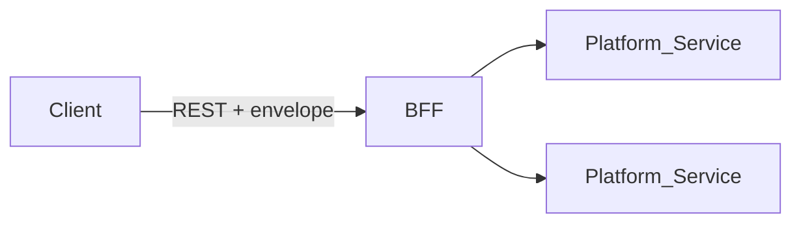

# API Standards

> **Volume:** 1 | **Chapter ID:** v1-18 | **Status:** reviewed

## Purpose

Define REST conventions, versioning rules, and the standard response envelope for every HTTP API exposed by the BFF and platform services. Consistent APIs reduce client integration cost and enable shared platform capabilities (pagination, error handling, logging).

## Overview

EPB is **API First**: contracts are designed and published before implementation. All frontend traffic enters through the [BFF](08-bff-layer.md). Platform services expose REST APIs consumed by the BFF and by other services — never by browsers directly.

EPB separates read and write operations per [Read Write Separation](12-read-write-separation.md):

| Operation | HTTP Methods | Path pattern |
|-----------|--------------|--------------|
| Read | `GET` | Collection and item resources |
| Write | `POST`, `PUT`, `PATCH`, `DELETE` | Commands and mutations |

Reporting and analytics endpoints may use dedicated read-only routes under `/reports` or a separate reporting service; they must not share transactional write paths.

## Architecture



Every successful or failed HTTP response uses the **standard envelope** defined below. The BFF is responsible for producing the client-facing envelope; internal service-to-service calls may use the same format for consistency.

## Responsibilities

- Resource-oriented URLs with predictable CRUD mappings
- Versioned base paths for breaking changes
- Uniform request/response envelopes with metadata
- Standard headers for auth, tracing, and content negotiation
- OpenAPI (or equivalent) documentation for every public endpoint
- Idempotent retries where safe (`GET`, `PUT` with idempotency keys on `POST` when required)

## Design Principles

1. **Resources, not actions** — prefer `POST /resources` over `POST /createResource` except for non-CRUD operations (e.g., `POST /resources/{id}/activate`)
2. **Nouns in paths, verbs in methods** — `DELETE /resources/{id}`, not `POST /deleteResource`
3. **Stateless requests** — session state lives in tokens; servers do not rely on sticky sessions for correctness
4. **Explicit versioning** — breaking changes require a new major version path
5. **Fail with standard errors** — see [Error Handling](19-error-handling.md)

## Implementation Guidelines

### Base URL and Versioning

```text
https://{host}/api/v{major}/{resource-collection}
```

| Rule | Detail |
|------|--------|
| Major version in path | `/api/v1/resources`, `/api/v2/resources` |
| Minor changes | Backward-compatible additions within the same major version |
| Deprecation | `Deprecation` and `Sunset` HTTP headers on deprecated endpoints |
| Default version | BFF may route unversioned clients to latest stable with explicit opt-in |

Breaking changes (removed fields, changed semantics, renamed paths) require `v2`. Non-breaking additions (new optional fields, new endpoints) stay in the current major version.

### REST Conventions

**Collection and item:**

```text
GET    /api/v1/resources              # list (paginated)
POST   /api/v1/resources              # create
GET    /api/v1/resources/{id}         # get by id
PUT    /api/v1/resources/{id}         # full replace
PATCH  /api/v1/resources/{id}         # partial update
DELETE /api/v1/resources/{id}         # delete (soft or hard per domain)
```

**Sub-resources and actions:**

```text
GET    /api/v1/resources/{id}/audit-events
POST   /api/v1/resources/{id}/activate
POST   /api/v1/resources/bulk         # bulk operations — see Common Functionalities
```

**Query parameters for reads:**

```text
GET /api/v1/resources?page=1&pageSize=20&sort=displayName&sortDir=asc&filter[status]=ACTIVE
```

Use `filter[field]=value` for filtering; see [Common Functionalities](39-common-functionalities.md).

### HTTP Status Codes

| Code | Usage |
|------|-------|
| `200 OK` | Successful `GET`, `PUT`, `PATCH` with body |
| `201 Created` | Successful `POST` creating a resource; include `Location` header |
| `204 No Content` | Successful `DELETE` or update with no response body |
| `400 Bad Request` | Validation failure, malformed JSON |
| `401 Unauthorized` | Missing or invalid authentication |
| `403 Forbidden` | Authenticated but insufficient permission |
| `404 Not Found` | Resource does not exist or not visible to tenant |
| `409 Conflict` | Version conflict, duplicate unique key |
| `422 Unprocessable Entity` | Semantically invalid (business rule violation) |
| `429 Too Many Requests` | Rate limit exceeded |
| `500 Internal Server Error` | Unexpected server failure |

### Standard Headers

| Header | Direction | Purpose |
|--------|-----------|---------|
| `Authorization` | Request | Bearer token or platform auth scheme |
| `X-Correlation-Id` | Request/Response | End-to-end tracing (generate if absent) |
| `X-Tenant-Id` | Request | Only when not implied by token; must match auth |
| `Content-Type` | Both | `application/json` default |
| `Accept` | Request | `application/json` |
| `Idempotency-Key` | Request | Optional on `POST` for safe retries |

### Standard Response Envelope

All JSON responses wrap payload in a consistent structure. The `data` field holds the resource or collection; `meta` holds cross-cutting metadata; `pagination` appears on list responses.

**Success — single resource (`200` / `201`):**

```json
{
  "success": true,
  "data": {
    "id": "res_9c4e1d",
    "code": "RES-001",
    "displayName": "Primary Resource",
    "status": "ACTIVE"
  },
  "meta": {
    "requestId": "req_a1b2c3d4",
    "correlationId": "corr_e5f6g7h8",
    "timestamp": "2026-08-01T10:30:00.000Z",
    "apiVersion": "v1"
  }
}
```

**Success — paginated list (`200`):**

```json
{
  "success": true,
  "data": [
    {
      "id": "res_9c4e1d",
      "code": "RES-001",
      "displayName": "Primary Resource",
      "status": "ACTIVE"
    }
  ],
  "pagination": {
    "page": 1,
    "pageSize": 20,
    "totalItems": 145,
    "totalPages": 8,
    "hasNext": true,
    "hasPrevious": false
  },
  "meta": {
    "requestId": "req_a1b2c3d4",
    "correlationId": "corr_e5f6g7h8",
    "timestamp": "2026-08-01T10:30:00.000Z",
    "apiVersion": "v1"
  }
}
```

**Error responses** use the same top-level shape with `success: false` — see [Error Handling](19-error-handling.md) for the full error object and code structure.

### Request Body Conventions

- JSON property names: `camelCase`
- Date/time: ISO 8601 UTC (`2026-08-01T10:30:00Z`)
- Identifiers: opaque strings (`res_9c4e1d`) or UUIDs — document in OpenAPI
- Empty body: omit body on `DELETE`; use `{}` only when the contract requires a payload

### DTO Alignment

Request and Response bodies use [DTO Standards](15-dto-standards.md). OpenAPI schemas are generated from shared library definitions — the handbook contract is the source of truth.

### Service-to-Service Calls

Internal calls follow the same REST and envelope conventions where practical. For high-throughput internal paths, services may use a slimmed envelope but must propagate `correlationId` and map errors to platform error codes at the BFF boundary.

## Best Practices

1. Publish OpenAPI specs per major version; validate requests against schemas at the BFF
2. Use `201` + `Location: /api/v1/resources/{id}` on create
3. Support `PATCH` with JSON Merge Patch or JSON Patch — document which in the API spec
4. Return `404` for cross-tenant access attempts instead of `403` when hiding existence
5. Log every request with `correlationId`, method, path, status, and duration per [Logging Standards](20-logging-standards.md)

## Anti-Patterns

| Anti-Pattern | Why It Fails | Preferred Approach |
|--------------|--------------|--------------------|
| RPC-style URLs (`/doSomething`) | Non-standard, hard to cache and document | Resource paths + HTTP verbs |
| Raw entity JSON in responses | Couples clients to database | Response DTO inside envelope |
| Per-service response shapes | Client chaos, no shared middleware | Standard envelope everywhere |
| Unversioned breaking changes | Breaks all clients silently | New `/api/v2` path |
| Frontend calling services directly | Security, coupling | BFF as sole entry point |

## Related Chapters

- [Previous: Mapping Strategy](17-mapping-strategy.md)
- [Next: Error Handling](19-error-handling.md)
- [API First Design](37-api-first-design.md)
- [Common Functionalities](39-common-functionalities.md)
- [EPB Glossary](../docs/GLOSSARY.md)

---

*Enterprise Platform Blueprint — Volume 1*
