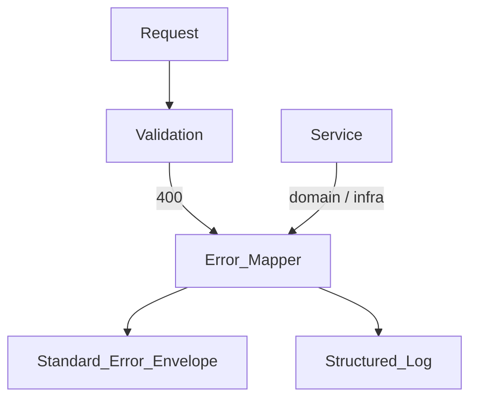

# Error Handling

> **Volume:** 1 | **Chapter ID:** v1-19 | **Status:** reviewed

## Purpose

Define how EPB surfaces failures consistently across the BFF and platform services. Clients, observability tools, and support teams must interpret errors the same way regardless of which service produced them.

## Overview

Exception handling is a **shared platform capability** — not per-service custom JSON shapes. Every layer catches exceptions, maps them to stable error codes, logs structured context, and returns the standard error envelope defined in [API Standards](18-api-standards.md).

The BFF translates internal service errors to **client-safe messages** while preserving machine-readable codes. Internal details (stack traces, SQL errors) never appear in API responses.



## Architecture

| Layer | Responsibility |
|-------|----------------|
| BFF | Final error envelope, client-safe messages, HTTP status selection |
| Platform service | Throw typed exceptions with error codes; no HTTP concerns in domain |
| Shared library | Error code constants, exception base types, mapper utilities |
| Logging | Full exception + correlation ID server-side only |

## Responsibilities

- Stable, documented error codes for programmatic handling
- Human-readable messages suitable for UI display (no secrets, no stack traces)
- Field-level validation details for forms
- Correlation ID on every error for support lookup
- Consistent HTTP status mapping per [API Standards](18-api-standards.md)

## Design Principles

1. **Fail fast at the edge** — validate Request DTOs at the BFF before downstream calls
2. **Codes are contracts** — error codes are versioned and deprecated explicitly, like API fields
3. **Safe client messages** — "Resource not found" not "Row 0 in resources table missing"
4. **Rich server logs** — log the full exception with correlation ID, tenant, user, and operation
5. **Platform first** — central exception middleware; applications extend, not replace

## Implementation Guidelines

### Error Code Structure

Error codes are **SCREAMING_SNAKE_CASE** strings with a fixed three-part structure:

```text
{DOMAIN}_{CATEGORY}_{DETAIL}
```

| Segment | Description | Examples |
|---------|-------------|----------|
| `DOMAIN` | Owning area or service | `AUTH`, `RESOURCE`, `TENANT`, `IMPORT`, `PLATFORM` |
| `CATEGORY` | Error class | `VALIDATION`, `NOT_FOUND`, `CONFLICT`, `FORBIDDEN`, `INTERNAL` |
| `DETAIL` | Specific condition | `REQUIRED_FIELD`, `DUPLICATE_CODE`, `VERSION_MISMATCH` |

**Examples:**

| Code | HTTP Status | Meaning |
|------|-------------|---------|
| `AUTH_VALIDATION_EXPIRED_TOKEN` | 401 | Token expired |
| `AUTH_FORBIDDEN_INSUFFICIENT_PERMISSION` | 403 | Missing permission |
| `RESOURCE_NOT_FOUND` | 404 | Resource ID unknown or not in tenant |
| `RESOURCE_VALIDATION_REQUIRED_FIELD` | 400 | Missing required field |
| `RESOURCE_CONFLICT_DUPLICATE_CODE` | 409 | Unique constraint violation |
| `RESOURCE_CONFLICT_VERSION_MISMATCH` | 409 | Optimistic concurrency failure |
| `RESOURCE_BUSINESS_INVALID_STATE` | 422 | Domain rule violation |
| `IMPORT_VALIDATION_INVALID_ROW` | 400 | Import row failed validation |
| `PLATFORM_INTERNAL_UNEXPECTED` | 500 | Unhandled exception |

Omit `_DETAIL` when the category alone is sufficient (`RESOURCE_NOT_FOUND`). Never reuse a code for a different meaning.

Register all codes in the shared library constants package. Document new codes in OpenAPI `enum` extensions or a platform error catalog.

### Standard Error Response

Errors use the same top-level envelope as success responses with `success: false` and an `error` object.

**Validation error (`400`):**

```json
{
  "success": false,
  "error": {
    "code": "RESOURCE_VALIDATION_FAILED",
    "message": "One or more validation errors occurred.",
    "details": [
      {
        "field": "code",
        "code": "RESOURCE_VALIDATION_REQUIRED_FIELD",
        "message": "Code is required."
      },
      {
        "field": "displayName",
        "code": "RESOURCE_VALIDATION_MAX_LENGTH",
        "message": "Display name must not exceed 256 characters."
      }
    ]
  },
  "meta": {
    "requestId": "req_a1b2c3d4",
    "correlationId": "corr_e5f6g7h8",
    "timestamp": "2026-08-01T10:30:00.000Z",
    "apiVersion": "v1"
  }
}
```

**Not found (`404`):**

```json
{
  "success": false,
  "error": {
    "code": "RESOURCE_NOT_FOUND",
    "message": "The requested resource was not found."
  },
  "meta": {
    "requestId": "req_x9y8z7",
    "correlationId": "corr_e5f6g7h8",
    "timestamp": "2026-08-01T10:30:00.000Z",
    "apiVersion": "v1"
  }
}
```

**Internal error (`500`):**

```json
{
  "success": false,
  "error": {
    "code": "PLATFORM_INTERNAL_UNEXPECTED",
    "message": "An unexpected error occurred. Please contact support with the correlation ID.",
    "supportReference": "corr_e5f6g7h8"
  },
  "meta": {
    "requestId": "req_m5n6o7",
    "correlationId": "corr_e5f6g7h8",
    "timestamp": "2026-08-01T10:30:00.000Z",
    "apiVersion": "v1"
  }
}
```

The `supportReference` field duplicates `meta.correlationId` for user-visible support tickets on 500 responses.

### Exception Mapping Flow

```text
1. Catch exception at boundary (middleware / filter)
2. Map to platform error code + HTTP status
3. Build client-safe message (localized when i18n is enabled)
4. Attach field details for validation exceptions
5. Log full exception with correlation ID at ERROR level
6. Return standard error envelope
```

### Layer-Specific Guidance

**BFF**

- Map downstream `4xx` errors through when codes are already platform-standard
- Wrap unknown downstream failures as `PLATFORM_INTERNAL_DOWNSTREAM` with 502/503 when appropriate
- Never forward raw service error bodies without normalization

**Domain / application services**

- Throw typed exceptions carrying `code` and optional `details` — no HTTP status in domain layer
- Use `422` mapping for business rule violations vs `400` for syntactic validation

**Infrastructure**

- Catch database constraint violations and map to `*_CONFLICT_*` codes
- Timeout and circuit-breaker failures map to `PLATFORM_UNAVAILABLE_*` with 503

### Localization

- `message` may be translated per `Accept-Language`
- `code` is never translated — clients branch on codes
- Field names in `details[].field` match Request DTO property names

## Best Practices

1. Use a single global exception handler per service; register domain-specific mappers
2. Include correlation ID in every log line for the failed request
3. Rate-limit repeated identical validation errors in logs to avoid noise
4. Test error mapping tables — every exception type must map to a documented code
5. Align audit events with security-related errors (`AUTH_*`, `FORBIDDEN_*`)

## Anti-Patterns

| Anti-Pattern | Why It Fails | Preferred Approach |
|--------------|--------------|--------------------|
| Different JSON shape per service | Clients cannot generic-handle errors | Standard error envelope |
| Stack trace in API response | Security risk, poor UX | Log server-side only |
| Generic "Error occurred" only | Unsupportable, untestable | Stable error codes |
| HTTP status as the only signal | Ambiguous for clients | Code + status |
| Catching and swallowing exceptions | Silent data loss | Log and map or rethrow |

## Related Chapters

- [Previous: API Standards](18-api-standards.md)
- [Next: Logging Standards](20-logging-standards.md)
- [Common Functionalities](39-common-functionalities.md)
- [Security Foundation](21-security-foundation.md)
- [EPB Glossary](../docs/GLOSSARY.md)

---

*Enterprise Platform Blueprint — Volume 1*
