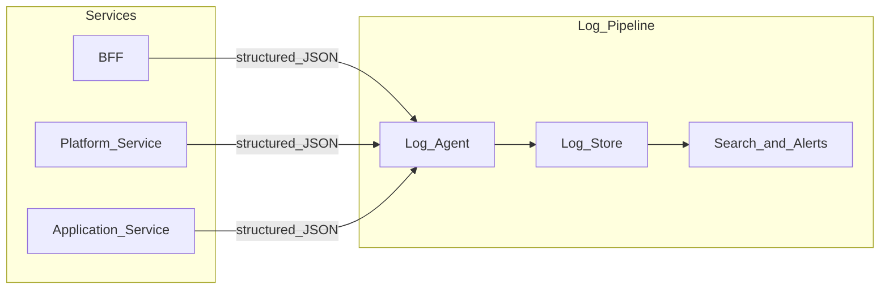

# Logging Standards

> **Volume:** 1 | **Chapter ID:** v1-20 | **Status:** reviewed

## Purpose

Define how every EPB component produces, structures, transports, and retains logs. Consistent logging enables debugging across services, satisfies audit requirements, and feeds monitoring and alerting pipelines.

## Overview

When a production incident occurs at 2 AM, logs are the primary evidence. If each service logs differently — free-text messages, inconsistent field names, missing correlation IDs — diagnosis takes hours instead of minutes.

EPB mandates **structured logging** across all layers: Frontend (client-side errors), BFF, platform services, and application services. Every log entry is machine-parseable JSON with a standard field set. Human-readable messages are included but never replace structured fields.

Logging serves four audiences:

1. **Developers** — debugging and local development
2. **Operations** — incident response and capacity planning
3. **Security** — threat detection and forensic analysis
4. **Compliance** — audit trail correlation (distinct from immutable audit records; see Volume 2 Audit service)

## Architecture



Services write to stdout/stderr (container-native). A log agent collects, enriches with infrastructure metadata, and forwards to centralized storage. Services never write directly to log storage — that couples them to infrastructure.

## Responsibilities

- Emit structured JSON logs from every service
- Include correlation and trace identifiers on every request
- Classify log levels consistently
- Never log secrets, credentials, or full PII
- Support log level changes at runtime without redeployment

## Design Principles

| Principle | Logging Application |
|-----------|-------------------|
| Convention Over Configuration | Standard field names across all services |
| Single Source of Truth | Shared library defines log schema and helpers |
| Security by Design | Redact sensitive data before emission |
| Platform First | Centralized log pipeline owned by infrastructure |

## Implementation Guidelines

### Standard Log Fields

Every log entry includes these fields:

| Field | Type | Description |
|-------|------|-------------|
| `timestamp` | ISO 8601 UTC | When the event occurred |
| `level` | string | `TRACE`, `DEBUG`, `INFO`, `WARN`, `ERROR`, `FATAL` |
| `service` | string | Service name (e.g., `identity-service`, `bff-web`) |
| `message` | string | Human-readable description |
| `correlationId` | string | Request correlation ID from BFF |
| `traceId` | string | Distributed trace ID (OpenTelemetry compatible) |
| `spanId` | string | Current span within the trace |
| `tenantId` | string | Tenant context when available |
| `userId` | string | Authenticated user ID when available (not PII) |
| `environment` | string | `development`, `staging`, `production` |

Additional context goes in a nested `context` object:

```json
{
  "timestamp": "2026-08-01T12:00:00.000Z",
  "level": "INFO",
  "service": "resource-service",
  "message": "Resource created",
  "correlationId": "corr-abc123",
  "traceId": "trace-xyz789",
  "spanId": "span-001",
  "tenantId": "tenant-42",
  "userId": "user-1001",
  "environment": "production",
  "context": {
    "resourceId": "res-555",
    "duration_ms": 45,
    "httpMethod": "POST",
    "httpPath": "/api/v1/resources",
    "httpStatus": 201
  }
}
```

### Log Levels

| Level | Use When |
|-------|----------|
| `TRACE` | Detailed internal flow (disabled in production by default) |
| `DEBUG` | Development diagnostics |
| `INFO` | Normal operations: request handled, event processed, job completed |
| `WARN` | Recoverable issues: retry succeeded, deprecated API used, slow query |
| `ERROR` | Operation failed but service continues: validation error, downstream timeout |
| `FATAL` | Service cannot continue: startup failure, unrecoverable configuration error |

Production default: `INFO`. Development default: `DEBUG`. Override via environment configuration.

### Request Logging

The BFF logs every inbound request and outbound response:

```text
INFO  Request received   method=GET path=/api/v1/resources correlationId=...
INFO  Request completed  method=GET path=/api/v1/resources status=200 duration_ms=120
```

Platform and application services log at service boundaries — not every internal method call.

### What Never Gets Logged

- Passwords, API keys, tokens, connection strings
- Full credit card numbers, government IDs, or health records
- Raw request bodies containing PII (log resource IDs instead)
- Stack traces in production `INFO`/`WARN` logs (reserve for `ERROR`/`FATAL`)

### Correlation and Tracing

1. BFF generates or accepts `X-Correlation-Id` header
2. BFF propagates correlation ID and trace context to all downstream calls
3. Every service includes both IDs in every log entry for the request
4. Use W3C Trace Context (`traceparent` header) for OpenTelemetry compatibility

## Best Practices

1. Use shared logging library from shared libraries — never ad-hoc `console.log` or `print`
2. Log at service boundaries: API entry/exit, event consumption, scheduled job start/end
3. Include duration (`duration_ms`) on operation completion logs
4. Structure errors with `error.code`, `error.message`, and `error.stack` in context
5. Configure log retention per environment: 7 days dev, 30 days staging, 90+ days production
6. Set up alerts on `ERROR` rate spikes and `FATAL` occurrences

## Anti-Patterns

| Anti-Pattern | Why It Fails | Preferred Approach |
|--------------|--------------|--------------------|
| Unstructured string logs | Cannot query, filter, or alert | JSON with standard fields |
| Logging inside tight loops | Noise, cost, performance impact | Log summary counts or sample |
| Different field names per service | Cross-service queries fail | Shared library schema |
| Logging secrets for debugging | Security breach if logs are compromised | Redact at source; use secure debug tools |
| File-based logging in containers | Lost on restart, not collected | stdout/stderr with log agent |
| Excessive DEBUG in production | Storage cost, missed real errors | INFO default; targeted DEBUG via config |

## Related Chapters

- [Previous: Error Handling](19-error-handling.md)
- [Next: Security Foundation](21-security-foundation.md)
- [Monitoring and Observability](33-monitoring-observability.md)
- [EPB Glossary](../docs/GLOSSARY.md)

---

*Enterprise Platform Blueprint — Volume 1*
