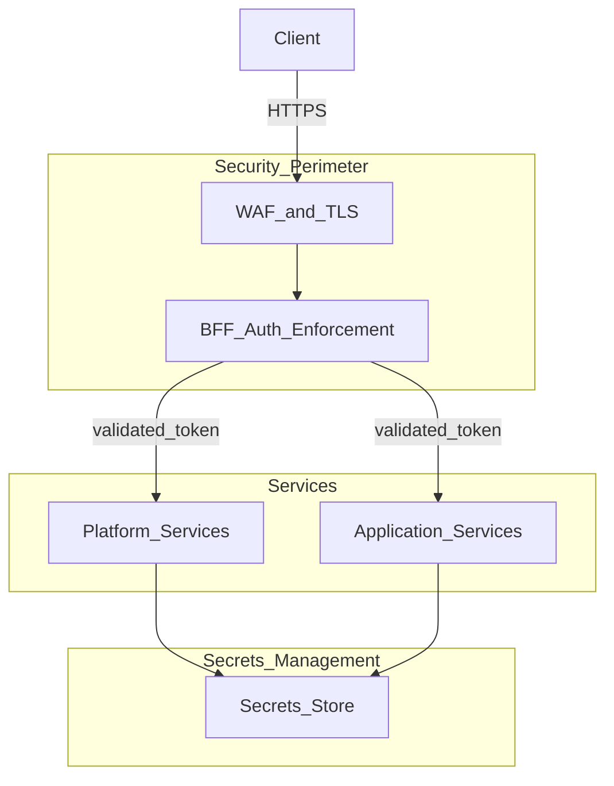

# Security Foundation

> **Volume:** 1 | **Chapter ID:** v1-21 | **Status:** reviewed

## Purpose

Establish the security baseline for every EPB component. Security is not a feature added at the end — it is embedded in architecture from the first line of code.

## Overview

Enterprise platforms handle authentication credentials, personal data, financial transactions, and operational secrets. A single weak service undermines the entire platform. EPB applies **Security by Design**: controls are architectural defaults, not optional add-ons.

This chapter defines the foundation. Volume 2 Identity service chapters detail authentication, authorization, users, roles, and permissions. Here we establish what every layer must enforce regardless of implementation technology.

## Architecture



Security enforcement concentrates at the **BFF** (edge) and **service boundaries** (defense in depth). Internal service-to-service calls also validate tokens — never trust the network.

## Responsibilities

### BFF (Edge Security)

- Terminate TLS
- Validate authentication tokens on every request
- Enforce authorization before routing to services
- Rate limiting and request size limits
- Input validation and sanitization
- Security headers (CSP, HSTS, X-Frame-Options)

### Platform and Application Services

- Validate tokens on every inbound API call (including service-to-service)
- Enforce authorization at resource level
- Scope all data access by tenant
- Never expose internal endpoints publicly
- Audit security-relevant events

### Infrastructure

- Secrets management (no secrets in code or config files in repos)
- Network segmentation between environments
- Encrypted data at rest and in transit
- Regular vulnerability scanning and patching

## Design Principles

| Principle | Security Application |
|-----------|---------------------|
| Security by Design | Threat modeling during design, not after release |
| Platform First | Identity, auth, and audit are platform services |
| Loose Coupling | Services validate independently; no implicit trust |
| Configuration Over Customization | Security policies configured per tenant/environment |
| Least Privilege | Services and users get minimum required permissions |

## Implementation Guidelines

### Authentication

- Use industry-standard protocols: OAuth 2.0 / OpenID Connect
- Access tokens are short-lived (minutes, not days)
- Refresh tokens rotate on use
- Support multi-factor authentication through identity platform
- Frontend stores tokens securely (httpOnly cookies or secure storage — never localStorage for sensitive tokens)

### Authorization

- Role-based access control (RBAC) as platform default
- Attribute-based access control (ABAC) for fine-grained policies when needed
- BFF checks coarse-grained permissions; services check resource-level access
- Deny by default — explicit grants required

### Multi-Tenant Isolation

Every data query and API operation must include tenant context:

```text
1. Token contains tenantId claim
2. BFF extracts and validates tenant context
3. BFF forwards tenantId to services (trusted header from BFF only)
4. Service enforces tenantId on every database query
5. Cross-tenant access is impossible by default
```

Never rely on client-supplied tenant IDs without token validation.

### Secrets Management

| Rule | Detail |
|------|--------|
| No secrets in source code | Use secrets manager or environment injection |
| No secrets in logs | Redact before emission |
| Rotate regularly | API keys, database passwords, signing keys |
| Separate per environment | Production secrets never in staging configs |

### Data Protection

- TLS 1.2+ for all external and internal service communication
- Encrypt sensitive data at rest (database encryption, object storage encryption)
- Hash passwords with adaptive algorithms (bcrypt, Argon2)
- PII minimization — collect and retain only what is needed

### Security Headers (BFF)

```text
Strict-Transport-Security: max-age=31536000; includeSubDomains
Content-Security-Policy: default-src 'self'
X-Content-Type-Options: nosniff
X-Frame-Options: DENY
Referrer-Policy: strict-origin-when-cross-origin
```

### Audit and Security Logging

Security events must be logged and auditable:

- Authentication success and failure
- Authorization denial
- Password changes and MFA enrollment
- API key creation and revocation
- Privilege escalation
- Data export and bulk operations

Correlate with [Logging Standards](20-logging-standards.md) field schema. Immutable audit records go to the Audit platform service.

## Best Practices

1. Threat model every new service before implementation
2. Run dependency vulnerability scans in CI pipeline
3. Penetration test annually and after major releases
4. Apply security patches within defined SLA (critical: 24-48 hours)
5. Train developers on OWASP Top 10 and secure coding practices
6. Use automated SAST/DAST in CI/CD — see [CI CD Pipeline](32-cicd-pipeline.md)

## Anti-Patterns

| Anti-Pattern | Why It Fails | Preferred Approach |
|--------------|--------------|--------------------|
| Security only at BFF | Internal compromise bypasses all controls | Services validate tokens independently |
| Secrets in environment files in git | Credential leak on repo access | Secrets manager with runtime injection |
| Trusting client-supplied user ID | Spoofing and privilege escalation | Extract identity from validated token |
| Shared service account for all services | Blast radius of one compromise | Per-service identities with least privilege |
| Skipping tenant filter on queries | Cross-tenant data leak | Mandatory tenant scoping on every query |
| Custom crypto implementation | Vulnerabilities in non-standard algorithms | Use platform/vetted libraries only |

## Related Chapters

- [Previous: Logging Standards](20-logging-standards.md)
- [Next: Configuration Management](22-configuration-management.md)
- [BFF Layer](08-bff-layer.md)
- [EPB Glossary](../docs/GLOSSARY.md)

---

*Enterprise Platform Blueprint — Volume 1*
