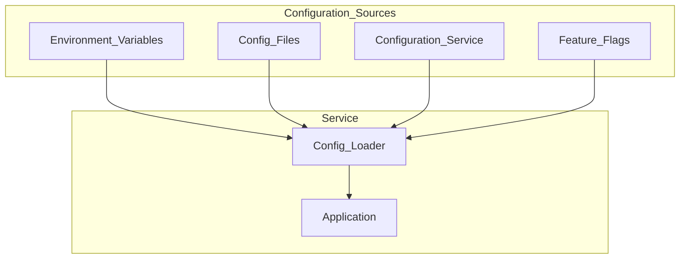

# Configuration Management

> **Volume:** 1 | **Chapter ID:** v1-22 | **Status:** reviewed

## Purpose

Define how EPB components load, validate, override, and manage configuration across environments and tenants. Configuration drives behavior; mismanaged configuration causes outages, security breaches, and inconsistent deployments.

## Overview

EPB follows **Configuration Over Customization** — behavior differences between environments, tenants, and feature rollouts should come from configuration, not code forks.

Configuration spans multiple layers:

| Layer | Examples | Change Frequency |
|-------|----------|------------------|
| Build-time | Service name, API version prefix | Per release |
| Deploy-time | Database connection, log level, feature flags | Per deployment |
| Runtime | Tenant settings, notification templates, thresholds | Without redeployment |

The platform provides a **Configuration service** (Volume 2) for runtime tenant and application settings. This chapter defines the standards every service follows regardless of how configuration is stored.

## Architecture



**Precedence** (highest wins):

```text
1. Environment variables (deploy-time overrides)
2. Configuration service (runtime tenant/app settings)
3. Environment-specific config files (appsettings.Staging.json, etc.)
4. Base config files (appsettings.json, application.yml)
5. Built-in defaults in code
```

## Responsibilities

- Externalize all environment-specific values
- Validate configuration at startup — fail fast on missing or invalid config
- Support configuration changes without code changes
- Separate secrets from non-secret configuration
- Document every configuration key

## Design Principles

| Principle | Configuration Application |
|-----------|--------------------------|
| Configuration Over Customization | Tenant behavior via config, not forks |
| Convention Over Configuration | Sensible defaults; config for exceptions |
| Single Source of Truth | Configuration service for runtime tenant settings |
| Security by Design | Secrets in secrets manager, never in config files |

## Implementation Guidelines

### What Must Be Configurable

| Category | Examples |
|----------|----------|
| Connection strings | Database, cache, queue, object storage |
| Service endpoints | Downstream service URLs |
| Feature flags | Enable/disable capabilities per tenant |
| Operational tuning | Timeouts, retry counts, pool sizes, log levels |
| Tenant settings | Notification templates, branding, locale defaults |
| Rate limits | Per-tenant or per-endpoint throttling |

### What Must NOT Be in Configuration Files

- Secrets (passwords, API keys, signing keys) — use secrets manager
- Business logic rules that belong in code or rule engine
- Compiled code or scripts

### Configuration File Structure

Use environment-specific overlays:

```text
config/
  application.yaml              # defaults
  application.development.yaml  # local dev overrides
  application.staging.yaml      # staging overrides
  application.production.yaml   # production overrides (non-secret values only)
```

Environment variables override file values using a defined naming convention:

```text
# File: database.host=localhost
# Override: DATABASE_HOST=prod-db.internal
```

### Validation at Startup

Services validate all required configuration on startup:

1. Required keys present
2. Values match expected types and ranges
3. Connection strings reachable (readiness check, not startup block for optional deps)
4. Fail with clear error message listing missing/invalid keys

Never start a service with partial or default-secret configuration in production.

### Feature Flags

Feature flags control capability availability without deployment:

| Flag Type | Use When |
|-----------|----------|
| Release flag | Gradual rollout of new feature |
| Ops flag | Kill switch for problematic feature |
| Tenant flag | Capability enabled for specific tenants |
| Permission flag | Feature gated by subscription tier |

Feature flag evaluation goes through the platform Configuration or Feature Flag service — not hard-coded `if (tenantId == "xyz")` checks.

### Runtime Configuration Refresh

For settings that change without redeployment:

- Poll configuration service on interval, or
- Subscribe to configuration change events
- Apply changes without restart where safe (log levels, feature flags, timeouts)
- Require restart for structural changes (connection strings, service URLs) — document which is which

## Best Practices

1. Document every config key in service README with type, default, and valid values
2. Use strongly typed configuration classes — not raw string dictionary access
3. Keep production config files in version control (non-secret values only)
4. Test with production-like configuration in staging before release
5. Audit configuration changes through the Configuration service audit trail
6. Use infrastructure-as-code for deploy-time configuration — see [DevOps Standards](29-devops-standards.md)

## Anti-Patterns

| Anti-Pattern | Why It Fails | Preferred Approach |
|--------------|--------------|--------------------|
| Hard-coded environment URLs | Requires code change per environment | Externalize in config |
| Secrets in appsettings.json | Leaked via source control | Secrets manager |
| No startup validation | Service runs with wrong config, fails at runtime | Validate on startup, fail fast |
| Per-tenant `if` statements in code | Unmaintainable as tenants grow | Feature flags and configuration service |
| Config changes without audit | Cannot trace who changed what | Configuration service with audit |
| Same config for all environments | Dev settings in production or vice versa | Environment-specific overlays |

## Related Chapters

- [Previous: Security Foundation](21-security-foundation.md)
- [Next: Folder Structure](23-folder-structure.md)
- [Core Philosophy](03-core-philosophy.md)
- [EPB Glossary](../docs/GLOSSARY.md)

---

*Enterprise Platform Blueprint — Volume 1*
