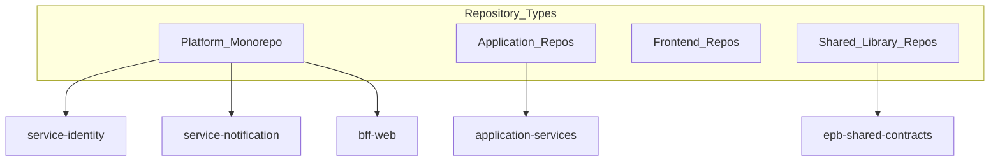

# Folder Structure

> **Volume:** 1 | **Chapter ID:** v1-23 | **Status:** reviewed

## Purpose

Define the canonical directory layout for EPB repositories — platform services, application services, BFF, frontend, and shared libraries. Consistent structure lets developers navigate any repository instantly.

## Overview

When every service follows the same folder structure, onboarding takes hours instead of days. A developer moving from the identity service to the notification service knows exactly where controllers, services, repositories, and tests live.

EPB folder structure follows **Convention Over Configuration**. The layout is fixed. Deviations require an [ADR](34-architecture-decision-records.md) with justification.

## Architecture

EPB organizes code into repository types:



| Repository Type | Contains |
|-----------------|----------|
| Platform monorepo | Platform services, BFF, infrastructure config |
| Application repos | Domain-specific application services |
| Frontend repos | UI applications per product |
| Shared library repos | DTOs, entities, interfaces, validators |

## Responsibilities

- Provide predictable navigation across all repositories
- Separate concerns by layer within each service
- Co-locate tests with the code they test
- Keep infrastructure and deployment config at repository root

## Design Principles

| Principle | Folder Structure Application |
|-----------|------------------------------|
| Convention Over Configuration | One layout; no per-team variations |
| High Cohesion | Related files grouped by feature or layer |
| Platform First | Shared patterns across platform and application services |

## Implementation Guidelines

### Platform / Application Service Layout

Every backend service follows this structure:

```text
service-name/
├── src/
│   ├── main/
│   │   ├── api/                    # Controllers, route handlers
│   │   │   ├── controllers/
│   │   │   └── middleware/
│   │   ├── application/            # Use cases, orchestration
│   │   │   ├── commands/
│   │   │   ├── queries/
│   │   │   └── services/
│   │   ├── domain/                 # Domain models, business rules
│   │   │   ├── models/
│   │   │   ├── events/
│   │   │   └── interfaces/
│   │   ├── infrastructure/         # Persistence, external clients
│   │   │   ├── persistence/
│   │   │   │   ├── entities/
│   │   │   │   ├── repositories/
│   │   │   │   └── migrations/
│   │   │   ├── messaging/
│   │   │   └── clients/
│   │   ├── mapping/                # DTO ↔ Domain ↔ Entity mappers
│   │   └── config/                 # Service-specific configuration
│   └── test/
│       ├── unit/
│       ├── integration/
│       └── fixtures/
├── config/                         # Environment config files
├── deploy/                         # Deployment manifests (K8s, Docker)
├── docs/                           # Service-specific documentation
├── Dockerfile
├── README.md
└── openapi.yaml                    # API specification
```

### Layer Mapping

| Folder | Layer Responsibility |
|--------|---------------------|
| `api/` | HTTP boundary — request validation, response mapping |
| `application/` | Use case orchestration — coordinates domain and infrastructure |
| `domain/` | Business logic — no framework or persistence dependencies |
| `infrastructure/` | Database, messaging, external API clients |
| `mapping/` | Converts between Request DTO, Domain Model, Entity, Response DTO |

This mirrors [Model Separation](11-model-separation.md). Domain folder must not import from `infrastructure/`.

### BFF Layout

```text
bff-web/
├── src/
│   ├── main/
│   │   ├── routes/                 # Route definitions
│   │   ├── controllers/            # Request handlers
│   │   ├── aggregators/            # Multi-service response composition
│   │   ├── clients/                # Downstream service HTTP clients
│   │   ├── middleware/             # Auth, logging, error handling
│   │   ├── mapping/                # Client response mapping
│   │   └── config/
│   └── test/
├── config/
├── deploy/
└── openapi.yaml
```

BFF has no `domain/` or `infrastructure/persistence/` — it does not own business data.

### Shared Library Layout

```text
epb-shared-contracts/
├── src/
│   ├── main/
│   │   ├── dto/
│   │   │   ├── request/
│   │   │   └── response/
│   │   ├── entities/
│   │   ├── enums/
│   │   ├── interfaces/
│   │   ├── validators/
│   │   ├── constants/
│   │   └── types/
│   └── test/
└── README.md
```

Shared libraries contain contracts only — no service logic, no database access.

### Frontend Layout

```text
frontend-app/
├── src/
│   ├── app/                        # Application shell, routing
│   ├── features/                   # Feature modules
│   │   └── resources/
│   │       ├── components/
│   │       ├── hooks/
│   │       ├── services/           # API client calls to BFF
│   │       └── types/
│   ├── shared/                     # Cross-feature utilities
│   │   ├── components/
│   │   ├── hooks/
│   │   └── utils/
│   ├── assets/
│   └── config/
├── public/
├── tests/
└── README.md
```

### Platform Monorepo Root

```text
epb-platform/
├── services/
│   ├── identity-service/
│   ├── notification-service/
│   └── ...
├── bff/
│   └── bff-web/
├── shared/
│   └── epb-shared-contracts/
├── infrastructure/
│   ├── docker/
│   ├── kubernetes/
│   └── terraform/
├── docs/
└── README.md
```

## Best Practices

1. Create new services from Volume 3 templates — do not invent layouts
2. Keep `domain/` free of framework imports — enables unit testing without infrastructure
3. Place OpenAPI spec at service root — it is a first-class artifact
4. Co-locate integration tests in `test/integration/` with docker-compose for dependencies
5. One service per deployable unit — do not combine unrelated services in one folder

## Anti-Patterns

| Anti-Pattern | Why It Fails | Preferred Approach |
|--------------|--------------|--------------------|
| Business logic in `api/controllers/` | Untestable, duplicated across endpoints | Move to `application/` or `domain/` |
| Database entities in `domain/` | Domain coupled to persistence | Entities in `infrastructure/persistence/entities/` |
| Custom folder layout per team | Onboarding friction, inconsistent tooling | Standard layout with ADR for exceptions |
| God folder (`src/utils/`) | Dumping ground, no cohesion | Feature-based or layer-based organization |
| Tests in separate top-level repo | Drift between code and tests | Co-located `test/` within service |
| Shared library with service logic | Circular dependencies, bloated library | Contracts only in shared libraries |

## Related Chapters

- [Previous: Configuration Management](22-configuration-management.md)
- [Next: Naming Conventions](24-naming-conventions.md)
- [Layered Architecture](06-layered-architecture.md)
- [Model Separation](11-model-separation.md)
- [EPB Glossary](../docs/GLOSSARY.md)

---

*Enterprise Platform Blueprint — Volume 1*
