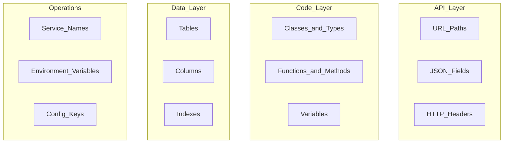

# Naming Conventions

> **Volume:** 1 | **Chapter ID:** v1-24 | **Status:** reviewed

## Purpose

Define consistent naming rules for APIs, code, databases, configuration, and infrastructure resources across all EPB components. Naming is the lowest-cost standardization with the highest long-term payoff.

## Overview

Inconsistent naming creates friction at every boundary. A developer who sees `resource_id` in the database, `resourceId` in JSON, `ResourceID` in Go, and `resource-id` in URLs wastes time on mapping mental models instead of solving problems.

EPB naming follows **Convention Over Configuration** — one rule per context, applied everywhere. This chapter is the reference. Volume 3 provides language-specific examples.

## Architecture

Naming conventions apply at every layer:



## Responsibilities

- Eliminate ambiguity between layers
- Enable automated tooling (linters, code generators, OpenAPI clients)
- Support domain-neutral terminology
- Align with industry conventions where they exist (REST, JSON, SQL)

## Design Principles

| Principle | Naming Application |
|-----------|-------------------|
| Convention Over Configuration | One pattern per context — no team variations |
| Single Source of Truth | Canonical names in shared libraries and OpenAPI specs |
| Domain Neutrality | Generic nouns in platform; domain terms in applications only |

## Implementation Guidelines

### REST API URLs

| Rule | Convention | Example |
|------|------------|---------|
| Case | kebab-case | `/api/v1/resource-types` |
| Resources | Plural nouns | `/resources`, `/organizations` |
| Hierarchy | Parent before child | `/resources/{id}/audit-events` |
| Actions | Verb as sub-resource | `/resources/{id}/activate` |
| Version | In path prefix | `/api/v1/...` |
| Query params | camelCase | `?pageSize=20&sortBy=displayName` |
| Filter params | Bracket notation | `?filter[status]=ACTIVE` |

See [API Standards](18-api-standards.md) for full REST conventions.

### JSON Fields

| Rule | Convention | Example |
|------|------------|---------|
| Case | camelCase | `displayName`, `createdAt`, `tenantId` |
| IDs | `{entity}Id` suffix | `resourceId`, `organizationId` |
| Booleans | `is` or `has` prefix | `isActive`, `hasAttachments` |
| Timestamps | `At` suffix, ISO 8601 | `createdAt`, `updatedAt`, `deletedAt` |
| Collections | Plural | `items`, `permissions`, `auditEvents` |
| Enums | SCREAMING_SNAKE in JSON | `"status": "ACTIVE"` |

### HTTP Headers

| Rule | Convention | Example |
|------|------------|---------|
| Custom headers | `X-` prefix or standard names | `X-Correlation-Id`, `Authorization` |
| Case | Pascal-Case with hyphens | `Content-Type`, `X-Tenant-Id` |

### Code (Language-Agnostic Rules)

| Element | Convention | Example |
|---------|------------|---------|
| Classes / Types | PascalCase | `ResourceService`, `CreateResourceRequest` |
| Interfaces | PascalCase, `I` prefix optional per language | `IResourceRepository` |
| Methods / Functions | camelCase (or snake_case in Python/Rust per language idiom) | `createResource()`, `findById()` |
| Constants | SCREAMING_SNAKE_CASE | `MAX_PAGE_SIZE`, `DEFAULT_TIMEOUT_MS` |
| Private members | Leading underscore or language convention | `_cache`, `private cache` |
| Files | Match primary export, kebab-case or PascalCase per language | `resource-service.ts`, `ResourceService.java` |
| Packages / Modules | lowercase, dot or slash separated | `com.epb.identity`, `epb/identity` |

### DTO and Model Naming

Per [DTO Standards](15-dto-standards.md) and [Model Separation](11-model-separation.md):

| Type | Suffix | Example |
|------|--------|---------|
| Request DTO | `Request` | `CreateResourceRequest` |
| Response DTO | `Response` | `ResourceResponse` |
| List item DTO | `Summary` or `ListItem` | `ResourceSummary` |
| Persistence Entity | `Entity` | `ResourceEntity` |
| Domain Model | No suffix or `Model` | `Resource` or `ResourceModel` |
| Mapper | `Mapper` | `ResourceMapper` |
| Repository | `Repository` | `ResourceRepository` |
| Service | `Service` | `ResourceService` |
| Controller | `Controller` | `ResourceController` |

### Database Naming

| Element | Convention | Example |
|---------|------------|---------|
| Tables | snake_case, plural | `resources`, `audit_events` |
| Columns | snake_case | `display_name`, `tenant_id`, `created_at` |
| Primary key | `id` | `id` (UUID or bigint) |
| Foreign key | `{referenced_table_singular}_id` | `organization_id`, `tenant_id` |
| Indexes | `idx_{table}_{columns}` | `idx_resources_tenant_id_status` |
| Unique constraints | `uq_{table}_{columns}` | `uq_resources_tenant_id_code` |
| Junction tables | `{table1}_{table2}` alphabetical | `role_permissions` |

### Service and Infrastructure Naming

| Element | Convention | Example |
|---------|------------|---------|
| Service name | kebab-case | `identity-service`, `notification-service` |
| Container image | `{registry}/{service}:{version}` | `epb/identity-service:1.2.0` |
| Environment variables | SCREAMING_SNAKE_CASE | `DATABASE_HOST`, `LOG_LEVEL` |
| Config keys | dot.notation.camelCase | `database.connectionTimeout` |
| Kubernetes resources | kebab-case with service prefix | `identity-service-deployment` |
| Event types | dot.notation | `resource.created`, `user.password.changed` |
| Queue/topic names | kebab-case with service prefix | `notification-send-email` |

### Enums

Platform enums use SCREAMING_SNAKE_CASE values:

```json
{
  "status": "ACTIVE",
  "priority": "HIGH",
  "channel": "EMAIL"
}
```

Application-specific enums follow the same convention for consistency.

## Best Practices

1. Run naming linters in CI — reject PRs that violate conventions
2. Generate OpenAPI clients from specs — ensures JSON field naming consistency
3. Use code generators from Volume 3 templates for DTOs and entities
4. Name things for what they are, not how they are implemented (`ResourceService`, not `ResourceManagerImpl`)
5. Avoid abbreviations unless industry-standard (`id`, `url`, `api`, `dto`)

## Anti-Patterns

| Anti-Pattern | Why It Fails | Preferred Approach |
|--------------|--------------|--------------------|
| Mixed casing in same API | Client SDK generation breaks | camelCase JSON, kebab-case URLs consistently |
| Singular table names | ORM and SQL convention conflicts | Plural snake_case tables |
| Hungarian notation | Noise, outdated practice | Descriptive names with type in DTO suffix |
| Domain terms in platform names | Violates domain neutrality | Generic names in platform layer |
| Abbreviated service names | Ambiguous in logs and dashboards | Full kebab-case names (`identity-service`) |
| Same name for DTO and Entity | Confusion about which layer | Distinct suffixes: `Request`, `Entity` |

## Related Chapters

- [Previous: Folder Structure](23-folder-structure.md)
- [Next: Coding Standards](25-coding-standards.md)
- [API Standards](18-api-standards.md)
- [DTO Standards](15-dto-standards.md)
- [Entity Standards](16-entity-standards.md)
- [EPB Glossary](../docs/GLOSSARY.md)

---

*Enterprise Platform Blueprint — Volume 1*
