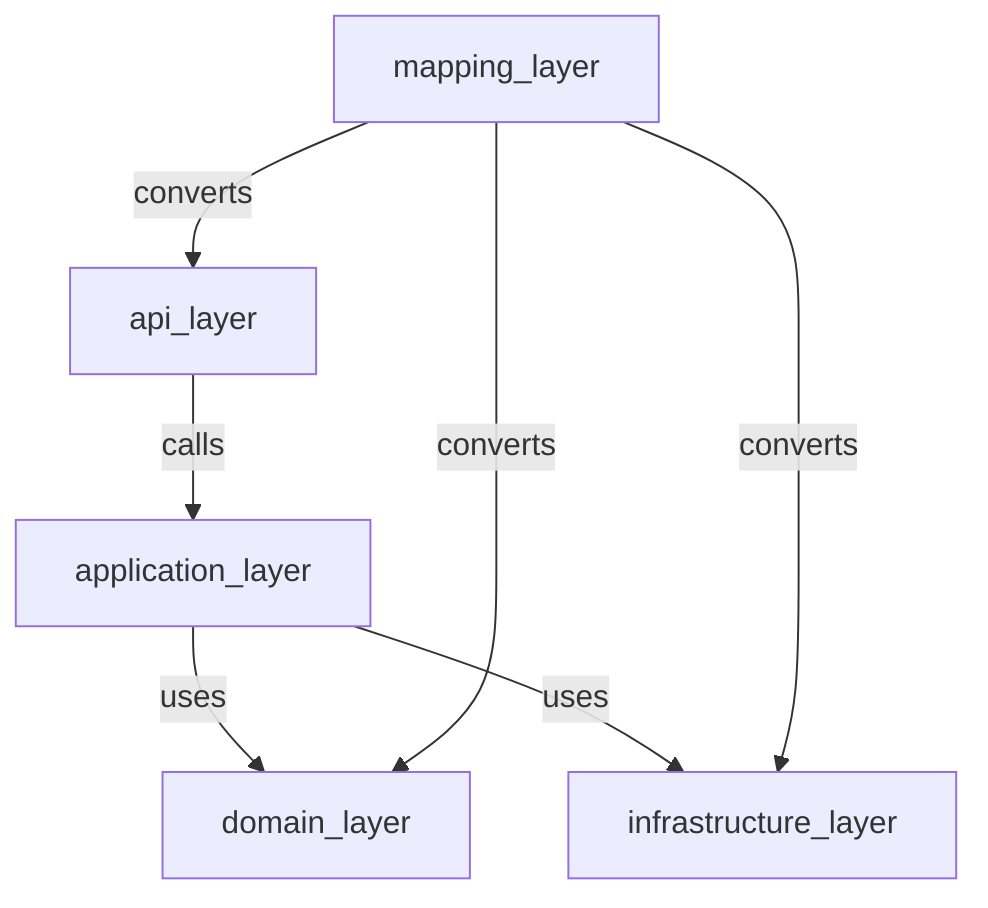

# Coding Standards

> **Volume:** 1 | **Chapter ID:** v1-25 | **Status:** reviewed

## Purpose

Define language-agnostic coding practices for all EPB components. These standards ensure readability, maintainability, and consistency regardless of which programming language a team chooses.

## Overview

EPB is framework-agnostic but opinionated where it matters. Every service — platform or application — follows the same coding discipline: clear separation of concerns, explicit error handling, testable design, and no shortcuts that compromise security or data integrity.

Coding standards complement [Naming Conventions](24-naming-conventions.md), [Folder Structure](23-folder-structure.md), and [Testing Standards](27-testing-standards.md). Volume 3 provides language-specific templates and examples.

## Architecture

Coding standards enforce the layer model in code:



Dependency direction is downward and inward: `api` → `application` → `domain`. `infrastructure` implements interfaces defined in `domain`. `domain` depends on nothing external.

## Responsibilities

- Keep business logic out of controllers and route handlers
- Make errors explicit and traceable
- Write testable code with injectable dependencies
- Prevent data layer leakage into API responses
- Enforce standards through automated linting in CI

## Design Principles

| Principle | Coding Application |
|-----------|-------------------|
| High Cohesion | One class/function, one responsibility |
| Loose Coupling | Depend on interfaces, not implementations |
| Single Source of Truth | Import DTOs from shared libraries |
| Security by Design | Validate all inputs; never trust client data |

## Implementation Guidelines

### Layer Discipline

| Layer | May Do | Must Not Do |
|-------|--------|-------------|
| `api/` | Parse request, call application service, map response, HTTP status codes | Business logic, database queries |
| `application/` | Orchestrate use cases, transaction boundaries, publish events | HTTP concerns, direct SQL |
| `domain/` | Business rules, domain events, interface definitions | Framework imports, persistence code |
| `infrastructure/` | Database access, messaging, external API calls | Business rule decisions |
| `mapping/` | Convert between model types | Business logic |

### Dependency Injection

- Constructor injection for required dependencies
- Interface-based dependencies in `application/` and `domain/`
- Concrete implementations registered in composition root / DI container
- No service locator pattern or global singletons for business dependencies

### Error Handling

Per [Error Handling](19-error-handling.md):

- Catch exceptions at layer boundaries, not everywhere
- Domain layer throws domain exceptions with error codes
- Application layer translates domain exceptions to application results
- API layer maps to standard HTTP error envelope
- Never swallow exceptions silently
- Never expose stack traces or internal details in API responses

```text
Domain:       throw ResourceNotFoundException("RESOURCE_NOT_FOUND")
Application:  catch → return Result.failure(RESOURCE_NOT_FOUND)
API:          map → 404 with standard error envelope
```

### Input Validation

- Validate request DTOs at API boundary (schema validation)
- Validate business rules in domain layer
- Reject invalid input early — do not pass unvalidated data to domain
- Use shared validators from shared libraries where applicable

### Async and Concurrency

- Prefer async I/O for network and database operations
- Use thread-safe patterns for shared mutable state
- Document concurrency assumptions on public methods
- Avoid blocking calls on async paths

### Code Style

| Rule | Detail |
|------|--------|
| Function length | Target under 30 lines; extract if longer |
| Class length | Target under 300 lines; split by responsibility |
| Parameters | Maximum 4-5; use request object for more |
| Nesting depth | Maximum 3 levels; use early returns |
| Comments | Explain why, not what; code should be self-documenting |
| Magic numbers | Named constants |
| Dead code | Remove, do not comment out |

### Git and Code Review

Per [Development Workflow](26-development-workflow.md):

- Small, focused pull requests (under 400 lines changed when possible)
- Every PR requires at least one reviewer
- CI must pass before merge: lint, test, build
- No direct commits to main/production branch

### Static Analysis

Every repository configures:

- Linter matching language conventions
- Formatter enforced in CI (no formatting debates in review)
- Type checking where language supports it
- Security scanning (SAST) in CI pipeline

## Best Practices

1. Write the test first or immediately after for business logic
2. Prefer composition over inheritance
3. Use immutable objects for DTOs and value types where possible
4. Return early to reduce nesting
5. Log at service boundaries, not inside every helper method
6. Keep `domain/` free of framework imports — this is the testability anchor
7. Use shared library types — never duplicate DTO definitions

## Anti-Patterns

| Anti-Pattern | Why It Fails | Preferred Approach |
|--------------|--------------|--------------------|
| Fat controllers | Untestable, duplicated logic | Thin controllers; logic in application/domain |
| Anemic domain model | Business rules scattered in services | Rich domain models with behavior |
| God class | Unmaintainable, untestable | Split by single responsibility |
| Primitive obsession | Stringly-typed bugs | Value objects and enums |
| Copy-paste DTOs | Drift between services | Import from shared library |
| Catching `Exception` everywhere | Hides real bugs | Catch specific exceptions at boundaries |
| Business logic in mappers | Wrong layer, hard to test | Mappers convert only; logic in domain |

## Related Chapters

- [Previous: Naming Conventions](24-naming-conventions.md)
- [Next: Development Workflow](26-development-workflow.md)
- [Error Handling](19-error-handling.md)
- [Testing Standards](27-testing-standards.md)
- [Model Separation](11-model-separation.md)
- [EPB Glossary](../docs/GLOSSARY.md)

---

*Enterprise Platform Blueprint — Volume 1*
