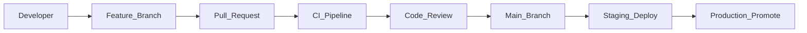

# Development Workflow

> **Volume:** 1 | **Chapter ID:** v1-26 | **Status:** reviewed

## Purpose

Define the end-to-end workflow from feature branch to production deployment. Consistent workflow reduces merge conflicts, speeds code review, and ensures every change passes the same quality gates.

## Overview

EPB teams work in a **trunk-based** model with short-lived feature branches. Every change flows through: branch → implement → test locally → pull request → CI validation → peer review → merge → automated deploy to staging → promotion to production. This workflow applies to platform services, application services, shared libraries, and infrastructure configuration.

## Architecture



The workflow spans all layers but each service deploys independently after merge.

## Responsibilities

- Enforce branch naming and PR size limits
- Require CI green before merge
- Block direct commits to `main` / `production`
- Tie releases to semantic versioning for shared libraries
- Document breaking changes in ADRs and release notes

## Design Principles

| Principle | Workflow Application |
|-----------|---------------------|
| Convention Over Configuration | Standard branch prefixes: `feature/`, `fix/`, `chore/` |
| Single Source of Truth | `main` is always deployable |
| Security by Design | Security checklist on every PR touching auth or data |
| Developer Experience First | Fast CI feedback under 10 minutes for unit tests |

## Implementation Guidelines

### Branch Strategy

| Branch | Purpose | Lifetime |
|--------|---------|----------|
| `main` | Integration; always deployable | Permanent |
| `feature/<ticket>-<desc>` | New capability | Days, not weeks |
| `fix/<ticket>-<desc>` | Bug fix | Hours to days |
| `release/<version>` | Release stabilization (optional) | Until tagged |

### Pull Request Requirements

1. Linked ticket or ADR reference in description
2. All CI checks pass: lint, unit tests, integration tests, build
3. At least one approval from a code owner
4. No unresolved review comments
5. Changes under 400 lines when possible — split large features

### Commit Messages

Use conventional commits: `feat:`, `fix:`, `docs:`, `refactor:`, `test:`, `chore:`.

```text
feat(catalog): add resource archive endpoint
fix(auth): correct token expiry validation
```

### Local Development Loop

```bash
git checkout -b feature/EPB-142-resource-archive
# implement + test
npm test
git commit -m "feat(catalog): add resource archive endpoint"
git push -u origin HEAD
# open PR
```

### Release Flow

Platform services tag releases (`v1.2.0`). Application teams consume platform APIs by version. Shared library changes require downstream service builds in CI.

## Best Practices

1. Rebase feature branches daily against `main` to reduce merge pain
2. Run the full test suite locally before pushing
3. Keep PRs focused — one concern per PR
4. Use draft PRs for early feedback
5. Deploy to staging automatically on merge; promote to production via approved pipeline

## Anti-Patterns

| Anti-Pattern | Why It Fails | Preferred Approach |
|--------------|--------------|--------------------|
| Long-lived branches (weeks) | Massive merge conflicts | Small PRs merged within days |
| Skipping CI | Broken main branch | CI required for merge |
| Direct push to main | No review, no audit trail | Branch protection rules |
| Giant PRs (1000+ lines) | Superficial review | Split into incremental PRs |
| Merge without staging test | Production surprises | Auto-deploy staging on merge |

## Related Chapters

- [Previous: Coding Standards](25-coding-standards.md)
- [Next: Testing Standards](27-testing-standards.md)
- [CI CD Pipeline](32-cicd-pipeline.md)
- [Git Workflow](../Volume-3-Developer-Guide/24-git-workflow.md)
- [EPB Glossary](../docs/GLOSSARY.md)

---

*Enterprise Platform Blueprint — Volume 1*
