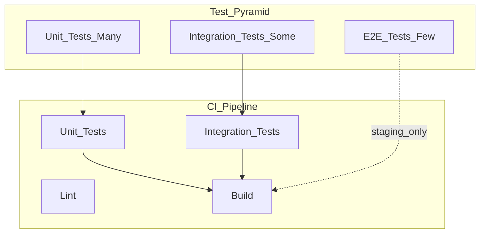

# Testing Standards

> **Volume:** 1 | **Chapter ID:** v1-27 | **Status:** reviewed

## Purpose

Define the testing strategy, pyramid, coverage expectations, and practices for all EPB components. Tests are the safety net that makes platform-wide refactoring and independent service deployment possible.

## Overview

EPB services deploy independently. Without tests, a change in the shared library or a platform service silently breaks downstream applications. Testing is not optional — it is a release gate.

EPB follows the **test pyramid**: many fast unit tests, fewer integration tests, and a small set of end-to-end tests. Tests run in CI on every pull request. Failing tests block merge.

## Architecture



| Layer | Scope | Speed | Dependencies |
|-------|-------|-------|--------------|
| Unit | Single class/function | Milliseconds | None (mocked) |
| Integration | Service + database/messaging | Seconds | Test containers or docker-compose |
| E2E | Full flow through BFF | Minutes | Staging environment |
| Contract | API schema compliance | Seconds | OpenAPI spec |

## Responsibilities

- Verify business logic correctness at unit level
- Verify persistence, messaging, and external integrations at integration level
- Verify critical user journeys at E2E level
- Prevent API contract breaking changes with contract tests
- Maintain tests as first-class code — not an afterthought

## Design Principles

| Principle | Testing Application |
|-----------|-------------------|
| High Cohesion | Test one behavior per test case |
| Loose Coupling | Mock external dependencies in unit tests |
| Convention Over Configuration | Standard test folder layout per [Folder Structure](23-folder-structure.md) |
| Developer Experience First | Fast feedback — unit tests complete in under 60 seconds |

## Implementation Guidelines

### Test Pyramid Targets

| Test Type | Coverage Target | Run When |
|-----------|----------------|----------|
| Unit | 80%+ line coverage on `domain/` and `application/` | Every PR |
| Integration | All repository and messaging paths | Every PR |
| Contract | All public API endpoints | Every PR |
| E2E | Critical paths (auth, CRUD, key workflows) | Staging deployment |
| Performance | Baseline benchmarks for critical endpoints | Weekly or pre-release |

Coverage targets apply to business logic layers. Do not chase 100% on boilerplate (mappers, config).

### Unit Tests

**What to test:**

- Domain business rules and validation
- Application service orchestration logic
- Mapper conversions (input → output correctness)
- Error handling paths

**How:**

- No database, network, or filesystem dependencies
- Mock interfaces defined in `domain/`
- One assertion concept per test
- Descriptive test names: `should_returnError_when_resourceNotFound`

```text
# Naming pattern
should_{expectedBehavior}_when_{condition}

Examples:
  should_createResource_when_validRequest
  should_return404_when_resourceNotFound
  should_rejectRequest_when_tenantIdMissing
```

### Integration Tests

**What to test:**

- Repository CRUD against real database (test container)
- Message publishing and consumption
- External service client behavior (with test doubles or wiremock)
- Database migrations apply cleanly

**How:**

- Use docker-compose or test containers for dependencies
- Reset database state between tests (transactions or truncation)
- Run in CI with dedicated test profile
- Located in `test/integration/`

### Contract Tests

**What to test:**

- API responses match OpenAPI specification
- Request validation rejects invalid payloads per schema
- Response envelope structure per [API Standards](18-api-standards.md)

**How:**

- Generate tests from `openapi.yaml`
- Provider verifies (service implements spec)
- Consumer verifies (BFF/clients expect spec)
- Breaking changes fail CI

### End-to-End Tests

**What to test:**

- Authentication and authorization flows
- Complete CRUD lifecycle for primary resources
- Cross-service workflows (create → notify → audit)
- Error scenarios visible to end users

**How:**

- Run against staging environment
- Use test tenant with isolated data
- Clean up test data after run
- Keep suite small and fast — critical paths only

### Test Data

| Rule | Detail |
|------|--------|
| Fixtures | Reusable builders in `test/fixtures/` |
| No production data | Ever |
| Deterministic | Tests produce same result every run |
| Isolated | Tests do not depend on execution order |
| Tenant-scoped | Multi-tenant tests use distinct tenant IDs |

### CI Requirements

Every pull request must pass:

1. Lint and format check
2. Unit tests (all)
3. Integration tests (all)
4. Contract tests (all)
5. Build (container image or artifact)

E2E tests run on staging deployment, not on every PR (too slow).

## Best Practices

1. Write tests alongside production code — not in a separate "testing sprint"
2. Test behavior, not implementation details (refactoring should not break tests)
3. Keep unit tests fast — the entire unit suite under 60 seconds
4. Use test builders/factories instead of copy-pasted JSON fixtures
5. Fail tests must include actionable error messages
6. Flaky tests are bugs — fix or quarantine immediately, never ignore
7. Review test quality in code review, not just production code

## Anti-Patterns

| Anti-Pattern | Why It Fails | Preferred Approach |
|--------------|--------------|--------------------|
| No tests on domain logic | Regressions ship silently | Unit test every business rule |
| Testing through HTTP in unit tests | Slow, brittle, not unit tests | Mock dependencies; test class directly |
| Shared mutable test state | Order-dependent failures | Isolated data per test |
| 100% coverage on mappers only | False confidence | Focus coverage on domain and application |
| E2E-only strategy | Slow feedback, hard to debug failures | Test pyramid with many unit tests |
| Skipping tests to meet deadline | Permanent debt | Tests are part of definition of done |
| Production database in tests | Data corruption, security risk | Test containers with isolated DB |

## Related Chapters

- [Previous: Development Workflow](26-development-workflow.md)
- [Next: Documentation Standards](28-documentation-standards.md)
- [Coding Standards](25-coding-standards.md)
- [CI CD Pipeline](32-cicd-pipeline.md)
- [EPB Glossary](../docs/GLOSSARY.md)

---

*Enterprise Platform Blueprint — Volume 1*
