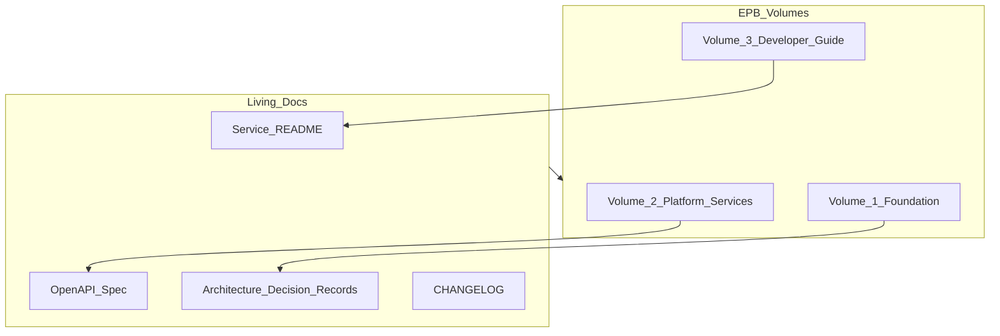

# Documentation Standards

> **Volume:** 1 | **Chapter ID:** v1-28 | **Status:** reviewed

## Purpose

Establish what must be documented, where it lives, and how to keep documentation current as the platform evolves.

## Overview

Documentation is a first-class deliverable in EPB — not an afterthought. Code without documentation creates onboarding friction and repeated questions. EPB documentation follows the **Diátaxis** model: tutorials (Volume 3), how-to guides, reference (API specs, glossary), and explanation (Volume 1 architecture chapters).

## Architecture



Handbook chapters are the canonical architecture reference. Service READMEs and OpenAPI specs are living documents updated with every API change.

## Responsibilities

- Every service has a README with setup, configuration, and API summary
- Every public API has an OpenAPI specification
- Significant decisions are recorded as ADRs
- Handbook chapters are updated when standards change
- Changelog entries accompany every release

## Design Principles

| Principle | Documentation Application |
|-----------|--------------------------|
| Single Source of Truth | One canonical location per topic |
| API First | Document API contracts before implementation |
| Configuration Over Customization | Document config options, not hard-coded behavior |
| Developer Experience First | A new developer can run a service from README alone |

## Implementation Guidelines

### Required Documentation per Service

| Document | Location | Update Trigger |
|----------|----------|----------------|
| README | `services/<name>/README.md` | Setup or config change |
| OpenAPI spec | `services/<name>/api/openapi.yaml` | Any API change |
| Environment vars | `.env.example` | New config key |
| Migrations | `migrations/` with README | Schema change |
| ADR | `docs/adr/` | Architectural decision |

### README Structure

Every service README must include:

1. **Purpose** — what the service does in one paragraph
2. **Prerequisites** — dependencies, other services
3. **Quick Start** — commands to run locally
4. **Configuration** — environment variables table
5. **API Summary** — link to OpenAPI spec
6. **Events** — published and consumed events
7. **Ownership** — team and contact

### Handbook Chapter Standards

Per [STYLE-GUIDE](../docs/STYLE-GUIDE.md):

- Volume 1: Purpose, Overview, Architecture, Responsibilities, Design Principles, Implementation Guidelines, Best Practices, Anti-Patterns
- Volume 3: What You Will Accomplish, Prerequisites, Steps, Verification, Troubleshooting

### ADR Format

```markdown
# ADR-NNN: Title
**Status:** accepted | superseded
**Date:** YYYY-MM-DD
## Context
## Decision
## Consequences
```

### Documentation Review in PRs

PRs that change behavior must include documentation updates. Reviewers check: README, OpenAPI, changelog, and handbook cross-references.

## Best Practices

1. Document the *why*, not just the *what*
2. Keep examples domain-neutral (use "resource", "entity", "tenant")
3. Update docs in the same PR as code changes
4. Link between handbook chapters and service READMEs
5. Use Mermaid diagrams for architecture; keep prose for rationale

## Anti-Patterns

| Anti-Pattern | Why It Fails | Preferred Approach |
|--------------|--------------|--------------------|
| Docs-only PRs months after code | Drift, inaccurate docs | Same-PR documentation |
| Wiki outside repo | Not versioned with code | Docs in repository |
| Undocumented environment variables | Onboarding failures | `.env.example` always current |
| Copy-paste between services | Inconsistent instructions | Link to Volume 3 guides |
| Stale OpenAPI specs | Client integration breaks | Generate spec from code or CI check |

## Related Chapters

- [Previous: Testing Standards](27-testing-standards.md)
- [Next: DevOps Standards](29-devops-standards.md)
- [Architecture Decision Records](34-architecture-decision-records.md)
- [EPB Glossary](../docs/GLOSSARY.md)

---

*Enterprise Platform Blueprint — Volume 1*
