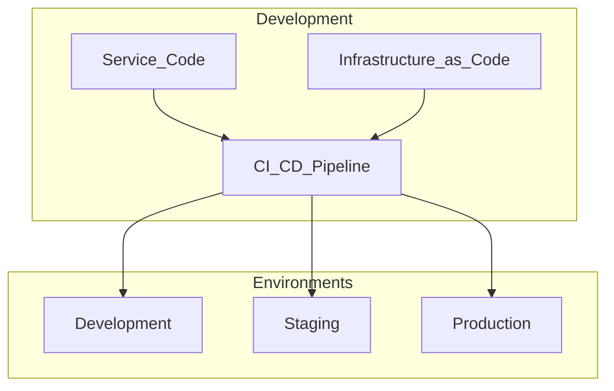

# DevOps Standards

> **Volume:** 1 | **Chapter ID:** v1-29 | **Status:** reviewed

## Purpose

Define the operational practices that connect development to reliable production systems: environment management, deployment automation, infrastructure as code, and operational readiness.

## Overview

DevOps in EPB is not a separate team silo — it is embedded in how every service is built and shipped. Developers own their service from code to production. Platform engineering provides shared pipelines, base images, and infrastructure templates; application teams consume them and extend with service-specific configuration.

## Architecture

Each environment is isolated. Configuration differences are expressed through environment variables and secrets — never through different code branches.

## Responsibilities

- Maintain reproducible builds across all environments
- Automate deployment; manual production deploys are exceptions
- Define environment promotion gates (tests, approvals)
- Monitor service health post-deploy
- Document runbooks for operational procedures

## Design Principles

| Principle | DevOps Application |
|-----------|-------------------|
| Configuration Over Customization | Same artifact, different config per environment |
| Security by Design | Secrets never in source control; least-privilege IAM |
| Scalability by Design | Stateless services; horizontal scaling via orchestrator |
| Platform First | Shared pipeline templates for all services |

## Implementation Guidelines

### Environment Tiers

| Environment | Purpose | Data | Access |
|-------------|---------|------|--------|
| Local | Developer workstation | Synthetic / seed data | Developer |
| Development | Integration testing | Disposable | Team |
| Staging | Pre-production validation | Anonymized production copy | Team + QA |
| Production | Live traffic | Real tenant data | Restricted |

### Infrastructure as Code

All infrastructure is defined in version-controlled templates:

- Container images via Dockerfiles
- Orchestration manifests (Kubernetes, Docker Compose)
- Database provisioning scripts
- Network and security group definitions

Changes to infrastructure follow the same PR workflow as application code.

### Deployment Standards

1. **Immutable artifacts** — build once, deploy everywhere
2. **Blue-green or rolling** — zero-downtime deploys for stateless services
3. **Database migrations** — run as pre-deploy step with rollback plan
4. **Health checks** — orchestrator waits for `/health/ready` before routing traffic
5. **Rollback** — previous image tag retained; one-command rollback

### Operational Readiness Checklist

Before a service goes to production:

- [ ] Health and readiness endpoints implemented
- [ ] Structured logging with correlation IDs
- [ ] Metrics exported (request rate, latency, errors)
- [ ] Alerts configured for SLO violations
- [ ] Runbook documented for common failures
- [ ] Secrets injected via secrets manager, not env files in image

## Best Practices

1. Treat staging as production-like — same topology, scaled down
2. Automate environment provisioning; manual setup drifts
3. Use feature flags for risky releases, not long-lived environment branches
4. Tag every production deploy with git SHA and timestamp
5. Post-deploy smoke tests run automatically before traffic shift

## Anti-Patterns

| Anti-Pattern | Why It Fails | Preferred Approach |
|--------------|--------------|--------------------|
| Snowflake servers | Unreproducible, untestable | Infrastructure as code |
| Manual production deploys | Human error, no audit | Automated pipeline with approval gate |
| Config in Docker image | Rebuild to change a URL | Externalized config and secrets |
| Shared staging database | Test pollution, flaky tests | Per-feature or disposable databases |
| No rollback plan | Extended outages | Retain previous artifact; document rollback |

## Related Chapters

- [Previous: Documentation Standards](28-documentation-standards.md)
- [Next: Infrastructure Overview](30-infrastructure-overview.md)
- [CI CD Pipeline](32-cicd-pipeline.md)
- [Docker and Containers](31-docker-and-containers.md)
- [Production Readiness](../Volume-3-Developer-Guide/26-production-readiness.md)
- [EPB Glossary](../docs/GLOSSARY.md)

---

*Enterprise Platform Blueprint — Volume 1*
