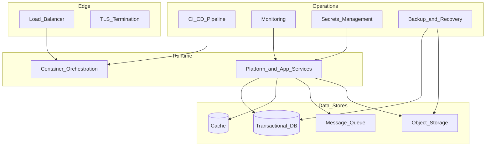

# Infrastructure Overview

> **Volume:** 1 | **Chapter ID:** v1-30 | **Status:** reviewed

## Purpose

Provide a high-level map of the infrastructure capabilities EPB requires and how they support platform services and applications. This chapter connects engineering standards to operational reality.

## Overview

Platform services and applications do not run in isolation. They need containers, databases, caches, queues, object storage, secrets management, monitoring, backups, and deployment pipelines. EPB treats infrastructure as a **shared foundation** — provisioned once, consumed by all services.

Infrastructure follows **Cloud Native** principles from [Core Philosophy](03-core-philosophy.md): containerized, horizontally scalable, health-checked, and configurable per environment. The same architecture runs on-premises or in any cloud provider.

## Architecture



## Responsibilities

EPB infrastructure must provide:

| Capability | Purpose |
|------------|---------|
| **Docker / Containers** | Consistent packaging and deployment of all services |
| **CI/CD** | Automated build, test, and deploy pipelines |
| **Monitoring** | Metrics, logs, traces, and alerting |
| **Caching** | Performance optimization for read-heavy paths |
| **Queue** | Asynchronous processing and event distribution |
| **Secrets** | Secure storage and injection of credentials |
| **Backup** | Point-in-time recovery for databases and object storage |
| **Recovery** | Documented procedures for disaster recovery |
| **Object Storage** | Files, documents, exports, and large payloads |
| **Cloud Ready** | Portable across cloud providers and on-premises |

## Design Principles

| Principle | Infrastructure Application |
|-----------|---------------------------|
| Cloud Native | Containers, health checks, horizontal scaling |
| Security by Design | Network segmentation, secrets management, encryption |
| Scalability by Design | Stateless services, externalized state, queue-based async |
| Configuration Over Customization | Environment differences via config, not different images |
| Platform First | Shared infrastructure for all services |

## Implementation Guidelines

### Container Strategy

Every service ships as a container image:

- Multi-stage builds for minimal image size
- Non-root user inside container
- Health check endpoints (`/health`, `/ready`)
- Configuration via environment variables
- Logs to stdout/stderr (see [Logging Standards](20-logging-standards.md))

See [Docker and Containers](31-docker-and-containers.md) for detailed standards.

### Data Stores

| Store | Use Case | EPB Standard |
|-------|----------|--------------|
| Relational DB | Transactional data per service | One database/schema per service |
| Cache | Session data, frequently read entities | Redis or equivalent |
| Message queue | Events, async jobs, retry processing | Platform event bus |
| Object storage | Files, documents, exports | S3-compatible API |
| Search index | Full-text search | Platform search service index |

Reporting workloads use separate stores per [Transactional vs Reporting](13-transactional-vs-reporting.md).

### Networking

```text
Internet → Load Balancer → BFF → Internal Network → Services
                                    ↓
                              Data Stores (private subnet)
```

- Public internet reaches only the load balancer and BFF
- Services communicate on internal network
- Databases and queues are not publicly accessible
- TLS everywhere — external and internal

### Environment Strategy

| Environment | Purpose | Data |
|-------------|---------|------|
| Development | Local developer machines | Synthetic / seed data |
| Staging | Pre-production validation | Anonymized production-like data |
| Production | Live traffic | Real data with full security controls |

Each environment has isolated infrastructure. Production secrets never appear in staging or development.

### CI/CD Pipeline

Per [CI CD Pipeline](32-cicd-pipeline.md) and [DevOps Standards](29-devops-standards.md):

1. **Build** — compile, lint, unit test, integration test
2. **Package** — container image with version tag
3. **Scan** — vulnerability scan on image and dependencies
4. **Deploy to staging** — automated on merge to main
5. **E2E tests** — run against staging
6. **Deploy to production** — manual approval or automated with canary

### Monitoring and Observability

Per [Monitoring and Observability](33-monitoring-observability.md):

| Signal | Tool Category | Purpose |
|--------|--------------|---------|
| Metrics | Prometheus, Datadog, CloudWatch | Performance, capacity, SLAs |
| Logs | ELK, Loki, CloudWatch Logs | Debugging, audit correlation |
| Traces | Jaeger, Zipkin, OpenTelemetry | Distributed request tracing |
| Alerts | PagerDuty, Opsgenie | Incident notification |

Every service exposes standard metrics: request rate, error rate, duration, queue depth.

### Secrets Management

- Centralized secrets store (HashiCorp Vault, AWS Secrets Manager, Azure Key Vault)
- Secrets injected at runtime — never baked into images
- Rotation policy for database credentials and API keys
- Separate secrets per environment and per service

### Backup and Recovery

| Asset | Backup Frequency | Retention | Recovery Target |
|-------|-----------------|-----------|-----------------|
| Transactional databases | Daily + continuous WAL | 30 days minimum | RPO < 1 hour, RTO < 4 hours |
| Object storage | Versioning enabled | Per compliance policy | RPO < 24 hours |
| Configuration | Version controlled | Indefinite | Immediate |
| Secrets | Managed by secrets store | Per store policy | Immediate |

Document and test recovery procedures quarterly.

### Caching Strategy

| Cache Level | Scope | Invalidation |
|-------------|-------|--------------|
| CDN / Edge | Static assets, public content | TTL or deploy |
| Application cache | Entity lookups, config | Event-driven or TTL |
| Database query cache | Read-heavy queries | TTL, avoid for transactional writes |

Cache is an optimization, not a source of truth. Services must function correctly if cache is unavailable.

## Best Practices

1. Infrastructure as Code (Terraform, Pulumi, CloudFormation) for all provisioning
2. Immutable infrastructure — replace containers, do not patch running instances
3. Auto-scaling based on CPU, memory, or custom metrics (queue depth)
4. Regular disaster recovery drills — untested backups are not backups
5. Cost monitoring per environment and per service
6. Keep infrastructure chapters in Volume 1 current as tooling evolves

## Anti-Patterns

| Anti-Pattern | Why It Fails | Preferred Approach |
|--------------|--------------|--------------------|
| Snowflake servers | Cannot reproduce, drift over time | Immutable containers |
| Shared database for all services | Coupling, scaling limits | Database per service |
| Manual deployment | Human error, slow releases | CI/CD pipeline |
| Secrets in container images | Credential leak on image access | Runtime secrets injection |
| No staging environment | Production is the test environment | Full staging mirror |
| Monitoring as afterthought | Blind during incidents | Metrics/logs/traces from day one |
| Single-region production | Regional outage = total outage | Multi-region for critical workloads |

## Related Chapters

- [Previous: DevOps Standards](29-devops-standards.md)
- [Next: Docker and Containers](31-docker-and-containers.md)
- [CI CD Pipeline](32-cicd-pipeline.md)
- [Monitoring and Observability](33-monitoring-observability.md)
- [Cloud Native Principles](38-cloud-native-principles.md)
- [Security Foundation](21-security-foundation.md)
- [EPB Glossary](../docs/GLOSSARY.md)

---

*Enterprise Platform Blueprint — Volume 1*
