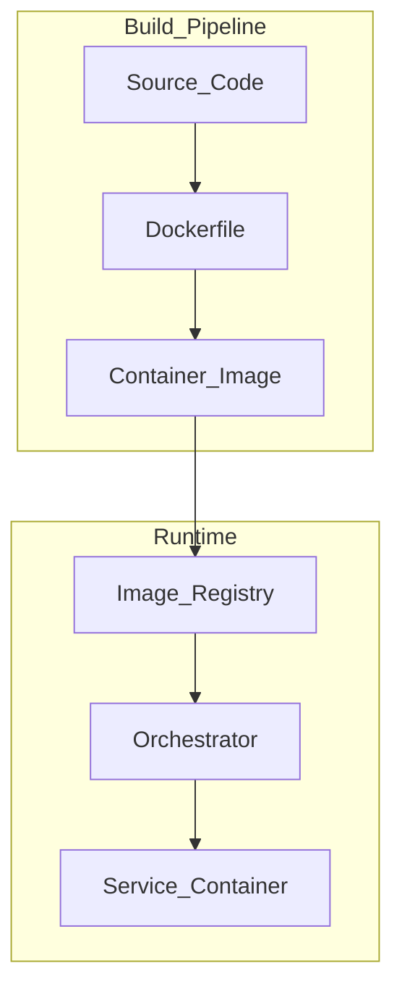

# Docker and Containers

> **Volume:** 1 | **Chapter ID:** v1-31 | **Status:** reviewed

## Purpose

Define how EPB services are packaged as containers for consistent deployment across development, staging, and production environments.

## Overview

Every EPB service ships as a Docker container. Containers eliminate "works on my machine" problems by bundling the runtime, dependencies, and application into an immutable artifact. The same image built in CI deploys to every environment — only configuration changes.

## Architecture



Services run as stateless containers. Persistent state lives in external databases, caches, and object storage — never inside the container filesystem.

## Responsibilities

- Provide a standard Dockerfile template for all services
- Enforce multi-stage builds for minimal production images
- Define base image selection and update policy
- Specify health check and signal handling requirements
- Document local development with Docker Compose

## Design Principles

| Principle | Container Application |
|-----------|----------------------|
| Cloud Native | Stateless, health-checked, horizontally scalable |
| Security by Design | Non-root user, minimal base image, no secrets in image |
| Configuration Over Customization | Runtime config via env vars, not baked into image |
| Single Source of Truth | One Dockerfile per service |

## Implementation Guidelines

### Standard Dockerfile Structure

```dockerfile
# Stage 1: Build
FROM builder-base AS build
WORKDIR /app
COPY package*.json ./
RUN npm ci
COPY . .
RUN npm run build

# Stage 2: Production
FROM runtime-base:alpine
WORKDIR /app
RUN addgroup -S app && adduser -S app -G app
COPY --from=build /app/dist ./dist
COPY --from=build /app/node_modules ./node_modules
USER app
EXPOSE 8080
HEALTHCHECK --interval=30s --timeout=3s CMD curl -f http://localhost:8080/health/live || exit 1
CMD ["node", "dist/main.js"]
```

### Image Requirements

| Requirement | Detail |
|-------------|--------|
| Base image | Approved minimal image (Alpine or distroless) |
| User | Non-root (`app` user) |
| Size target | Under 200MB for typical service |
| Labels | `version`, `git-sha`, `maintainer` |
| Health check | `HEALTHCHECK` directive or orchestrator probe |
| Signal handling | Graceful shutdown on SIGTERM (30s drain) |

### Local Development

Docker Compose orchestrates the full local stack:

```yaml
services:
  catalog:
    build: ./services/application/catalog
    ports: ["8085:8085"]
    env_file: .env
    depends_on:
      postgres: { condition: service_healthy }
      redis: { condition: service_started }
```

Developers run `docker compose up` for integration testing without installing every dependency locally.

### Image Tagging

| Tag | When |
|-----|------|
| `latest` | Latest main branch build (staging only) |
| `<semver>` | Release tags (`v1.2.0`) |
| `<git-sha>` | Every CI build (traceability) |

Never deploy `latest` to production.

## Best Practices

1. Multi-stage builds — build tools stay out of production image
2. `.dockerignore` excludes `node_modules`, `.git`, test files
3. Pin base image versions; update on security patches
4. Scan images for vulnerabilities in CI (Trivy, Snyk)
5. One process per container — no sidecar processes in app image

## Anti-Patterns

| Anti-Pattern | Why It Fails | Preferred Approach |
|--------------|--------------|--------------------|
| Secrets in Dockerfile | Leaked in image layers | Inject at runtime via secrets manager |
| Running as root | Container escape risk | Non-root user |
| Monolithic image with DB | Can't scale independently | External database |
| Mutable containers (SSH in, patch) | Drift, unreproducible | Rebuild and redeploy |
| Giant images (1GB+) | Slow deploys, attack surface | Multi-stage, minimal base |

## Related Chapters

- [Previous: Infrastructure Overview](30-infrastructure-overview.md)
- [Next: CI CD Pipeline](32-cicd-pipeline.md)
- [Cloud Native Principles](38-cloud-native-principles.md)
- [Deployment Guide](../Volume-3-Developer-Guide/19-deployment-guide.md)
- [EPB Glossary](../docs/GLOSSARY.md)

---

*Enterprise Platform Blueprint — Volume 1*
