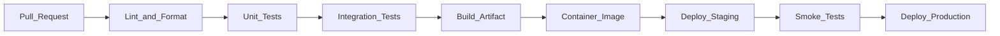

# CI CD Pipeline

> **Volume:** 1 | **Chapter ID:** v1-32 | **Status:** reviewed

## Purpose

Define the continuous integration and continuous delivery pipeline that validates, builds, and deploys every EPB service automatically.

## Overview

CI/CD is the quality gate between developer commits and production traffic. Every pull request triggers automated validation. Every merge to `main` triggers a build and deploy to staging. Production promotion requires explicit approval. No service reaches users without passing the pipeline.

## Architecture



Pipeline stages run sequentially within a job; independent services build in parallel across the monorepo.

## Responsibilities

- Enforce code quality gates (lint, format, type check)
- Run automated tests on every PR
- Build immutable container images tagged with git SHA
- Deploy to staging automatically on merge
- Require approval for production promotion
- Notify teams of build failures

## Design Principles

| Principle | CI/CD Application |
|-----------|------------------|
| Single Source of Truth | Pipeline defined in repo (`.github/workflows/`, `Jenkinsfile`) |
| Security by Design | SAST scanning, dependency audit, secret detection |
| Developer Experience First | Fast feedback — unit tests under 5 minutes |
| Convention Over Configuration | Shared pipeline template per service type |

## Implementation Guidelines

### Pipeline Stages

| Stage | Trigger | Actions | Failure Action |
|-------|---------|---------|----------------|
| Validate | PR open/update | Lint, format check, type check | Block merge |
| Test | PR open/update | Unit + integration tests | Block merge |
| Build | Merge to main | Compile, containerize, push image | Alert team |
| Deploy Staging | Build success | Deploy image to staging | Alert team |
| Smoke Test | Staging deploy | Health check + critical path tests | Block production |
| Deploy Production | Manual approval | Rolling deploy to production | Rollback on failure |

### Monorepo Strategy

Only build services with changed files:

```yaml
# Detect changed services
- uses: dorny/paths-filter@v2
  with:
    filters: |
      catalog:
        - 'services/application/catalog/**'
        - 'libs/shared/**'
```

Shared library changes trigger builds for all dependent services.

### Quality Gates

| Gate | Threshold |
|------|-----------|
| Unit test coverage | 80% on domain/application layers |
| Lint errors | Zero |
| Security vulnerabilities (critical) | Zero |
| Build time | Under 15 minutes per service |
| Integration test pass rate | 100% |

### Artifact Management

- Container images stored in private registry
- Images tagged: `<registry>/<service>:<git-sha>` and `<registry>/<service>:<semver>`
- Images retained for 90 days (rollback window)
- SBOM (Software Bill of Materials) generated per build

### Deployment Strategies

| Strategy | When | Detail |
|----------|------|--------|
| Rolling update | Default | Replace pods incrementally |
| Blue-green | Major releases | Switch traffic between two deployments |
| Canary | High-risk changes | Route 5% traffic, monitor, then full |

## Best Practices

1. Pipeline as code — versioned alongside application code
2. Fail fast — lint before tests, unit before integration
3. Cache dependencies between builds for speed
4. Parallelize independent service builds
5. Post-deploy smoke tests verify health before marking deploy successful

## Anti-Patterns

| Anti-Pattern | Why It Fails | Preferred Approach |
|--------------|--------------|--------------------|
| Manual test runs before deploy | Skipped under pressure | Automated pipeline gates |
| Building on production server | Unreproducible, insecure | Build in CI, deploy artifact |
| No integration tests in CI | Broken deploys to staging | Test containers in pipeline |
| Deploying untested `latest` | Unknown state in production | Tag with git SHA; promote tested image |
| Monolithic pipeline for all services | Slow feedback on small changes | Path-based service detection |

## Related Chapters

- [Previous: Docker and Containers](31-docker-and-containers.md)
- [Next: Monitoring and Observability](33-monitoring-observability.md)
- [Development Workflow](26-development-workflow.md)
- [CI CD Integration](../Volume-3-Developer-Guide/25-cicd-integration.md)
- [EPB Glossary](../docs/GLOSSARY.md)

---

*Enterprise Platform Blueprint — Volume 1*
