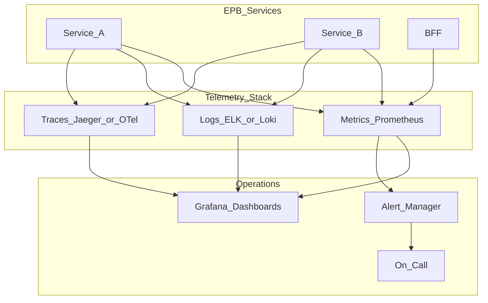

# Monitoring and Observability

> **Volume:** 1 | **Chapter ID:** v1-33 | **Status:** reviewed

## Purpose

Define the three pillars of observability — metrics, logs, and traces — and how EPB services instrument themselves for operational visibility.

## Overview

You cannot operate what you cannot see. Every EPB service exports structured telemetry so operators detect problems before users report them. Observability is not optional infrastructure — it is a service requirement enforced at code review.

## Architecture



All services use OpenTelemetry-compatible instrumentation for vendor portability.

## Responsibilities

- Export RED metrics (Rate, Errors, Duration) for every API endpoint
- Emit structured JSON logs with correlation IDs
- Propagate trace context across service boundaries
- Define SLOs and alerting thresholds per service
- Maintain dashboards for service health overview

## Design Principles

| Principle | Observability Application |
|-----------|--------------------------|
| Security by Design | Never log PII, credentials, or full request bodies |
| Convention Over Configuration | Standard metric names and log fields across all services |
| Platform First | Shared instrumentation library in shared libraries |
| Developer Experience First | Auto-instrument HTTP, DB, and messaging in framework middleware |

## Implementation Guidelines

### Metrics (RED Method)

| Metric | Type | Example |
|--------|------|---------|
| Request rate | Counter | `http_requests_total{method, path, status}` |
| Error rate | Counter | `http_errors_total{method, path, status}` |
| Duration | Histogram | `http_request_duration_seconds{method, path}` |

Additional service-specific metrics: queue depth, cache hit rate, active connections.

### Structured Logging

Every log entry includes:

```json
{
  "timestamp": "2026-08-01T12:00:00Z",
  "level": "info",
  "service": "catalog",
  "correlationId": "abc-123",
  "tenantId": "tenant-456",
  "message": "Resource created",
  "resourceId": "res-789"
}
```

Per [Logging Standards](20-logging-standards.md): no PII, no stack traces at info level, correlation ID on every entry.

### Distributed Tracing

- Generate trace ID at BFF entry point
- Propagate via `traceparent` header (W3C Trace Context)
- Each service creates spans for: HTTP handler, database query, external call, event publish
- Trace sampling: 100% in staging, 10% in production (adjustable)

### Alerting

| Alert | Condition | Severity |
|-------|-----------|----------|
| High error rate | >5% 5xx over 5 minutes | Critical |
| High latency | p99 > 2s over 10 minutes | Warning |
| Service down | Health check fails 3 consecutive | Critical |
| Queue backlog | Depth > 1000 for 15 minutes | Warning |

### SLO Framework

| SLO | Target | Measurement Window |
|-----|--------|-------------------|
| Availability | 99.9% | 30-day rolling |
| Latency (p99) | < 500ms | 30-day rolling |
| Error budget | 0.1% of requests | 30-day rolling |

## Best Practices

1. Instrument at framework middleware level — developers get metrics for free
2. Use correlation IDs to link logs, metrics, and traces for a single request
3. Dashboard per service plus platform-wide overview dashboard
4. Alert on symptoms (error rate, latency), not causes (CPU usage alone)
5. Runbooks linked from every alert definition

## Anti-Patterns

| Anti-Pattern | Why It Fails | Preferred Approach |
|--------------|--------------|--------------------|
| `console.log` debugging in production | Unstructured, unsearchable | Structured JSON logging |
| Logging PII | Compliance violation | Log IDs, not personal data |
| No correlation IDs | Cannot trace request across services | Propagate from BFF |
| Alert fatigue (100+ alerts) | Alerts ignored | SLO-based alerting only |
| Metrics without dashboards | Data exists but unused | Grafana dashboard per service |

## Related Chapters

- [Previous: CI CD Pipeline](32-cicd-pipeline.md)
- [Next: Architecture Decision Records](34-architecture-decision-records.md)
- [Logging Standards](20-logging-standards.md)
- [Monitoring Instrumentation](../Volume-3-Developer-Guide/58-monitoring-instrumentation.md)
- [Health Check Implementation](../Volume-3-Developer-Guide/57-health-check-implementation.md)
- [EPB Glossary](../docs/GLOSSARY.md)

---

*Enterprise Platform Blueprint — Volume 1*
