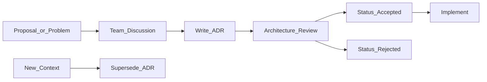

# Architecture Decision Records

> **Volume:** 1 | **Chapter ID:** v1-34 | **Status:** reviewed

## Purpose

Establish a lightweight process for capturing significant architectural decisions, their context, and consequences — so future teams understand *why* the platform is built the way it is.

## Overview

An Architecture Decision Record (ADR) is a short document that captures a single architectural decision. ADRs prevent repeated debates, preserve institutional knowledge, and provide audit trail for compliance. EPB uses ADRs for decisions that affect multiple services or are difficult to reverse.

## Architecture



ADRs are immutable once accepted. When context changes, write a new ADR that supersedes the old one.

## Responsibilities

- Write an ADR before implementing significant architectural changes
- Review ADRs in architecture review meetings
- Store ADRs in version control alongside code
- Reference ADR numbers in PR descriptions and handbook chapters
- Supersede (never edit) accepted ADRs when decisions change

## Design Principles

| Principle | ADR Application |
|-----------|----------------|
| Single Source of Truth | ADR is the canonical record of a decision |
| Loose Coupling | ADRs are independent documents, not a hierarchy |
| Developer Experience First | Template is short — fill in, don't write essays |
| Configuration Over Customization | ADR process is standardized; content is specific |

## Implementation Guidelines

### When to Write an ADR

| Write ADR | Skip ADR |
|-----------|----------|
| Choosing message broker (Kafka vs RabbitMQ) | Picking a variable name |
| Database per service vs shared database | Adding a new API endpoint |
| Authentication strategy (JWT vs session) | Fixing a bug |
| Multi-tenant isolation model | Updating a dependency version |
| API versioning strategy | Refactoring within a service |

**Rule of thumb:** if reversing the decision would require significant rework across services, write an ADR.

### ADR Template

```markdown
# ADR-NNN: [Short Title]

**Status:** proposed | accepted | rejected | superseded by ADR-XXX
**Date:** YYYY-MM-DD
**Authors:** [names]
**Deciders:** [architecture board / tech lead]

## Context

What is the issue? What forces are at play?

## Decision

What is the change we are proposing/have agreed to implement?

## Consequences

What becomes easier or harder? What are the trade-offs?

## Alternatives Considered

What other options were evaluated and why were they rejected?
```

### ADR Lifecycle

| Status | Meaning |
|--------|---------|
| `proposed` | Under discussion; not yet binding |
| `accepted` | Decision is final; implement accordingly |
| `rejected` | Considered and explicitly declined |
| `superseded by ADR-XXX` | Replaced by a newer decision |

### Storage and Numbering

- Location: `docs/adr/NNN-short-title.md`
- Sequential numbering: `001`, `002`, `003`
- Index file: `docs/adr/README.md` listing all ADRs with status

### Review Process

1. Author drafts ADR with status `proposed`
2. Architecture review meeting discusses (async comment OK for small teams)
3. Deciders update status to `accepted` or `rejected`
4. Implementation PRs reference ADR number in description

## Best Practices

1. Keep ADRs short — one to two pages maximum
2. Focus on context and trade-offs, not implementation details
3. Link ADRs to handbook chapters that implement the decision
4. Review ADRs annually — supersede outdated ones
5. Include "Alternatives Considered" — shows due diligence

## Anti-Patterns

| Anti-Pattern | Why It Fails | Preferred Approach |
|--------------|--------------|--------------------|
| Editing accepted ADRs | History lost, confusion | Supersede with new ADR |
| ADR for every trivial choice | Process fatigue, ignored | ADR only for significant decisions |
| ADRs in wiki, not repo | Not versioned with code | `docs/adr/` in repository |
| No alternatives section | Looks like rubber-stamping | Document rejected options |
| ADRs written after implementation | Rationalization, not decision record | Propose before building |

## Related Chapters

- [Previous: Monitoring and Observability](33-monitoring-observability.md)
- [Next: Engineering Principles](35-engineering-principles.md)
- [Documentation Standards](28-documentation-standards.md)
- [Architecture Principles](05-architecture-principles.md)
- [EPB Glossary](../docs/GLOSSARY.md)

---

*Enterprise Platform Blueprint — Volume 1*
