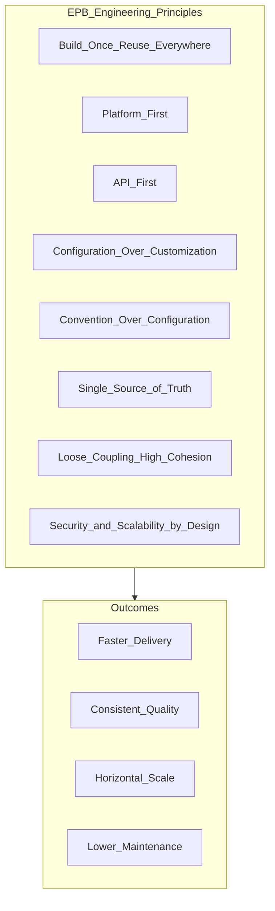

# Engineering Principles

> **Volume:** 1 | **Chapter ID:** v1-35 | **Status:** reviewed

## Purpose

Codify the engineering values that guide every technical decision in EPB — from code review comments to architecture reviews to technology selection.

## Overview

Engineering principles are the "why" behind EPB standards. When two valid approaches exist, principles break the tie. They apply to every team, every service, and every pull request. Principles are stable; implementations evolve.

## Architecture

These eight principles are defined in [Core Philosophy](03-core-philosophy.md) and elaborated in dedicated chapters throughout Volume 1.

## Responsibilities

- Apply principles consistently in design reviews and code reviews
- Reference principles when documenting ADRs
- Teach principles during onboarding
- Reject designs that violate principles without documented exception (ADR)

## Design Principles

| Principle | Meaning | Example |
|-----------|---------|---------|
| Build Once. Reuse Everywhere. | Shared capabilities eliminate duplication | Auth service, not per-app login |
| Platform First | Build platform capabilities before application features | Notification service before app-specific alerts |
| API First | Define contracts before implementation | OpenAPI spec before controller code |
| Configuration Over Customization | Behavior changes via config, not code forks | Feature flags, tenant settings |
| Convention Over Configuration | Sensible defaults reduce boilerplate | Standard folder structure, naming |
| Single Source of Truth | One canonical definition per concept | Shared DTO library, central glossary |
| Loose Coupling. High Cohesion. | Services independent; modules focused | Event-driven integration, not shared DB |
| Security by Design. Scalability by Design. | Non-negotiable cross-cutting concerns | Tenant isolation, stateless services |

## Implementation Guidelines

### Applying Principles in Practice

**Platform First in action:**

Before building a notification feature in an application service, check: does the Notification Platform already support this channel and template? If yes, integrate. If no, extend the platform — do not build a one-off.

**API First in action:**

1. Write OpenAPI spec for the endpoint
2. Review spec with consumers (BFF team, frontend)
3. Generate server stubs and client SDKs
4. Implement business logic against the contract

**Configuration Over Customization in action:**

A tenant needs a different approval threshold. Store the threshold in Configuration Service — do not fork the approval service code.

### Principle Conflicts

When principles conflict, resolve by impact:

1. **Security** always wins over convenience
2. **Platform First** wins over speed-to-market for reusable capabilities
3. **Loose Coupling** wins over performance shortcuts that create dependencies
4. Document exceptions in an ADR with expiration review date

### Review Checklist

Use in architecture and code reviews:

- [ ] Does this duplicate an existing platform capability?
- [ ] Is the API contract defined before implementation?
- [ ] Can behavior vary via configuration instead of code?
- [ ] Does this follow established conventions?
- [ ] Is there a single source of truth for shared types?
- [ ] Are service boundaries respected (no shared database)?
- [ ] Are security and scalability addressed?

## Best Practices

1. Cite the relevant principle when giving review feedback
2. Onboard new engineers with principles before standards
3. Revisit principles in retrospectives — are we living them?
4. Use principles to evaluate vendor tools and frameworks
5. Keep the principles list short — eight is enough

## Anti-Patterns

| Anti-Pattern | Violated Principle | Preferred Approach |
|--------------|-------------------|-------------------|
| Copy-paste auth in each app | Build Once | Central auth platform |
| App team builds own scheduler | Platform First | Use Scheduler Platform |
| Code before API spec | API First | OpenAPI first |
| Hard-coded tenant rules | Configuration Over Customization | Tenant config in Configuration Service |
| Inventing new folder layout | Convention Over Configuration | Follow [Folder Structure](23-folder-structure.md) |
| Duplicate DTO definitions | Single Source of Truth | Shared library types |
| Direct DB access across services | Loose Coupling | API or event integration |

## Related Chapters

- [Previous: Architecture Decision Records](34-architecture-decision-records.md)
- [Next: Platform First Design](36-platform-first-design.md)
- [Core Philosophy](03-core-philosophy.md)
- [Architecture Principles](05-architecture-principles.md)
- [EPB Glossary](../docs/GLOSSARY.md)

---

*Enterprise Platform Blueprint — Volume 1*
