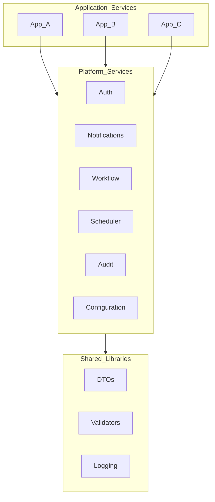

# Platform First Design

> **Volume:** 1 | **Chapter ID:** v1-36 | **Status:** reviewed

## Purpose

Explain how the Platform First principle shapes system design — building shared capabilities before application-specific features to maximize reuse across all enterprise applications.

## Overview

Platform First means: when multiple applications need the same capability, build it once in the platform layer and consume it everywhere. Authentication, notifications, workflows, scheduling, reporting, and audit are platform concerns — not application concerns. Application services focus on domain-specific business rules.

## Architecture



Application services never reimplement platform capabilities. They call platform APIs or subscribe to platform events.

## Responsibilities

- Identify capabilities that serve multiple applications
- Build reusable platform services with generic APIs
- Keep platform services domain-neutral
- Provide extension points for application-specific behavior
- Prevent platform scope creep into application business rules

## Design Principles

| Principle | Platform First Application |
|-----------|---------------------------|
| Build Once. Reuse Everywhere. | One notification service for all apps |
| Loose Coupling | Apps integrate via API/events, not shared code |
| Configuration Over Customization | Tenant-specific behavior via config, not forks |
| API First | Platform APIs are contracts consumed by many teams |

## Implementation Guidelines

### Platform vs Application Decision Tree

```text
Does more than one application need this capability?
├── No  → Build in application service
└── Yes → Is the capability domain-neutral?
    ├── No  → Extract generic parts to platform; keep domain logic in app
    └── Yes → Build as platform service
```

### Platform Service Characteristics

| Characteristic | Platform Service | Application Service |
|----------------|-----------------|-------------------|
| Consumers | Multiple applications | One product |
| Data model | Generic (resource, entity) | Domain-specific |
| API stability | High — breaking changes are costly | Moderate |
| Deployment | Independent, shared infrastructure | Per-product |
| Team ownership | Platform engineering | Product team |

### Extension Points

Platform services expose extension without forking:

- **Events** — apps subscribe to lifecycle events (`resource.created`)
- **Configuration** — tenant-level settings change behavior
- **Plugins** — optional adapters for external systems
- **Webhooks** — outbound notifications to application endpoints

### Platform Capability Catalog

| Capability | Platform Service | Application Uses |
|------------|-----------------|------------------|
| Identity | Auth Platform | Login, token validation |
| Permissions | Authorization Platform | Role checks, resource access |
| Notifications | Notification Platform | Send email, SMS, push |
| Approvals | Workflow Platform | Multi-step approval flows |
| Scheduling | Scheduler Platform | Cron jobs, delayed tasks |
| Reporting | Report Platform | Generate PDF, Excel exports |
| Audit | Audit Platform | Record who changed what |
| Search | Search Platform | Full-text search across entities |

## Best Practices

1. Ask "does a platform service already do this?" before writing code
2. Design platform APIs for the union of all consumer needs, not one app
3. Version platform APIs carefully — many consumers depend on stability
4. Platform services own their data — no shared tables with applications
5. Measure platform adoption — unused platform services indicate design gaps

## Anti-Patterns

| Anti-Pattern | Why It Fails | Preferred Approach |
|--------------|--------------|--------------------|
| App-specific logic in platform service | Platform becomes unmaintainable | Extension points; config hooks |
| Each app builds own auth | Inconsistent security, wasted effort | Auth Platform |
| Platform service with one consumer | Premature abstraction | Keep in application until second consumer |
| Leaking domain terms into platform API | Other apps can't use it | Generic resource/entity terminology |
| Bypassing platform via direct DB access | Tight coupling, no audit | API or event integration |

## Related Chapters

- [Previous: Engineering Principles](35-engineering-principles.md)
- [Next: API First Design](37-api-first-design.md)
- [Platform Services Layer](09-platform-services-layer.md)
- [Common Functionalities](39-common-functionalities.md)
- [EPB Glossary](../docs/GLOSSARY.md)

---

*Enterprise Platform Blueprint — Volume 1*
