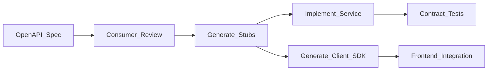

# API First Design

> **Volume:** 1 | **Chapter ID:** v1-37 | **Status:** reviewed

## Purpose

Define how EPB designs, documents, and evolves APIs before writing implementation code — ensuring contracts are stable, consumable, and consistent across all services.

## Overview

API First means the API contract is the primary artifact. Design the API, review it with consumers, generate stubs, then implement. This prevents breaking changes, enables parallel development (frontend and backend teams work from the same spec), and makes services truly independent.

## Architecture



The OpenAPI specification is the contract. Implementation must conform to the spec — not the other way around.

## Responsibilities

- Write OpenAPI specs before implementation
- Follow [API Standards](18-api-standards.md) for all endpoints
- Version APIs explicitly; never break consumers silently
- Generate client SDKs from specs for BFF and frontend teams
- Run contract tests in CI to detect spec/implementation drift

## Design Principles

| Principle | API First Application |
|-----------|----------------------|
| API First | Spec before code, always |
| Single Source of Truth | OpenAPI spec is the canonical API definition |
| Loose Coupling | Consumers depend on contract, not implementation |
| Convention Over Configuration | Standard URL patterns, error envelopes, pagination |

## Implementation Guidelines

### API Design Workflow

1. **Draft** — author writes OpenAPI spec for new endpoints
2. **Review** — consumers (BFF, frontend, other services) comment
3. **Approve** — spec merged to repository
4. **Generate** — server stubs and client SDKs generated
5. **Implement** — business logic fills in generated handlers
6. **Verify** — contract tests confirm implementation matches spec

### Standard URL Structure

```text
/{service-name}/v{version}/{resource-collection}
/{service-name}/v{version}/{resource-collection}/{id}
/{service-name}/v{version}/{resource-collection}/{id}/{sub-resource}
```

Examples:

```text
GET    /catalog/v1/resources
GET    /catalog/v1/resources/{id}
POST   /catalog/v1/resources
PUT    /catalog/v1/resources/{id}
DELETE /catalog/v1/resources/{id}
GET    /catalog/v1/resources/{id}/history
```

### Standard Response Envelope

```json
{
  "data": { },
  "meta": {
    "correlationId": "abc-123",
    "timestamp": "2026-08-01T12:00:00Z"
  }
}
```

Error responses per [Error Handling](19-error-handling.md):

```json
{
  "error": {
    "code": "RESOURCE_NOT_FOUND",
    "message": "Resource not found",
    "details": []
  },
  "meta": {
    "correlationId": "abc-123"
  }
}
```

### Versioning Strategy

| Strategy | When | Example |
|----------|------|---------|
| URL path versioning | Breaking changes | `/v1/`, `/v2/` |
| Additive changes | New optional fields | Same `/v1/` — backward compatible |
| Deprecation header | Removing fields | `Sunset: 2026-12-01` header |

Run v1 and v2 concurrently during migration. Deprecation period: minimum 6 months.

### Pagination, Filtering, Sorting

Standard query parameters across all list endpoints:

| Parameter | Type | Example |
|-----------|------|---------|
| `page` | integer | `?page=1` |
| `pageSize` | integer | `?pageSize=20` |
| `sort` | string | `?sort=createdAt:desc` |
| `filter` | string | `?filter=status eq 'active'` |

## Best Practices

1. Design APIs for consumers, not for database tables
2. Use nouns for resources, HTTP verbs for actions
3. Return appropriate HTTP status codes (201 for create, 204 for delete)
4. Include examples in OpenAPI spec for every endpoint
5. Contract-test in CI — fail build if implementation drifts from spec

## Anti-Patterns

| Anti-Pattern | Why It Fails | Preferred Approach |
|--------------|--------------|--------------------|
| Code-first API design | Spec drifts from reality | OpenAPI spec first |
| Exposing database schema as API | Leaky abstraction, breaking changes | Response DTOs |
| Breaking changes without versioning | Downstream services break | URL version bump |
| Inconsistent error formats | Client error handling complexity | Standard error envelope |
| RPC-style URLs (`/createResource`) | Not RESTful, not cacheable | `POST /resources` |

## Related Chapters

- [Previous: Platform First Design](36-platform-first-design.md)
- [Next: Cloud Native Principles](38-cloud-native-principles.md)
- [API Standards](18-api-standards.md)
- [DTO Standards](15-dto-standards.md)
- [API Versioning](../Volume-3-Developer-Guide/30-api-versioning.md)
- [EPB Glossary](../docs/GLOSSARY.md)

---

*Enterprise Platform Blueprint — Volume 1*
