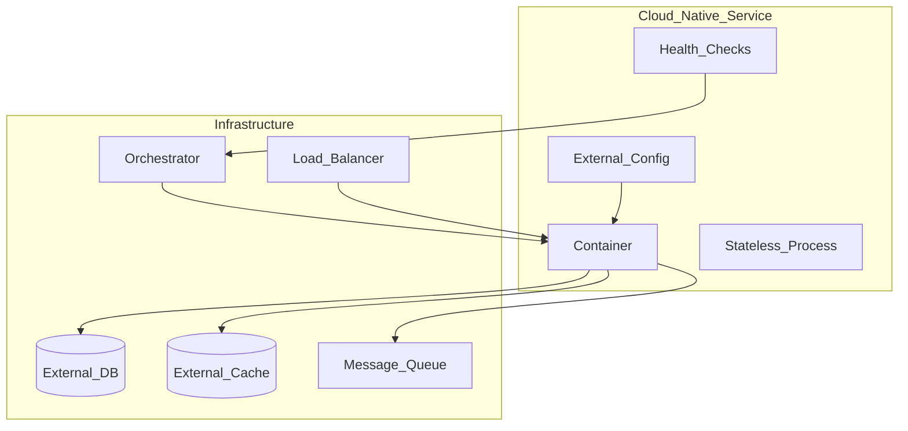

# Cloud Native Principles

> **Volume:** 1 | **Chapter ID:** v1-38 | **Status:** reviewed

## Purpose

Define the cloud-native design principles that make EPB services portable, resilient, and scalable across any cloud provider or on-premises infrastructure.

## Overview

Cloud native is not "running in the cloud." It is an architectural approach: containerized, dynamically orchestrated, microservices-based, and API-driven. EPB services are cloud native by design — they run equally well on AWS, Azure, GCP, or on-premises Kubernetes.

## Architecture



Services contain no infrastructure assumptions. All external dependencies are accessed via configuration.

## Responsibilities

- Design services as stateless, horizontally scalable processes
- Externalize all configuration and secrets
- Implement health checks for orchestrator integration
- Handle graceful shutdown and connection draining
- Avoid cloud-vendor-specific APIs in application code

## Design Principles

| Principle | Cloud Native Application |
|-----------|-------------------------|
| Scalability by Design | Scale out (more containers), not up (bigger machine) |
| Loose Coupling | Services communicate via APIs and events, not shared state |
| Configuration Over Customization | Same container image in every environment |
| Security by Design | Network policies, secrets management, least privilege |

## Implementation Guidelines

### The Twelve-Factor Alignment

EPB services align with [12-Factor App](https://12factor.net/) methodology:

| Factor | EPB Implementation |
|--------|-------------------|
| Codebase | One repo per service (monorepo with path isolation) |
| Dependencies | Explicitly declared; bundled in container |
| Config | Environment variables via Configuration Service |
| Backing services | Attached resources (DB, cache, queue) via URLs |
| Build, release, run | Strict separation; CI builds, orchestrator runs |
| Processes | Stateless; state in external stores |
| Port binding | Self-contained HTTP server per container |
| Concurrency | Scale via process model (more containers) |
| Disposability | Fast startup, graceful shutdown |
| Dev/prod parity | Same containers, same topology (scaled) |
| Logs | Stdout streams collected by log aggregator |
| Admin processes | One-off tasks as containers or jobs |

### Resilience Patterns

| Pattern | Implementation |
|---------|---------------|
| Health checks | `/health/live` (process up), `/health/ready` (can serve traffic) |
| Graceful shutdown | Drain connections on SIGTERM; 30-second timeout |
| Circuit breaker | Fail fast when downstream service is unhealthy |
| Retry with backoff | Transient failures on external calls |
| Bulkhead | Thread/connection pools isolated per dependency |
| Timeout | Every external call has a maximum wait time |

### Portability Requirements

- No cloud-specific SDKs in application code (use abstraction layer)
- Object storage via S3-compatible API
- Message queue via AMQP or cloud-agnostic SDK
- Database via standard drivers (PostgreSQL, not DynamoDB-specific)
- Secrets via vault abstraction, not cloud-specific secret manager API

### Scaling Model

```text
Traffic increase
  → Orchestrator detects high CPU/memory or custom metric
  → Scales replica count (e.g., 2 → 5 containers)
  → Load balancer distributes traffic
  → New replicas pass health check before receiving traffic
```

State lives in PostgreSQL, Redis, and message queues — never in container memory or filesystem.

## Best Practices

1. Design for failure — assume any dependency can be unavailable
2. Keep containers small and fast-starting (under 30 seconds)
3. Use readiness probes that check actual dependencies (DB connection), not just process alive
4. Test with chaos engineering in staging (kill containers, inject latency)
5. Document resource requests and limits for orchestrator scheduling

## Anti-Patterns

| Anti-Pattern | Why It Fails | Preferred Approach |
|--------------|--------------|--------------------|
| Local filesystem for state | Lost on container restart | External database or object storage |
| Sticky sessions in app memory | Can't scale horizontally | External session store or stateless JWT |
| Cloud-vendor lock-in APIs | Can't migrate providers | Abstraction layer or standard APIs |
| No health checks | Orchestrator can't manage lifecycle | Liveness + readiness endpoints |
| Ignoring SIGTERM | Dropped connections on deploy | Graceful shutdown with drain period |

## Related Chapters

- [Previous: API First Design](37-api-first-design.md)
- [Next: Common Functionalities](39-common-functionalities.md)
- [Docker and Containers](31-docker-and-containers.md)
- [Infrastructure Overview](30-infrastructure-overview.md)
- [Production Readiness](../Volume-3-Developer-Guide/26-production-readiness.md)
- [EPB Glossary](../docs/GLOSSARY.md)

---

*Enterprise Platform Blueprint — Volume 1*
