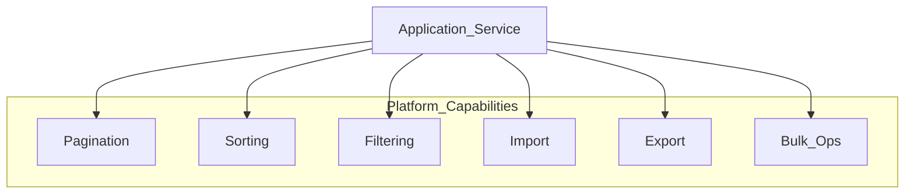

# Common Functionalities

> **Volume:** 1 | **Chapter ID:** v1-39 | **Status:** reviewed

## Purpose

Document reusable platform patterns for list operations, data exchange, and batch processing. Applications must consume these capabilities from the platform — not reimplement pagination, import, or bulk delete in every service.

## Overview

EPB treats cross-cutting behaviors as **platform capabilities** listed in the master blueprint: pagination, sorting, filtering, validation, search, import, export, file handling, bulk operations, logging, audit, error handling, standard responses, and mapping utilities.

This chapter defines the **contracts** those capabilities expose. Volume 2 service chapters and Volume 3 implementation guides show how to wire them; [API Standards](18-api-standards.md) and [Error Handling](19-error-handling.md) define envelopes and error shapes.



## Architecture

Common functionalities apply at two levels:

1. **HTTP contract** — query parameters and response `pagination` block on list APIs (BFF-facing)
2. **Platform services** — Import, Export, File Management, and Search as shared services applications call via API or events

Application services implement resource-specific filter fields and bulk actions but use platform libraries for parsing, validation, and job orchestration.

## Responsibilities

| Capability | Owner | Consumer |
|------------|-------|----------|
| Pagination / sorting / filtering | Shared library + each list endpoint | BFF, clients |
| Import / export jobs | Platform Import/Export services | Application services |
| Bulk mutations | Application service with platform patterns | BFF, clients |
| File upload/download | Platform File Management | Import, export, document flows |
| Validation | Shared validators + Request DTOs | BFF, services |
| Global search | Platform Search service | BFF, clients |

## Design Principles

1. **Convention over configuration** — same query parameter names on every list endpoint
2. **Platform first** — import/export and file storage are never one-off per application
3. **Tenant isolation** — every query and job scoped to authenticated tenant
4. **Async for heavy work** — large import/export/bulk jobs return job IDs, not blocking HTTP
5. **Consistent errors** — validation failures use field-level `details` per [Error Handling](19-error-handling.md)

## Implementation Guidelines

### Pagination

**Query parameters:**

| Parameter | Type | Default | Max | Description |
|-----------|------|---------|-----|-------------|
| `page` | integer | `1` | — | 1-based page index |
| `pageSize` | integer | `20` | `100` | Items per page |

**Response** (inside standard envelope — see [API Standards](18-api-standards.md)):

```json
"pagination": {
  "page": 1,
  "pageSize": 20,
  "totalItems": 145,
  "totalPages": 8,
  "hasNext": true,
  "hasPrevious": false
}
```

Reject `pageSize` above the configured maximum with `PLATFORM_VALIDATION_PAGE_SIZE_EXCEEDED`. For very large datasets, offer cursor-based pagination as an extension (`cursor`, `limit`) documented per endpoint; offset pagination remains the default for simplicity.

### Sorting

**Query parameters:**

| Parameter | Type | Description |
|-----------|------|-------------|
| `sort` | string | Field name to sort by |
| `sortDir` | `asc` \| `desc` | Sort direction; default `asc` |

**Example:**

```text
GET /api/v1/resources?sort=displayName&sortDir=desc
```

Only allow sorting on an explicit allowlist per resource (`displayName`, `createdAt`, `status`). Unknown sort fields return `400` with `PLATFORM_VALIDATION_INVALID_SORT_FIELD`. Multi-column sort uses comma-separated fields: `sort=status,createdAt&sortDir=asc,desc`.

### Filtering

Use bracket notation for equality filters; extend with operators for advanced cases.

**Basic filters:**

```text
GET /api/v1/resources?filter[status]=ACTIVE&filter[organizationId]=org_7f3a2b
```

**Operator syntax (when supported):**

| Operator | Example | Meaning |
|----------|---------|---------|
| (none) | `filter[status]=ACTIVE` | Equals |
| `gte` / `lte` | `filter[createdAt][gte]=2026-01-01` | Range |
| `in` | `filter[status][in]=ACTIVE,DRAFT` | In list |
| `like` | `filter[displayName][like]=primary` | Contains (case per DB) |

Invalid filter fields or values map to `RESOURCE_VALIDATION_INVALID_FILTER` or platform validation codes. Combine filters with AND semantics unless documented otherwise.

### Search

Resource list `filter` handles structured queries. **Global search** across entity types is a separate platform capability — clients call `/api/v1/search?q=...` on the BFF, which delegates to the Search service. Do not implement ad-hoc full-text search in every repository.

### Import

Large file ingestion runs as an **asynchronous job** through the platform Import capability.

**Flow:**

```text
1. Client uploads file → Platform File Management (returns fileId)
2. Client POST /api/v1/resources/import { fileId, format, options }
3. Service returns 202 { jobId }
4. Client polls GET /api/v1/jobs/{jobId} or receives webhook/event on completion
5. Result includes successCount, failureCount, errorReportFileId
```

**Request example:**

```json
{
  "fileId": "file_abc123",
  "format": "CSV",
  "options": {
    "skipHeaderRow": true,
    "dryRun": false
  }
}
```

Row-level failures produce a downloadable error report (CSV/JSON) with row number, field, and error code. Use `IMPORT_VALIDATION_INVALID_ROW` in the per-row detail.

### Export

Symmetric to import: client requests export, receives job ID, downloads file when ready.

```text
POST /api/v1/resources/export
{
  "format": "CSV",
  "filter": { "status": "ACTIVE" },
  "columns": ["code", "displayName", "status", "createdAt"]
}
```

Response `202`:

```json
{
  "success": true,
  "data": {
    "jobId": "job_export_456",
    "status": "QUEUED"
  },
  "meta": { "...": "..." }
}
```

Completed job `data` includes `downloadUrl` or `fileId` with expiry. Exports respect tenant scope and row-level permissions.

### Bulk Operations

Bulk endpoints process many IDs in one request. Use for batch activate, deactivate, delete, or assign — not for unbounded full-table operations (use export + import or admin jobs).

**Endpoint pattern:**

```text
POST /api/v1/resources/bulk/{action}
```

**Request example — bulk deactivate:**

```json
{
  "ids": ["res_001", "res_002", "res_003"],
  "reason": "Annual review"
}
```

**Response — partial success (`200` or `207` if documented):**

```json
{
  "success": true,
  "data": {
    "processed": 3,
    "succeeded": 2,
    "failed": 1,
    "results": [
      { "id": "res_001", "status": "SUCCESS" },
      { "id": "res_002", "status": "SUCCESS" },
      {
        "id": "res_003",
        "status": "FAILED",
        "error": {
          "code": "RESOURCE_BUSINESS_INVALID_STATE",
          "message": "Resource cannot be deactivated in current status."
        }
      }
    ]
  },
  "meta": { "...": "..." }
}
```

**Limits:**

| Rule | Value |
|------|-------|
| Max IDs per synchronous bulk request | 100 (configurable per tenant) |
| Larger batches | Submit async bulk job (same job pattern as import) |
| Idempotency | Support `Idempotency-Key` header on bulk `POST` |

### File Upload, Download, and Preview

File operations delegate to platform File Management:

- **Upload** — `POST /api/v1/files` multipart → returns `fileId`, virus scan status
- **Download** — `GET /api/v1/files/{fileId}` with auth and short-lived signed URL when using object storage
- **Preview** — platform Document Engine generates previews for supported MIME types

Import and export never store files locally in application containers.

### Validation

Request validation runs at the BFF and owning service using shared validators tied to [DTO Standards](15-dto-standards.md). List query validation (page, sort, filter) uses platform parser utilities so every service rejects malformed queries identically.

### Audit and Logging

Mutations from bulk, import, and write APIs emit audit events per platform Audit capability. Structured logs include `correlationId`, `tenantId`, `operation`, and `recordCount` for bulk/import/export jobs.

## Best Practices

1. Document allowed `sort` and `filter` fields in OpenAPI for every list endpoint
2. Default `pageSize` to 20; never return unbounded lists
3. Run import/export on the scheduler/queue — not on HTTP request threads
4. Return per-item results on bulk operations so clients can retry failures only
5. Apply the same tenant and permission checks on bulk IDs as on single-resource routes

## Anti-Patterns

| Anti-Pattern | Why It Fails | Preferred Approach |
|--------------|--------------|--------------------|
| Custom pagination per service | Client integration friction | Standard `page` / `pageSize` / `pagination` block |
| Synchronous import of 100k rows | Timeouts, OOM | Async job + progress polling |
| `DELETE` with body listing 10k IDs | Non-standard, proxy issues | Bulk POST endpoint or async job |
| Client-side filter of full list | Performance, data exposure | Server-side filter query params |
| Per-app CSV parsers | Inconsistent validation | Platform Import service |

## Related Chapters

- [Previous: Cloud Native Principles](38-cloud-native-principles.md)
- [Next: Volume 1 Index](40-volume1-index.md)
- [API Standards](18-api-standards.md)
- [Error Handling](19-error-handling.md)
- [DTO Standards](15-dto-standards.md)
- [EPB Glossary](../docs/GLOSSARY.md)

---

*Enterprise Platform Blueprint — Volume 1*
