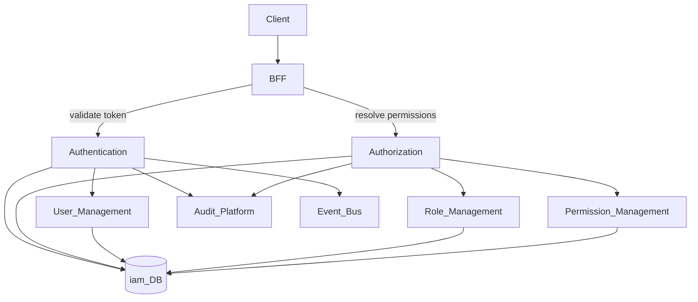
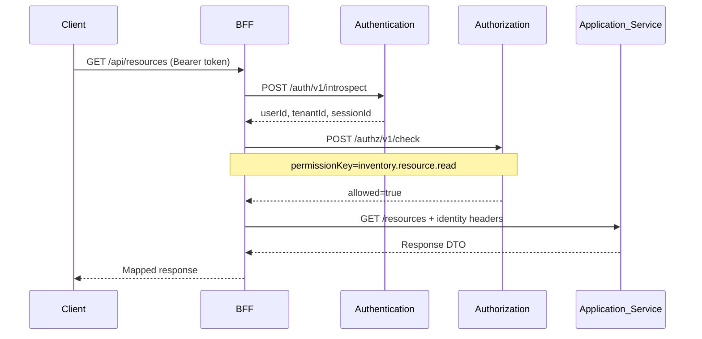
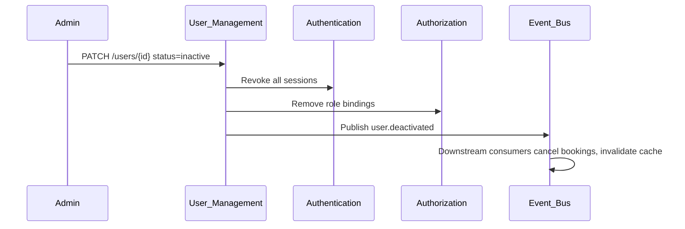

# Identity and Access

> **Volume:** 2 | **Chapter ID:** v2-01 | **Status:** reviewed

## Purpose

**Identity and Access** is the umbrella capability domain that governs who can use EPB and what they may do. It unifies authentication (proving identity), authorization (enforcing permissions), user lifecycle, role assignment, and permission catalog management into a coherent platform boundary. Applications never implement login, token parsing, role checks, or user provisioning logic — they delegate to dedicated platform services and receive resolved identity context from the **BFF** (Backend For Frontend).

This chapter defines the cross-cutting architecture. Deep implementation lives in [Authentication](02-authentication.md), [Authorization](03-authorization.md), [User Management](04-user-management.md), [Role Management](05-role-management.md), and [Permission Management](06-permission-management.md).

## Architecture



The BFF is the enforcement point for inbound requests. Platform services own credentials, sessions, user records, roles, and permission grants. Application services receive trusted identity headers or internal service tokens — never raw passwords or permission matrices.

## Responsibilities

### In Scope

- Unified identity model: users, service principals, tenants, organizations
- Credential lifecycle: login, logout, MFA, password reset, session revocation
- Permission model: resources, actions, scopes, role bindings
- User provisioning and deactivation with cascading access revocation
- Role templates and tenant-specific role customization
- Permission catalog registration by applications at deploy time
- Cross-service identity events for downstream sync (search index, audit, notifications)
- Admin APIs for IAM operations exposed through BFF with elevated authorization

### Out of Scope

- Application business rules (e.g., "only assignee may edit entity")
- UI login screens and admin consoles (frontend/BFF presentation)
- External IdP configuration UI (may be separate admin tool; protocol handled by Authentication adapters)
- Network-level security (TLS, WAF — infrastructure layer)

## API Design

Identity and Access does not expose a single monolithic API. Consumers integrate with the service family below. The BFF aggregates where the client needs a single round-trip.

### Service Base Paths

| Service | Base Path | Primary Consumer |
|---------|-----------|------------------|
| Authentication | `/auth/v1` | BFF, internal services |
| Authorization | `/authz/v1` | BFF |
| User Management | `/users/v1` | BFF, admin tools |
| Role Management | `/roles/v1` | BFF, admin tools |
| Permission Management | `/permissions/v1` | Application deploy hooks |

### BFF Identity Context Endpoint

| Method | Path | Description |
|--------|------|-------------|
| GET | /me | Current user profile + resolved permissions |
| GET | /me/sessions | Active sessions for current user |
| GET | /me/permissions | Flattened permission list for UI gating |

### Internal Service Headers (BFF → Application)

After token validation, the BFF forwards trusted headers — applications must not re-validate tokens:

| Header | Description |
|--------|-------------|
| `X-Tenant-Id` | Resolved tenant UUID |
| `X-User-Id` | Authenticated user UUID |
| `X-Organization-Id` | Active organization context |
| `X-Session-Id` | Session reference for audit |
| `X-Correlation-Id` | Request trace ID |

Permission checks occur at the BFF before routing to application services. Application services may enforce additional resource-level rules but must not bypass platform authorization for API access.

### Permission Registration (Application Deploy)

```json
{
  "applicationId": "inventory-service",
  "permissions": [
    {
      "permissionKey": "inventory.resource.read",
      "resource": "resource",
      "action": "read",
      "description": "View resource records"
    },
    {
      "permissionKey": "inventory.resource.write",
      "resource": "resource",
      "action": "write",
      "description": "Create and update resources"
    }
  ]
}
```

Follow [API Standards](../Volume-1-Foundation/18-api-standards.md).

## Database Design

Each IAM service owns its schema. No cross-service direct database access.

| Service | Primary Tables | Purpose |
|---------|----------------|---------|
| Authentication | `auth_sessions`, `auth_credentials`, `auth_refresh_tokens` | Sessions and credentials |
| Authorization | `authz_permission_grants`, `authz_policy_cache` | Resolved access decisions |
| User Management | `users`, `user_profiles`, `user_org_memberships` | User records |
| Role Management | `roles`, `role_permissions`, `user_role_bindings` | Role definitions and assignments |
| Permission Management | `permission_catalog`, `permission_versions` | Registered permission keys |

Shared conventions across all IAM tables:

- `tenant_id` on every row for multi-tenant isolation
- `created_at`, `updated_at`, `created_by` audit columns
- Soft delete via `deleted_at` where applicable
- No plaintext secrets — hashes and encrypted tokens only

## Folder Structure

```text
services/
├── authentication/
├── authorization/
├── user-management/
├── role-management/
└── permission-management/
    ├── api/
    ├── domain/
    ├── persistence/
    ├── adapters/       # IdP, Notification, Event Bus
    ├── mappers/
    ├── events/
    └── tests/
```

Shared IAM libraries (not a monolith):

```text
libs/iam-common/
├── identity-context/   # Parsed headers DTO
├── permission-keys/    # Constants and validation
└── events/             # user.created, role.assigned schemas
```

## Sequence Diagrams

### Authenticated Request Flow



### User Deactivation Cascade



## Extension Points

- **External IdP adapters** — OIDC, SAML, LDAP via Authentication service plugins
- **Custom role templates** — tenant seeds default roles on provisioning
- **Attribute-based conditions** — organization scope, resource ownership in Authorization policies
- **SCIM provisioning** — optional inbound user sync adapter

## Integration

- **Depends on:** Audit Platform, Event Bus, Configuration Service, Notification Platform (password reset)
- **Events published:** `user.created`, `user.deactivated`, `role.assigned`, `role.revoked`, `permission.registered`
- **Events consumed:** `tenant.provisioned` (seed admin user and default roles)
- **Used by:** Every application and BFF in EPB

## Best Practices

1. Enforce identity at the BFF — application services trust internal headers, not client-supplied user IDs
2. Register permissions at deploy time; never hardcode permission strings in multiple services
3. Separate authentication (who) from authorization (what) — never embed roles in JWT beyond session reference
4. Revoke sessions immediately on user deactivation or password change
5. Use correlation IDs across IAM operations for audit trail completeness
6. Default deny — missing permission grants deny access

## Anti-Patterns

| Anti-Pattern | Why It Fails | Preferred Approach |
|--------------|--------------|-------------------|
| Per-app user tables | Duplicate identities, SSO impossible | User Management APIs |
| Roles embedded in JWT | Stale permissions until token expiry | Authorization check per request |
| Application validates Bearer tokens | Duplicated crypto logic, security drift | BFF introspect + header forwarding |
| Stringly-typed permission checks | Typos cause silent security holes | Permission catalog registration |
| Shared IAM database | Violates service ownership | Service-owned schemas with events |

## Related Chapters

- [Next: Authentication](02-authentication.md)
- [Authorization](03-authorization.md)
- [User Management](04-user-management.md)
- [Role Management](05-role-management.md)
- [Permission Management](06-permission-management.md)
- [EPB Glossary](../docs/GLOSSARY.md)

---

*Enterprise Platform Blueprint — Volume 2*
