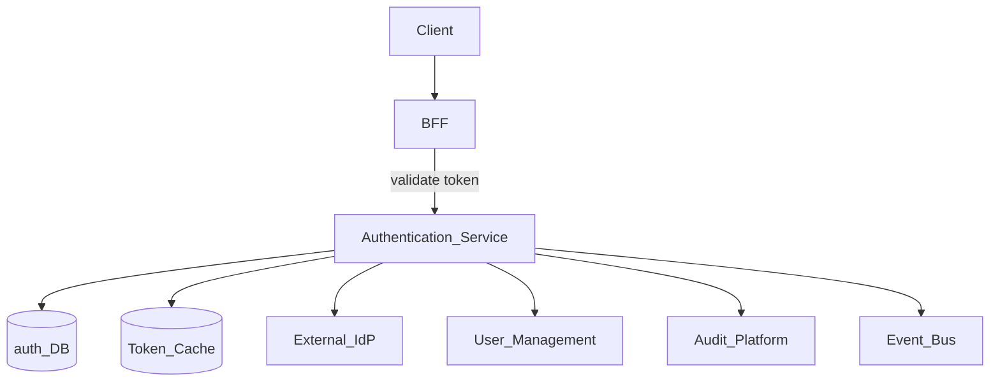
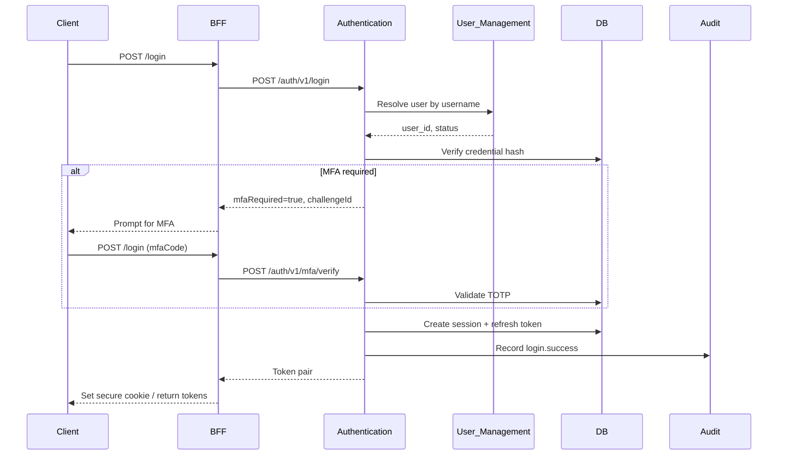
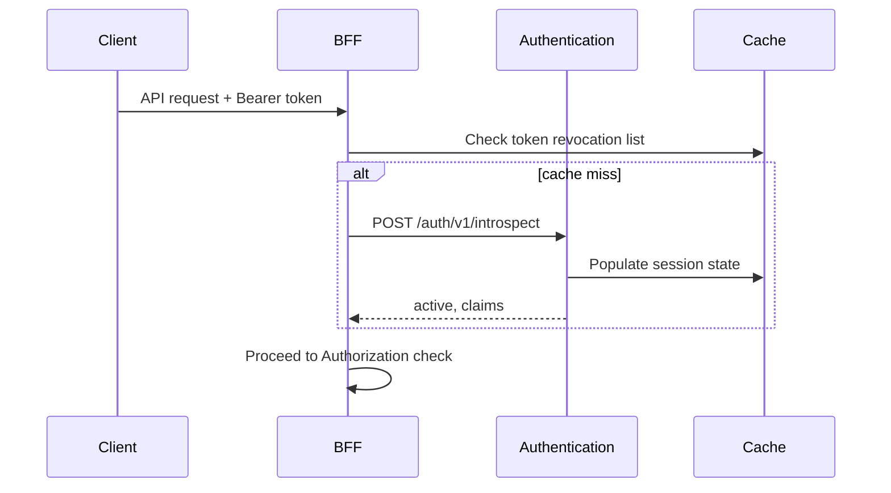

# Authentication

> **Volume:** 2 | **Chapter ID:** v2-02 | **Status:** reviewed

## Purpose

The **Authentication** platform service verifies identity for every user and service principal across EPB. It issues, validates, refreshes, and revokes credentials so applications never implement login flows, token parsing, or session stores themselves. The **BFF** (Backend For Frontend) validates tokens on every inbound request; this service is the single source of truth for credential lifecycle.

## Architecture



Authentication owns credential metadata and session state. It does not own user profiles (see [User Management](04-user-management.md)) or permission grants (see [Authorization](03-authorization.md)).

## Responsibilities

### In Scope

- Credential verification: password, API key, OAuth2/OIDC, SAML (via adapters)
- Token issuance: access tokens, refresh tokens, service-to-service tokens
- Token validation and introspection for BFF and internal services
- Session lifecycle: create, extend, revoke, concurrent session limits
- Multi-factor authentication (MFA) enrollment and challenge
- Password policy enforcement and secure reset flows
- Account lockout after failed attempts
- Publishing authentication events for audit and downstream sync

### Out of Scope

- Permission checks and role assignment ([Authorization](03-authorization.md))
- User profile CRUD ([User Management](04-user-management.md))
- UI login screens (frontend responsibility)
- Authorization header parsing in application services (BFF responsibility)

## API Design

### Base Path

`/auth/v1`

All endpoints return [Standard Response](../Volume-1-Foundation/19-error-handling.md) envelopes. Sensitive fields never appear in logs.

### Authentication Endpoints

| Method | Path | Description |
|--------|------|-------------|
| POST | /login | Authenticate with credentials; returns token pair |
| POST | /logout | Revoke current session and tokens |
| POST | /refresh | Exchange refresh token for new access token |
| POST | /introspect | Validate token; return claims (internal/BFF only) |
| POST | /mfa/enroll | Start MFA enrollment for authenticated user |
| POST | /mfa/verify | Complete MFA challenge during login |
| POST | /password/reset-request | Initiate password reset (email via Notification Platform) |
| POST | /password/reset-confirm | Complete reset with one-time token |
| POST | /service-tokens | Issue short-lived token for service principal |
| DELETE | /sessions/{sessionId} | Revoke specific session (admin or self) |
| GET | /sessions | List active sessions for current user |

### Login Request

```json
{
  "tenantId": "tenant-uuid",
  "username": "user@example.com",
  "password": "********",
  "clientId": "web-app",
  "mfaCode": "123456"
}
```

### Login Response

```json
{
  "accessToken": "eyJ...",
  "refreshToken": "rt_...",
  "expiresIn": 3600,
  "tokenType": "Bearer",
  "sessionId": "session-uuid",
  "mfaRequired": false
}
```

### Token Claims (JWT)

| Claim | Description |
|-------|-------------|
| `sub` | User ID |
| `tid` | Tenant ID |
| `sid` | Session ID |
| `client_id` | Calling application |
| `exp` / `iat` | Expiry and issued-at |
| `scope` | Granted OAuth scopes (not permissions) |

Permissions are resolved separately by Authorization at the BFF — never embed roles in tokens beyond opaque session references.

Follow [API Standards](../Volume-1-Foundation/18-api-standards.md).

## Database Design

All tables include `tenant_id` for multi-tenant isolation. Passwords stored as salted hashes only.

| Table | Key Columns | Purpose |
|-------|-------------|---------|
| `auth_credentials` | `user_id`, `credential_type`, `secret_hash`, `status` | Password and API key storage |
| `auth_sessions` | `session_id`, `user_id`, `client_id`, `expires_at`, `revoked_at` | Active and historical sessions |
| `auth_refresh_tokens` | `token_hash`, `session_id`, `expires_at`, `rotated_from` | Refresh token rotation chain |
| `auth_mfa_devices` | `user_id`, `device_type`, `secret_encrypted`, `verified_at` | TOTP/WebAuthn enrollment |
| `auth_login_attempts` | `username`, `ip_address`, `success`, `attempted_at` | Lockout and fraud signals |
| `auth_password_reset_tokens` | `user_id`, `token_hash`, `expires_at`, `used_at` | One-time reset tokens |
| `auth_service_principals` | `principal_id`, `client_id`, `secret_hash` | Machine-to-machine clients |
| `auth_audit_log` | `event_type`, `user_id`, `metadata_json`, `created_at` | Immutable auth event trail |

Indexes: `(tenant_id, user_id)` on sessions; `(token_hash)` unique on refresh tokens; TTL job on expired sessions.

## Folder Structure

```text
services/authentication/
├── api/              # REST controllers, request validation
├── domain/
│   ├── login/        # Credential verification logic
│   ├── tokens/       # JWT issue, validate, rotate
│   ├── mfa/          # MFA challenge handlers
│   └── sessions/     # Session lifecycle
├── persistence/      # Entities, repositories
├── adapters/
│   ├── oidc/         # External IdP integration
│   └── notification/ # Password reset event publisher
├── mappers/          # DTO ↔ domain ↔ entity
├── events/           # auth.login, auth.logout publishers
└── tests/
```

## Sequence Diagrams

### Login with MFA



### Token Validation (per request)



## Extension Points

- **IdP adapters** — plug in OIDC, SAML, or LDAP per tenant via Configuration Service
- **MFA providers** — TOTP default; WebAuthn/SMS via adapter interface
- **Password policy** — tenant-level rules (length, complexity, rotation) from configuration
- **Custom lockout rules** — threshold and duration per tenant

## Integration

- **Depends on:** User Management, Configuration Service, Audit Platform, Notification Platform (reset emails)
- **Events published:** `auth.login.success`, `auth.login.failed`, `auth.logout`, `auth.session.revoked`, `auth.password.changed`
- **Events consumed:** `user.deactivated` (revoke all sessions), `tenant.provisioned` (default auth policies)
- **Consumers:** BFF (introspection), Authorization (session context), Audit Platform

## Best Practices

1. Short-lived access tokens (15–60 minutes); rotate refresh tokens on each use
2. BFF validates tokens — application services trust BFF-forwarded identity headers, not raw tokens
3. Rate-limit login and reset endpoints per IP and username
4. Never return whether username exists on failed login (generic error message)
5. Revoke all sessions on password change and account deactivation
6. Use correlation IDs across login, MFA, and audit events

## Anti-Patterns

| Anti-Pattern | Why It Fails | Preferred Approach |
|--------------|--------------|-------------------|
| Embedding roles in JWT | Stale permissions until token expires | Authorization check per request |
| Per-app login implementations | Inconsistent security, audit gaps | Authentication platform only |
| Long-lived access tokens without rotation | Stolen token window too large | Refresh rotation + short TTL |
| Storing tokens in localStorage on web | XSS steals credentials | httpOnly cookies or secure memory |
| Application services parsing JWT directly | Duplicated validation logic | BFF introspection once |

## Related Chapters

- [Previous: Identity and Access](01-identity-and-access.md)
- [Next: Authorization](03-authorization.md)
- [User Management](04-user-management.md)
- [Security Foundation](../Volume-1-Foundation/21-security-foundation.md)
- [EPB Glossary](../docs/GLOSSARY.md)

---

*Enterprise Platform Blueprint — Volume 2*
